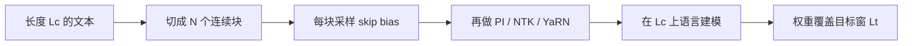

# PoSE

    
不必在目标长度上做满序列微调；把原窗口切成几块，给后块加上跳过的位置偏置，短上下文也能覆盖长窗口里的相对距离。

    <footer>—— Zhu 等，PoSE: Efficient Context Window Extension of LLMs via Positional Skip-wise Training，ICLR 2024</footer>

位置插值解决的是「下标出界」，微调仍然要在长度为 $L_t$ 的序列上做注意力，显存随 $L_t$ 二次涨。北京大学与微软的 Dawei Zhu、Nan Yang、Liang Wang、Yifan Song、Wenhao Wu、Furu Wei 与 Sujian Li 在 ICLR 2024 提出 Positional Skip-wisE（PoSE）：微调长度锁在原窗口 $L_c$（例如 2k），但位置下标被操纵成覆盖目标窗口 $L_t$（例如 128k）里的相对距离。序列切成若干连续块，后一块加上跳过偏置，块长与偏置每个样本重采样。配合 PI、NTK 或 YaRN，他们把 LLaMA 从 2k 扩到 128k，训练成本远低于满长度微调。本篇写这篇跳步训练原文，而不是再讲插值公式。

## 问题

满长度微调（full-length fine-tuning）在数学上最干净：模型见到完整的 $0\ldots L_t-1$ 与整段文本。代价是注意力激活与 KV 按 $L_t$ 涨，从 2k 到 32k 已经接近平方十六倍的计算，到 128k 在当时硬件上几乎不可做。PI 降低的是优化难度，不降低这一步的二次项。需要把「训练时的物理长度」和「位置通道要覆盖的目标长度」解耦。

Ruoss 等人的 RandPos 在预训练编码器里随机抽有序位置子集，相邻 token 的下标可以不连续。PoSE 针对的是已经训好的解码器 LLM：块内必须保持连续下标，以免破坏预训练学到的局部语言建模；块间才允许跳过，以 visist 大 $\Delta$。问题设定是微调方法，不是从零换一套位置编码。

### 覆盖相对位置，同时像预训练

两条约束对着干。要覆盖 $\{1,\ldots,L_t-1\}$ 上的相对距离，位置必须能跳到远处。要保住原能力，局部必须仍是连续整数，句子不能被拆成随机下标的词袋。PoSE 的折中是：窗口内 $N$ 个连续块（原文主设定 $N=2$），块内连续，块间加单调不减的 skip bias，每个样本重抽块长与 bias，使相对距离的直方图在训练过程中铺满目标窗。

跳过的是位置下标，不是注意力边。物理上仍对 $L_c$ 个 token 做满注意力；看不见的是跳过那段里的真实词。模型学的是「若相对位置是 5 万，相位长这样」，而不是「5 万个词的内容」。

## 方法

把长度为 $L_c$ 的微调样本分成 $N$ 块 $c_0,\ldots,c_{N-1}$，长度 $l_i$ 满足 $\sum l_i=L_c$。第 $i$ 块的跳过偏置 $u_i$ 从离散均匀分布里抽，且 $u_i\ge u_{i-1}$，上界保证加上块长后不超过 $L_t$。第 $i$ 块内第 $j$ 个 token 的位置不再是全局 $0,1,2,\ldots$，而是块内偏移加上 $u_i$（再经所选的插值策略映回可训练范围）。$u_0=0$，第一块贴在原点，后块跳到目标窗的某处。

文本内容同样按块取连续跨度；论文试过内容连续、内容与 $u_i$ 对齐、以及随机切，对结果影响不大。关键是位置通道的覆盖。插值（线性 / NTK / YaRN）加在操纵之后，避免 $L_t$ 很大时相位仍然 OOD。$N=2$ 是效率与「像预训练」之间的折中：块数越多，相对位置更全，局部结构越不像预训练。

### 与满长度微调、RandPos 的差别

满长度：物理长度 $=L_t$，二次项按目标窗付。PoSE：物理长度 $=L_c$，二次项按原窗付，位置像「在长文里挖了 $N$ 个窗口」。RandPos：相邻位置可不连续，面向从零训练的长度泛化；PoSE：块内连续，面向 LLM 微调。经验上，LLaMA 用 2k 训练窗扩到 128k（64 倍），语言建模与理解仍可用。兼容 LLaMA、LLaMA2、GPT-J、Baichuan，以及三种插值。理论上目标窗可以再大，上限变成推理显存，而不是微调显存。

## 机制

机制是对相对位置轴做稀疏采样。$N=2$ 时，每个 batch 提供一块近程连续 $\Delta$，以及一块「起点很远、内部仍连续」的 $\Delta$。遍历足够多样本后，模型在目标窗的许多绝对位置与许多相对跨度上都做过预测。插值保证这些被跳到的下标仍落在 RoPE 可插值的数值范围，微调才稳。块内连续使下一词预测仍像预训练：相邻词的相位差是 1 而不是随机整数，局部语法不先坏掉。

看不见跳过区间的内容，是机制里的缺口。模型从未在一次前向里对 $L_t$ 个真实 token 做联合推理，只见过「位置几何上的长距离」加「两段短内容」。因此 passkey 若落在推理时两段之间的真实中间区域，取决于模型能否把微调学到的相位用到从未同时出现的内容上。这比满长度微调更依赖「相位可迁移」这一假设。

推理必须改回连续的 $0\ldots n-1$（再按同一套插值缩放），不能继续跳步。跳步只属于训练。若推理也跳，用户文档会被挖空。

### 为何说「潜在无限」

微调图与 $L_t$ 解耦之后，$L_t$ 只影响 $u_i$ 的采样上界和插值比 $\alpha=L_t/L_c$。把上界加倍，训练开销几乎不变。真正卡住的是推理：FlashAttention 与分页 KV 能撑多长，窗口才能声明多长。原文 128k 是当时推理栈上的实证点，不是方法的数学终点。

## 边界与工程取舍

PoSE 不降低推理复杂度。128k 解码的 KV 与满长度训出来的 128k 模型一样贵。它省的是适配阶段的 GPU 小时。跳过导致训练分布缺少「整本连续长文」，对必须通读中间段落的任务，满长度或检索可能仍然更强。$N$ 与插值策略要一起扫：只改 $N$、插值仍用过大的线性 $s$，高频照样糊。

实现上最常见的错是把 skip 做成无序位置或允许 $u_i$ 回绕造成块间下标重叠。约束 $u_i\ge u_{i-1}$ 就是为了防重叠。内容切块与位置切块可以不对齐原文偏移；不要为了「真实」强行 $v_i=u_i$，论文发现这不是性能关键。已经原生长窗预训练的模型再套 PoSE，会把正确的连续长距离改成跳步几何，属于负优化。

与 Self-Extend、DCA 的分工：后两者是推理期改相对位置矩阵、权重冻结；PoSE 是训练期用跳步位置上课，推理用连续长下标。不要在推理再叠一套 Self-Extend 阶梯，除非消融证明必要——相位会被折两次。

### 评测

必须同时报：原窗任务（跳步是否伤短能力）、目标长度 PPL、针测（针在「训练时可能被跳过」的深度）。只报「2k 显存训出 128k」没有意义。与满长度微调的公平比较要固定数据与插值，只改物理长度，才能说省了多少、掉了多少。

## 小结

- PoSE 用原窗口长度微调，靠块间 skip bias 覆盖目标窗口的位置，从而把训练长度与目标长度解耦。
- 块内连续下标以接近预训练；每个样本重采样块长与偏置。
- 与 PI、NTK、YaRN 及多种 RoPE LLM 兼容；实证 2k→128k。
- 省的是微调二次项，不是推理 KV；跳过区间的内容从未进入同一次前向。
- 推理应恢复连续位置加同一套插值，不要把跳步带上线。
- 出处：Zhu 等，*PoSE: Efficient Context Window Extension of LLMs via Positional Skip-wise Training*，ICLR 2024，arXiv:2309.10400。对照 Chen 等 PI（2023）、Ruoss 等 RandPos（2023）。
