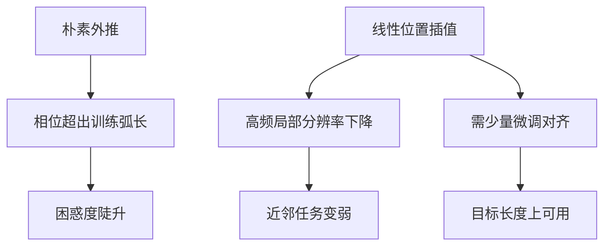

# 位置插值与外推失败模式

把更大的位置下标按比例映回原窗口，只需少量微调就能延长上下文；不插值而硬外推，旋转相位会先坏掉。

<footer>—— Chen 等，Position Interpolation，2023</footer>

RoPE 模型在训练长度 $L$ 之外突然变笨，常常被说成「不会外推」。失败其实分几类：相位卷绕、高频被插值抹平、注意力熵塌缩、微调没覆盖长程任务。Chen 等人 2023 年的位置插值给出一条能用的路——把 $[0,L')$ 线性映到 $[0,L)$，再短续训——同时也把「为什么朴素外推不行」写清楚了。本文只讨论这条失败谱与插值本身的代价，不把 YaRN 或 ALiBi 重写成综述；它们只作为对照出现。

## 问题

RoPE 的相对位置进入 $\cos(\theta_i\Delta)$。训练时 $\Delta\in\{0,\ldots,L-1\}$，每条频率对应的弧长都在数据里反复出现。推理若直接使用 $\Delta$ 直到 $L'-1$，高频维的弧长超出训练范围，余弦从平滑相对信号变成近似正交的噪声，点积不再编码「隔了多少 token」，只剩幅度上的偶然相关。这是外推失败的第一型：几何出界。

第二型是绝对嵌入式的表出界：可学习位置向量没有第 $L$ 行。RoPE 没有这张表，所以第一型更隐蔽——模型还能前向，只是分数无意义。第三型是分配失败：即使相位勉强可算，softmax 在更多键上变尖，质量集中在句首或最近邻，长程键分不到梯度曾经见过的那类质量。

工程上需要一张失败清单，否则会把所有「长了就笨」都当成同一只虫子，轮流试增大基数、插值、换温度，却不知道自己在修哪一型。能前向不等于位置通道仍有效。RoPE 外推时损失爆炸或重复生成，优先怀疑相位出界；插值后邻域任务变差，优先怀疑高频被压死。先分型，再选补丁。

## 方法

位置插值（Position Interpolation，PI）定义新位置

$$
p' = p \cdot \frac{L}{L'} = \frac{p}{s}
$$

其中 $s=L'/L$。最大位置 $L'-1$ 映到约 $L$ 的原窗口内，所有 $\theta_i\Delta$ 按同一比例缩小，训练见过的弧长重新覆盖推理范围。Chen 等人表明，在目标长度上用原预训练分布做数千步量级的微调，即可把困惑度从「外推崩溃」拉回到可用区间，远小于从头按 $L'$ 预训练的成本。

插值是对坐标的全局仿射，不改 $b$，也不按维区别对待。它的方法承诺很窄：让相位重新落回训练支撑集，再靠微调适应被压慢的频率。

## 机制

### RoPE 外推为何崩

固定 $\theta_i$，令 $\Delta$ 超过 $L$。高频维在 $[0,L)$ 内可能已经转过数圈或至少扫过训练所见的最大角；再增大 $\Delta$，相对位置与余弦值不再单调对应训练时的那张表。注意力分数的尺度被随机相位搅动，softmax 出现极端峰值或均匀噪声。生成端常见症状是立刻重复、突然离题、或对提示开头过度锚定。这些不是解码器采样温度单独能解释的，因为短于 $L$ 的同模型同温度仍然正常。

绝对位置嵌入的外推更干脆：越界下标若被截断到 $L-1$，则所有超长位置共享同一向量，模型认为它们是同一个位置；若取模，则周期错位。失败模式与 RoPE 不同，但同样说明：位置通道一旦离开训练支撑，内容通道救不回来。

### 位置插值的压缩代价

PI 把所有频率的 $\Delta$ 除以 $s$。低频维本就变化慢，除以 $s$ 后仍然平滑，长程结构往往还能辨认。高频维的邻域差被压缩，$s=4$ 或 $8$ 时「差一个 token」接近「几乎没差」。微调可以让投影矩阵改用剩下的频率做局部区分，但不能凭空恢复已经被线性映掉的带宽。于是出现与外推相反的失败：长窗口困惑度尚可，精确复制、局部替换、近距离指代变差。这是插值特有的第二型失败，不是外推没修好的残留。

微调步数少，是因为几何已经被映回支撑集，优化只需适应压缩后的频谱，不必重新学习语言。若微调数据全是短序列，模型不会自动使用 $L'$ 的后半段，插值只保证「算得动」，不保证「用得着」。

### 失败模式清单

按现象对齐原因，避免混修：

1. 一超过 $L$ 就崩溃、短于 $L$ 正常：优先朴素外推导致的相位出界，PI 或改基数针对这一型。
2. 长窗口能跑，但近邻混淆、小跨度复制差：优先 PI 或过大 $s$ 造成的高频压缩；NTK-aware 或 YaRN 分段减少这一型。
3. 相位已校正，仍只盯句首或最近 token：注意力熵与汇点，温度或窗口内的注意力设计，不是再加大插值。
4. 评测任务需要精确相对偏移，而位置通道被改成单调压缩：任何全局仿射都会伤这类任务，架构级相对偏置或更细的频率方案也只能减轻，不能假装坐标变换可逆。

## 边界与工程取舍

PI 的 $s$ 不能任意大。压缩比过高时，微调也无法从低频里挤出局部分辨率，表现为平台很短的「可用长度」后再次变差。多阶段拉长——先 $2L$ 再 $4L$——往往比一次 $s=16$ 更稳，因为每次微调都在不太离谱的压缩上对齐。

插值与 KV 缓存的位置下标必须用同一套 $p'$。若缓存存的是真实 $p$，注意力却按 $p/s$ 旋转，相对位置全错。实现上应在 RoPE 的输入位置统一乘 $L/L'$，而不是在部分层做。

Chen 等的结果不能外推成「所有失败都可用 PI 修复」。ALiBi 没有可插值的旋转坐标；NoPE 没有显式位置。PI 是 RoPE 与绝对下标类方法的坐标补丁。换位置编码等于换失败模式，而不是把清单作废。

### 评测时不要只看能跑多长

最大可解码长度只说明数值与掩码没炸。需要在 $L$ 内、$L$ 边界、以及 $L'$ 上分别看困惑度曲线是否陡升；再用需要局部精度与需要长程检索的两类任务对照，才能看出是外推崩了还是插值把高频卖掉了。

## 小结

- 朴素 RoPE 外推的典型失败是相位超出训练弧长，分数失去相对位置含义。
- 位置插值把下标按 $L/L'$ 压缩回原窗口，使相位重新落在支撑集上。
- 插值的代价是高频局部分辨率下降，近邻任务可能变差。
- 少量目标长度微调是 PI 方法的一部分，不是可有可无的后处理。
- 失败要分型：几何出界、高频压缩、熵塌缩、任务没用上新窗口，补丁各不相同。
- PI 不适用于 ALiBi 或 NoPE 这类没有同一套旋转坐标的模型。
- 出处：Chen 等，*Extending Context Window of Large Language Models via Position Interpolation*，2023；对照 Press 等 ALiBi（2021）、Peng 等 YaRN（2023）及 bloc97 的 NTK-aware 社区方案（2023）。
