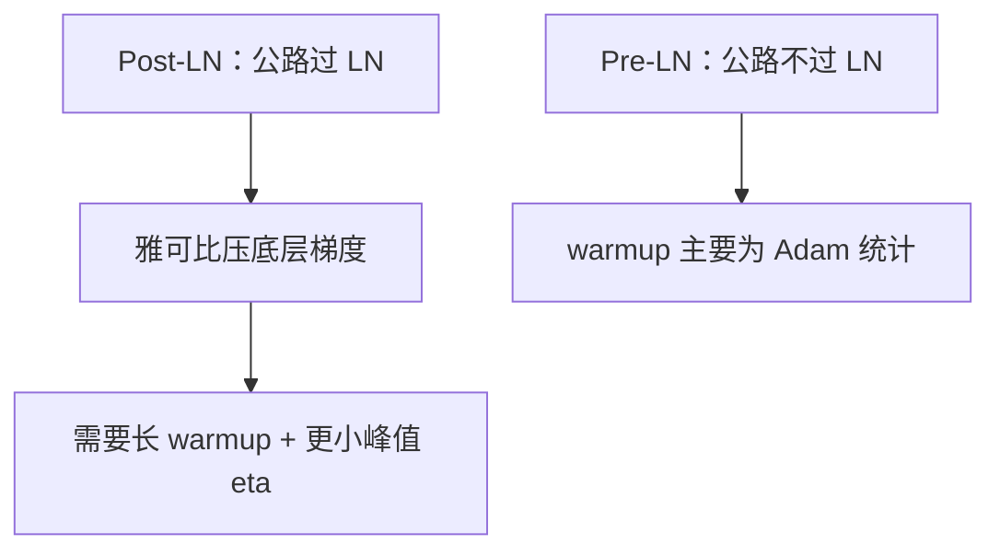

# Post-LN 预热

LayerNorm 放在残差加法之后，初始化附近的雅可比会压低深层到嵌入的通路；没有足够长的学习率预热，深 Post-LN 常常根本走不进幂律段。

<footer>—— Xiong et al., On Layer Normalization in the Transformer Architecture, 2020</footer>

[上一课](/llm/activation-scale-drift)说明 Pre-LN 的病是总线 RMS 涨。缺口是另一侧：主干 [Pre-LN 与 Post-LN](/llm/pre-ln-post-ln) 已经给出两种写法和梯度公路，本课不重推公式。当代默认 Pre-LN 之后，仍会遇到要复现原版 Transformer、或在浅网上追求 Post-LN 表示的情况。Xiong 等人指出：Post-LN 对 **warmup** 的依赖远强于 Pre-LN。稳定性单元把这件事从「LN 位置」里拆出来，专讲预热为何是 Post-LN 的生存条件。

## 问题

Post-LN：$x_{l+1}=\mathrm{LN}(x_l+F(x_l))$。恒等路径经过 LN。初始化时 $F$ 不小，LN 在残差与输入之间重新分配尺度，靠近嵌入的层分到的梯度过小。学习率一开始就处在峰值，底层几乎不更新、顶层先动，随后底层在错误的顶层特征下补课，容易炸或长期平台。Warmup 把 $\eta$ 从近 0 拉到峰值，给底层梯度一个「先小步对齐」的窗口。Xiong 等人的实验：同样深度，Post-LN 去掉 warmup 更易失败，Pre-LN 对 warmup 短得多仍可训。

这与 [深度缩放初始化](/llm/depth-scaled-init) 互补：Fixup / DeepNorm 改的是 $F$ 的起步幅度，warmup 改的是时间轴上的 $\eta$。Post-LN 两者都更饿。只加长 warmup 而不缩小 $F$，深层仍可能在 warmup 结束后立刻不稳；只做 Fixup 而 $\eta$ 第一步就全开，同样危险。

warmup 步数应按 token 还是按 step 声明，与主干 [学习率日程](/llm/lr-schedule) 一致。Post-LN 需要的是**足够的数据量**让底层统计稳定，不是「固定 2000 step」——大 batch 下同样 step 更少噪声，有时反而要更长 warmup（Goyal 的大 batch 规则）。

## 方法

若必须 Post-LN：

1. warmup 显著长于同深度 Pre-LN 配方，并在触顶率、底层分层梯度上验收：warmup 结束前底层范数不应长期近 0。
2. 峰值 $\eta$ 更保守。Xiong 的观察是 Pre-LN 允许更大 $\eta$；把 Pre-LN 的 $\eta$ 贴到 Post-LN 上是常见炸因。
3. 与深度缩放或 Admin 一类对 LN 的初始化修正一起用，不要指望单靠日程。

若已经 Pre-LN：不要因为「论文都写 warmup」就复制一套为 Post-LN 设计的超长预热。过长 warmup 浪费峰值学习的 token，Chinchilla 预算下这是真金。Pre-LN 的 warmup 主要服务 Adam 的二阶矩估计与大 $\eta$，不是 LN 雅可比。

日程形状（线性 warmup + 余弦 / WSD）仍按主干；本课只改**长度与峰值**对 LN 位置的依赖。

## 机制

LN 的雅可比在输入偏离单位尺度时把残差通路缩小。Post-LN 每层做一次，深度方向连乘。Warmup 期间 $\eta$ 小，顶层不能把表示拉得太偏，底层才有机会在梯度尚未被压扁到零之前更新。Pre-LN 的主干不经过 LN，连乘不发生在公路上，warmup 不再承担「救公路」的任务。

这解释了为何浅 Post-LN（6–12 层翻译模型）可以很短甚至没有 warmup 仍成功，而深 Post-LN 不行：连乘因子随 $L$ 指数变差。把 12 层翻译配方的 warmup 抄到 96 层解码器上，数量级不够。

## 边界

本课不主张回到 Post-LN 当大模型默认。只在你明确选择 Post-LN 时，把 warmup 写成稳定性约束。Hybrid / Sandwich LN 等变体对 warmup 的需求介于两者之间，应单独测底层梯度，不要线性插值步数当定理。

复现 2017 年原版翻译配方时，把当代 Pre-LN 大模型的短 warmup 贴回去，是最常见的「论文说可以训」却训崩的原因。下一课进入优化器内部：Adam 的 $\varepsilon$ 如何在已经「看起来稳」的网络上改写更新尺度。

## 小结

- Post-LN 的恒等路径经过 LN，深层初始化附近底层梯度被压；warmup 是生存条件。
- 同深度下 Post-LN 的峰值 $\eta$ 应小于 Pre-LN；长度按 token 声明，随 $L$ 加。
- 深度缩放与 warmup 互补，不能互相替代。
- Pre-LN 大模型不要照抄为 Post-LN 设计的超长预热。
- 出处：Xiong et al., 2020；日程背景见 Goyal 等大 batch warmup。
