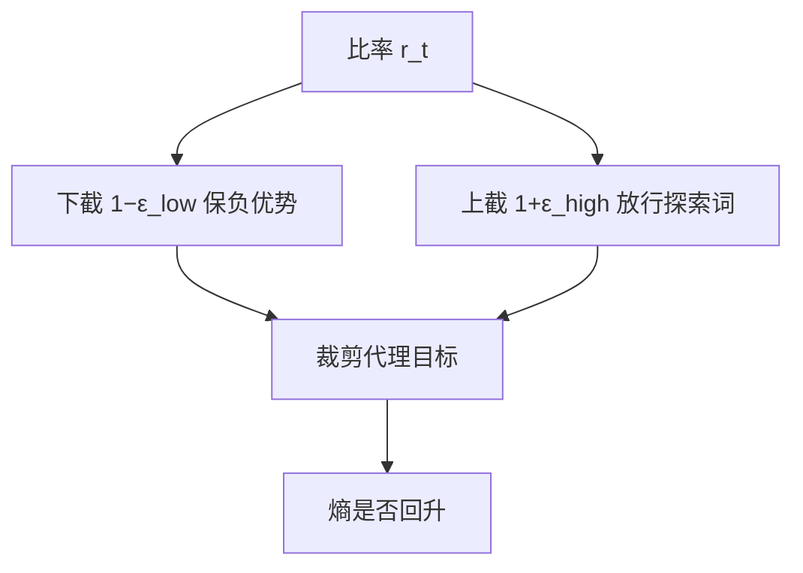

# clip 与 clip-higher

对称 ε 把低概率探索词的涨幅卡死；把上截单独抬高，熵才有地方回来。

<footer>—— Schulman 等 PPO 的近端裁剪；Yu 等 DAPO 把上下 ε 拆开</footer>

[上一课](/llm/gae-lambda)给出 $\hat A_t$。PPO 用比率 $r_t(\theta)=\pi_\theta/\pi_{\mathrm{old}}$ 乘优势，再裁剪。缺口是：**对称 $\varepsilon$ 对「抬低概率 token」过紧、对「压高概率 token」相对松，长链上熵塌。** 本课写 clip 的不对称，不重导 clip 公式——公式见 [PPO](/llm/ppo-llm)。DAPO 的 Clip-Higher 是本课的主工程结论。

## 问题

裁剪的非对称作用上一课单元已经用过：正优势时阻止 $r_t$ 过大，负优势时阻止 $r_t$ 过小。$\varepsilon=0.2$ 时，概率 $0.01$ 的词最多升到约 $0.012$，而本来就很大的词几乎不受上界限制。推理 RL 需要把罕见但高优势的分叉词（「等等」「换一种证法」）抬起来；上截过紧，探索死，组内回复互为复制。[GRPO](/llm/grpo) 沿用同一 clip，问题一样。

Yu 等人把上截改成 $1+\varepsilon_{\mathrm{high}}$、下截保持 $1-\varepsilon_{\mathrm{low}}$，$\varepsilon_{\mathrm{low}}=0.2$、$\varepsilon_{\mathrm{high}}=0.28$。再放大下截会把 token 概率压穿，采样空间崩。只改上截是为了放行正优势的探索词。

### 不要把 0.28 当成新物理常数

DAPO 的数是在 Qwen2.5-32B + 数学规则奖励上扫出来的。换模型、换长度、换 [GSPO](/llm/gspo) 的序列比率，量纲都变。本课要的是「上下截分开扫」，不是抄 0.28。

梯度裁剪（grad clip）与比率 clip 不是一件事。前者管更新范数，后者管信任域。两件都要。

## 方法

目标仍是 PPO / GRPO 的 $\min(r_t\hat A, \mathrm{clip}(r_t,1-\varepsilon_{\mathrm{low}},1+\varepsilon_{\mathrm{high}})\hat A)$，只是两个 $\varepsilon$ 独立。监控：被上截命中的正优势 token 比例、熵、组内独特率。上截命中接近 0，说明 $\varepsilon_{\mathrm{high}}$ 太松或没有探索；命中接近 1，说明步长相对 $\varepsilon$ 过大。DAPO 消融：朴素 GRPO 之后加上 Clip-Higher，AIME 从过滤后的 36 到 38，幅度小于动态采样，但对熵曲线关键。

MiniMax-M1 后来认为大量 off-policy 轮次里 Clip-Higher 仍会丢掉分叉词，改 clip 重要性采样权重。那是后课截断 IS 的接口。本课范围：on-policy 近端目标里的不对称 $\varepsilon$。

## 机制

正优势 + 低 $\pi_{\mathrm{old}}$ 的 token，是「值得变常见的罕见动作」。对称上截把这条通道几乎关掉，策略只能微调已经常见的词，熵下降。抬上截等于扩大正向信任域、保持负向信任域，避免一边放探索一边把旧高概率词删光。熵回升后，[GRPO](/llm/grpo) 的组内方差才回来，相对优势才有信号——与动态采样互补。

$\varepsilon_{\mathrm{high}}-\varepsilon_{\mathrm{low}}$ 不是学习率。学习率过大时，未裁剪侧一步就冲出区间，clip 只是更频繁地截断，有效更新变稀。

## 边界与工程取舍

偏好 RM 上优势噪声大，抬上截可能放大 RM 抖动，过优化更快。可验证 0/1 是 Clip-Higher 的主场。[无 KL 的 RL](/llm/kl-free-rl) 更依赖这条探索通道，因为没有参考分布把策略拉回。价值函数与 GAE 不因 clip 改变定义。下一课才谈 critic 从哪初始化。序列级比率（GSPO）的 $\varepsilon$ 量纲不同，禁止把 0.28 抄过去。

上截与下截要分开记进配置，并与熵曲线同图；只改一个 ε 达不到 DAPO 消融里的那一截增益。

## 小结

- 对称 ε 卡死低概率词的正向涨幅，长链熵塌。
- Clip-Higher 拆开上下截：上截松、下截紧，放行探索、防止压穿。
- 具体数字要扫；序列级比率不要抄 token 级 ε。
- 与动态采样、熵监控一起看，不要单改一个 ε。
- 出处：Schulman 等 PPO, 2017；Yu 等 DAPO；对照 MiniMax-M1 / GSPO 的后续改法。
