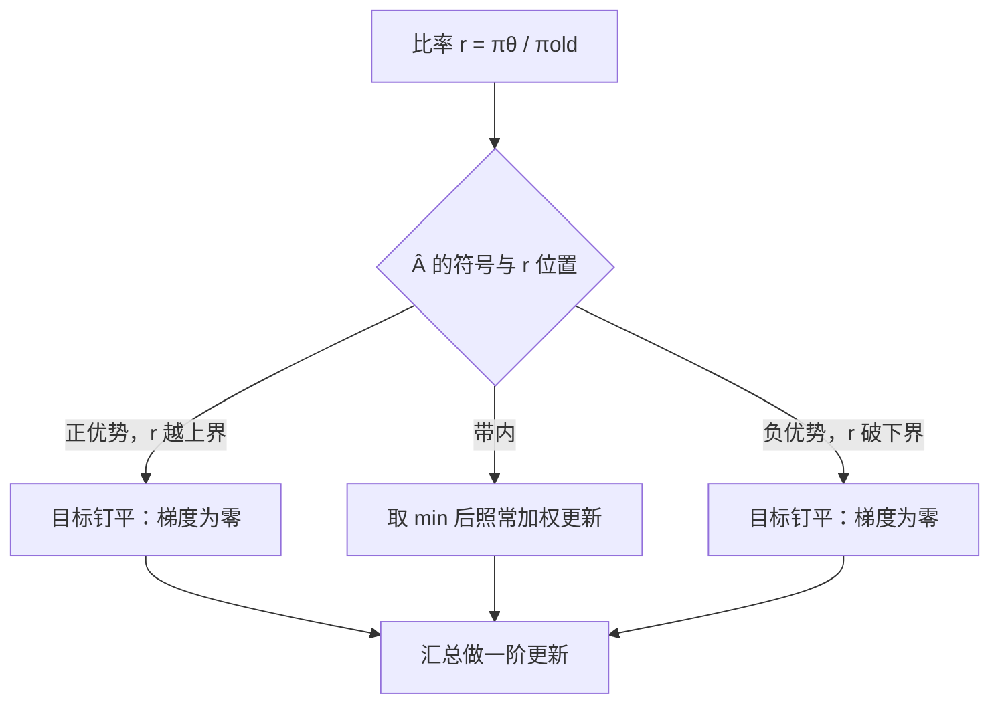
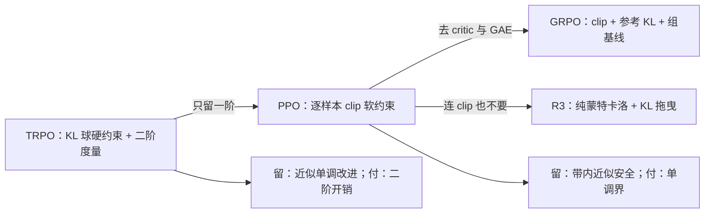

# PPO 的信任域重读

PPO 把「别走太远」从二阶约束改成一条一阶裁剪：比率出带即停发梯度——信任域的承诺打了折，工程账却好算得多。

<footer>—— 据 Schulman et al., Proximal Policy Optimization Algorithms, 2017 及其在 LLM 后训练的工程化整理</footer>

[上一课](/llm/trust-region-monotone)把单调改进折成 KL 约束下的代理最大化，代价是共轭梯度、Fisher-向量积与线搜索。千亿参数、每步 rollout 以万 token 计的 LLM 场景里，这份二阶开销要求把信任域再做一次降维：只留一阶。本课用信任域语言重读 PPO 的 clip——裁剪比率是逐样本的近似信赖域——并与 [REINFORCE / R3](/llm/reinforce-llm)、[GRPO](/llm/grpo) 对位：GRPO 保留裁剪、去掉价值函数，是无 critic 的折中。PPO 在 LLM 里的实现细节见 [PPO](/llm/ppo-llm) 一课，此处不重复。至此本单元把定理、方差、基线、自举、信任域走完；下一单元把长期后果整个拿掉，从上下文 bandit 这个最小案例重新审视后训练——那是收束单元的第一课。

## 问题

TRPO 的一阶目标配上二阶度量，慢在两处：共轭梯度每步多几次反向传播，线搜索要反复评估代理目标。而 LLM 训练另有动机想「走得远一点」：一批昂贵的 rollout 想用好几个 epoch 的 minibatch 更新，$\pi_\theta$ 相对采样策略 $\pi_{\mathrm{old}}$ 的偏离随更新累积，重要性比率迅速失控——不设防的多轮复用等于在错误的分布上做梯度上升。需要一个机制：允许多次小更新，同时每个样本上的偏离有硬上限，且全程一阶。

## 方法

记逐 token 比率 $r_t(\theta)=\pi_\theta(a_t\mid s_t)/\pi_{\mathrm{old}}(a_t\mid s_t)$，PPO 的裁剪目标是

比率可以读成「新策略比旧策略更爱这个动作几倍」：$r_t=1$ 表示没变，$r_t=1.5$ 表示概率被抬高了 50%。多 epoch 复用同一批数据，本质就是监控这个倍数别离 1 太远。

$$
L^{\mathrm{CLIP}}(\theta)=\mathbb{E}\bigl[\min\bigl(r_t\hat A_t,\ \mathrm{clip}(r_t,1-\epsilon,1+\epsilon)\hat A_t\bigr)\bigr],\quad \epsilon\approx 0.2.
$$

按 $\hat A_t$ 的符号读：$\hat A_t\gt 0$ 且 $r_t\gt 1+\epsilon$ 时，目标被钉在 $(1+\epsilon)\hat A_t$，梯度归零——不再奖励继续抬高；$\hat A_t\lt 0$ 且 $r_t\lt 1-\epsilon$ 时同理。带内照常更新，带外停发。原论文另给 KL 惩罚变体，工程上常以「KL 到 $\pi_{\mathrm{old}}$ 超标即早停」的形式保留一角。

裁剪没有拉回力：比率越界后目标对该样本的梯度恰为零，既不奖励继续越界，也不把它推回带内——推回的力来自别的样本或 KL 早停。诊断要看 clip fraction：长期大面积顶格，说明 $\epsilon$ 名存实亡，学习率该降了。

## 机制

与上一课的硬约束对读：KL 球是全局的、二阶度量的，且带单调界；clip 是逐样本的、一阶的、乘性的，没有改进保证。它约束的是「单个样本的优势不被无限放大」，悲观化的 $\min$ 让裁剪只在「会进一步推高性能估计」的方向生效——反方向（把已采到的概率压回去）不受限，所以它是不对称的信赖域。这个保证更弱，换来的是：无需 Fisher、无需线搜索，一阶优化器直接跑，多 epoch 复用在比率带内近似安全。GRPO 的位置在此看得最清楚：保留 clip 与参考 KL（信任域那半），去掉 critic 与 GAE（自举那半），组基线补位——是在同一张蓝图上按 LLM 的显存与生成预算重划的取舍。[REINFORCE / R3](/llm/reinforce-llm) 那条纯蒙特卡洛路线则连裁剪都不留，靠参考 KL 的拖曳防崩。

$\min$ 的直觉：在两个「这个样本值多少」的说法里挑悲观的那个。好处是不给「继续吹大优势」的方向发梯度——宁可不赚这笔，也不信夸大的账。

从二阶硬约束到一阶软约束的降档路径，每一步各留什么、扔什么：

## 边界

信任域语言的三个警告。其一，clip 不惩罚越界只停发梯度：比率可以一路贴边走远，KL 早停是补丁不是定理。其二，$\epsilon=0.2$ 来自连续控制的实验默认，LLM 实现里它与 KL 目标、minibatch 数耦合，跨栈迁移要重调。其三，整套论证假设优势 $\hat A_t$ 是在 $\pi_{\mathrm{old}}$ 下估的——GAE 的 critic 滞后、组基线的偏差都会让「带内」也不安全，裁剪不修优势估计的错。多 epoch 更新时监控三件：clip fraction、对 $\pi_{\mathrm{old}}$ 的逐 minibatch KL、比率分布的漂移。把长期后果拿掉之后这套机制还剩多少，是下一单元上下文 bandit 要回答的问题。

为什么盯 clip fraction：若三成以上的样本长期顶格，说明学习率或 $\epsilon$ 已经失配——大部分样本不发梯度，等效批量在缩水，训练看着在跑，其实没学多少东西。

## 小结

- clip = 逐样本的乘性信赖域：比率出带即停发梯度，全程一阶、无 Fisher、无线搜索。
- $\min$ 的悲观化使裁剪不对称：只挡「进一步放大优势」，不挡回撤。
- 保证弱于 TRPO（无单调界），换来多 epoch 复用与 LLM 规模的可跑性。
- GRPO = 保留裁剪与参考 KL、去掉 critic 的折中；R3 连裁剪也不留，靠 KL 拖曳。
- 监控 clip fraction 与逐 minibatch KL；优势估计的误差不被裁剪修复。
- 出处：Schulman et al., *Proximal Policy Optimization Algorithms*, 2017；Schulman et al., TRPO, 2015；Shao et al., DeepSeekMath, 2024。
