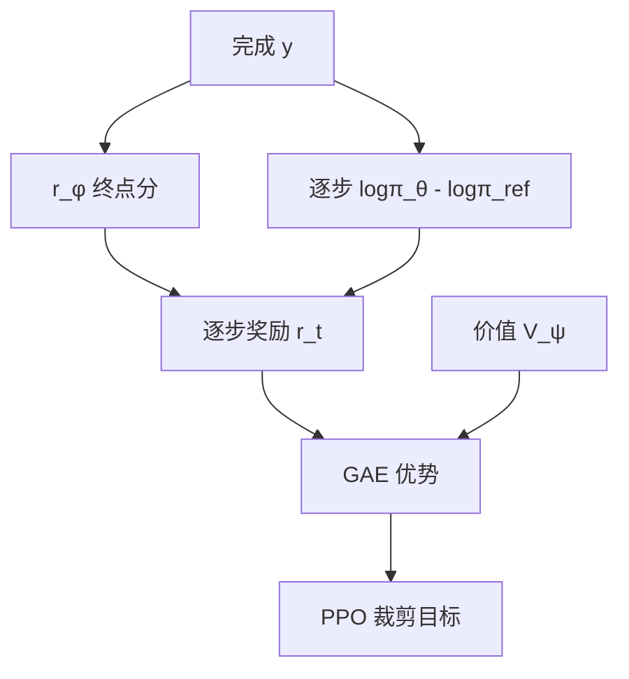

# KL 惩罚与价值函数

奖励模型只在参考策略附近被比较数据校准；KL 把更新拴在这片邻域，价值函数则把稀疏的终点分摊回每一个 token。

<footer>—— 接到 Schulman 的 PPO / GAE；Ouyang 等人把逐步 KL 写进语言模型的奖励</footer>

经典 RLHF 的第三段有两个常被揉成「PPO 超参」的零件，其实分工不同。KL 惩罚约束的是新策略相对冻结参考 $\pi_{\mathrm{ref}}$（通常是 SFT）的偏移，防止策略为了抬 RM 分数跑出校准区。价值函数 $V_\psi$ 估计从当前前缀出发的期望回报，用来构造优势、给 [PPO](/llm/ppo-llm) 降方差。没有 KL，奖励黑客来得很快；没有可用的 $V$，长序列上的策略梯度接近只改最后一个标点。本篇把这两项从流水线叙述里拆出来。

## 问题

RM 的训练分布是「SFT 或早期策略写出的成对回答」。策略一旦学会 RM 没见过的句式——无限重复恭维、堆砌安全套话、长度膨胀——$r_\phi$ 仍可能给出高分，人类不会同意。Christiano 与 Ouyang 的框架用对参考策略的 KL 作为隐式正则：只在 $\pi_{\mathrm{ref}}$ 仍有质量的地方允许上升。这不是因为 SFT 已经完美，而是因为离开它之后 RM 的数字不再可信。

另一方面，自然语言轨迹很长，RM 往往只在 EOS 给一个标量。若每步优势都等于「整段分 − 基线」，中间 token 的信用分配全靠运气。需要一个能看前缀的基线，把「后面大概还能拿多少分」减掉，剩下才是这个 token 的增量贡献。这就是 critic。

### KL 有两种写法，不要双计

逐步奖励塑造：

$$
r_t = -\beta \log\frac{\pi_\theta(a_t\mid s_t)}{\pi_{\mathrm{ref}}(a_t\mid s_t)},\qquad r_T \mathrel{+}= r_\phi(x,y)
$$

序列级则在终点减 $\beta\,\mathrm{KL}(\pi_\theta\|\pi_{\mathrm{ref}})$ 的估计。也可以把 KL 留在损失里、不进 $r$。Ouyang 等人采用奖励侧的逐步 KL，使优势与 GAE 直接看见「离参考有多远」。若奖励里已经减了 KL，损失里再加同一 β，等效惩罚翻倍，曲线好看但不可比。自适应 β（目标 KL 过大则加大惩罚）是工程，不是原文的一条定律。

这里的 KL 是训练期相对 SFT 参考，不是用户推理时的采样温度，也不是蒸馏温度。三者都叫「离分布的远近」，配置项必须分开。

## 方法

参考模型冻结，与策略同结构、同模板，对同一 $y$ 算 $\log\pi_{\mathrm{ref}}(a_t\mid s_t)$。β 把 RM 的量纲和以 nat 计的 KL 接到同一加减法里；RM 分数若未标准化，β 没有可移植的默认值。实现上常对 RM 分数做 batch 内平移或缩放，再选 β，使初始 KL 项与奖励项量级相当。

价值头 $V_\psi(s_t)$ 吃与策略共享或独立的隐状态，输出标量。训练目标是拟合回报（或 GAE 的 $\lambda$-回报）。Schulman 等人的 GAE 用

$$
\hat A_t = \sum_{l=0}^{T-t}(\gamma\lambda)^l \delta_{t+l},\qquad \delta_t = r_t + \gamma V(s_{t+1}) - V(s_t)
$$

在 LLM 里折扣 $\gamma$ 常取 1 或非常接近 1，因为没有「物理时间」上的远近，只有 token 次序。$\lambda$ 在偏差—方差之间插值：$\lambda=1$ 更接近蒙特卡洛，$\lambda$ 小则更信 critic。优势在 batch 内标准化几乎是默认，否则 RM 漂移会让 $\hat A$ 的尺度每个迭代都变。

### 价值函数拟合的是哪一种回报

若 $r_t$ 已含 KL，$V$ 拟合的是「RM 减 KL 之后」的期望；策略与 critic 看到同一奖励定义，一致。若 KL 只在策略损失里，$V$ 仍拟合纯 RM 回报，优势与真正优化目标错位，稳定会变差。应在代码里把奖励定义打印成一条不可变协议。终止态的 $V(s_{T+1})=0$，EOS 之后不要继续 bootstrap。对 padding 与截断序列，bootstrap 规则要单独写：截断不是环境终止，用 $V$ 补尾；真正 EOS 才是终止。

## 机制

KL 项改变最优策略：$\pi^\star \propto \pi_{\mathrm{ref}} \exp(r_\phi/\beta)$ 一类指数倾斜（在适当的正则与温度解释下）。β 大，最优靠近 SFT，RM 的峰值用不上；β 小，最优靠近 RM 的 argmax，黑客句式出现。这是可控的偏置，不是噪声。监控应同时看 RM 分、KL、以及 SFT 锚上的回归任务，只看奖励必然选到黑客。

价值函数的机制是减方差：$\hat A_t \approx Q(s_t,a_t)-V(s_t)$，同前缀上比较「这个 token 比平均好多少」。LLM 的 $V$ 很难真的准：奖励稀疏、语言多变、RM 还在被策略分布慢慢带偏。不准的 $V$ 会系统性地把某类前缀判成高价值，策略学会进入这些前缀而不是真的提高答案质量。[Actor-critic 稳定性](/llm/ac-stability) 的主因往往在这里，而不在 clip 的 ε。

白化优势能压住尺度，也会抹掉 batch 之间真实的奖励平移。若某个迭代全是低分样本，标准化仍制造出一半正优势，策略会在垃圾堆里相对地「变好」。需要结合绝对 RM 分做门控或丢弃整批。

## 边界与工程取舍

### 砍掉 critic 时，KL 仍在

[GRPO](/llm/grpo) 与 [RLOO](/llm/rloo) 用组内基线代替 $V_\psi$，不再训价值头，但不自动取消对 $\pi_{\mathrm{ref}}$ 的 KL。无 critic 只解决显存与价值过拟合，不解决 RM 外推。可验证奖励（对错）没有 RM 黑客那种句式漏洞，但仍能用 KL 防止策略把提示复读成乱码换长度。是否加 KL，要看奖励是否只在参考邻域有定义。

价值头与策略共享主干时，价值损失的系数过大，表征被「拟合当前 RM」占据，SFT 得来的指令能力回退。分设学习率、停掉价值对主干的梯度、或晚一点再开 critic，都是工程补丁。独立 critic 更稳、更贵。没有免费的准确 $V$。

不要用「平均 KL」代替逐样本诊断。少数提示上 KL 爆炸、多数近零，平均值看起来健康。应按分位数报 KL，并对爆炸提示停更或降 β。

## 小结

- KL 惩罚把策略拴在 RM 已被校准的参考邻域；可进奖励或进损失，只能选一种计数。
- 价值函数为逐步优势提供基线，GAE 把终点 RM 分摊回 token。
- 奖励定义必须与 $V$ 拟合目标一致；截断与 EOS 的 bootstrap 规则要写死。
- 不准的 critic 会制造虚假高价值前缀；后续无 critic 方法改的是基线，不是放弃 KL 的理由。
- 出处：Schulman et al., PPO, 2017；GAE, ICLR 2016；语言模型中的逐步 KL 见 Ouyang et al., NeurIPS 2022。
