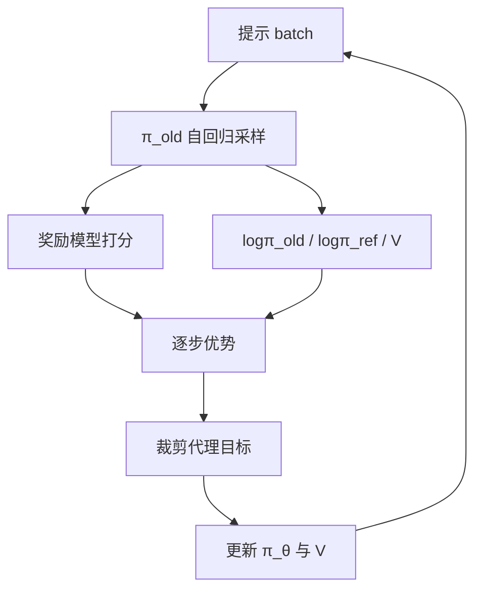

# PPO 在语言模型中的实现

把一次作答看成一条轨迹：状态是已写出的前缀，动作是下一个 token，近端裁剪限制新策略相对旧策略的逐步概率比。

<footer>—— Schulman et al., Proximal Policy Optimization Algorithms, 2017；接到 Ouyang 等人的指令模型</footer>

Schulman 等人的 PPO 用裁剪后的重要性比率，把策略更新限制在旧策略的近端邻域，避免 TRPO 的二次规划，同时保留「不要一步走太远」的精神。Ouyang 等人把它接到语言模型上：对每个提示采样一条（或一批）完成，按 token 计算新旧策略的对数概率比，用奖励模型与 KL 构成回报，再在若干 epoch 内对这批轨迹做 minibatch 更新。公式与连续控制相同，实现却被自回归、稀疏奖励、四模型常驻改写。本篇写这一接到 LLM 上的实现，不重写 [整条 RLHF 流水线](/llm/rlhf-pipeline)。

## 问题

语言模型的策略 $\pi_\theta(a_t\mid s_t)$ 里，$s_t=(x,y_{<t})$，$a_t=y_t$，轨迹在 EOS 或最大长度结束。动作空间是整张词表，地平线是数百到数千步，奖励往往只在终点由 RM 给出。朴素策略梯度方差极大；每步都对 $\pi_\theta$ 做大更新，采样分布转眼过期，重要性权重爆炸。PPO 要在「用掉这批 rollout 多一点」和「不要离采样策略太远」之间给一个可一阶优化的代理目标。

与控制环境不同，LLM 没有便宜的模拟器重置：每条轨迹都是一次昂贵的自回归生成，还要同时跑参考模型、奖励模型、价值模型。实现的核心约束是：**on-policy 生成次数尽量少，每次生成要被近端目标用够，但不能用到比率失效。**

### 动作是 token，不是整段话

有人把整段 $y$ 当成一个动作，用序列对数概率做一次比率。那会让长度不同的样本权重不可比，也失去逐步 KL 与逐步优势。主流实现把每个 token 当一步，序列奖励再分配到 token 上（终点奖励加逐步 KL 惩罚）。两种写法的梯度支撑不同，超参不能互抄。InstructGPT 一类工作按 token 处理；写配置时必须写明。

「PPO epoch」指对同一批冻结轨迹反复做梯度步，不是再生成一轮。epoch 太多，比率 $\pi_\theta/\pi_{\mathrm{old}}$ 离开裁剪区间，代理目标失效，等于在过期数据上硬更新。宁可少 epoch、再采样，也不要无限制复用。

## 方法

一次迭代大致为：用当前策略（记为 $\pi_{\mathrm{old}}$）对一批提示生成 $y$；计算每个 token 的 $\log\pi_{\mathrm{old}}$、$\log\pi_{\mathrm{ref}}$、价值 $V_\psi$、以及序列奖励；构造逐步优势 $\hat A_t$（常配合 GAE）；然后最大化

$$
L^{\mathrm{CLIP}}(\theta)=\mathbb{E}_t\left[\min\bigl(r_t(\theta)\hat A_t,\, \mathrm{clip}(r_t(\theta),1-\epsilon,1+\epsilon)\hat A_t\bigr)\right]
$$

其中 $r_t(\theta)=\pi_\theta(a_t\mid s_t)/\pi_{\mathrm{old}}(a_t\mid s_t)$。价值头另有回归损失，熵或 KL 可进奖励也可进损失，见 [KL 惩罚与价值函数](/llm/ppo-kl-value)。参考模型冻结，只提供 $\log\pi_{\mathrm{ref}}$，不反传。

生成必须用与训练一致的聊天模板、停止规则与长度上限。padding 位要从损失里 mask 掉，否则 pad token 的比率会污染均值。半精度下对数概率应在足够精度里算，避免比率全是噪声。

### 与生成引擎的接口

训练框架要能对同一批序列分别以 $\pi_\theta$、$\pi_{\mathrm{old}}$、$\pi_{\mathrm{ref}}$ 算逐 token 对数概率。$\pi_{\mathrm{old}}$ 可在生成时缓存；更新若干步后 $\pi_\theta$ 已变，必须重新前向，不能沿用生成时的缓存当 $\pi_\theta$。RM 往往只在完整序列上跑一次，把标量广播到最后一个 token，或均摊，协议要固定。策略与 RM 模板不一致时，奖励打的是「另一个模型会看到的字符串」，PPO 会优化一个错的对象。

批大小有两层：生成时的 prompt batch，以及 PPO 更新时把轨迹按 token 打乱的 minibatch。后者决定方差与 critic 过拟合速度。长完成会让 token 数极不均匀，必须按有效 token 加权，而不是按条数平均。

## 机制

裁剪的作用是：当 $\hat A_t>0$ 时，阻止 $r_t$ 过大（不要把已经变好的动作再无限抬高）；当 $\hat A_t<0$ 时，阻止 $r_t$ 过小（不要把坏动作的概率削穿）。未被裁剪的一侧仍可沿优势下降或上升。这是一阶、可与 Adam 一起用的近端近似，不是硬约束。$\epsilon$ 太小，有效更新稀；太大，退化为未裁剪的重要性采样。

语言模型里正优势高度集中在少数「RM 很喜欢」的轨迹，负优势在长而空的拒绝或胡言上。若不做优势归一化，少数长样本会主导一步。GAE 把终点奖励沿价值函数往回传，让中间 token 也有非零 $\hat A_t$，否则前几百个 token 的梯度接近零，模型只改结尾套话。

KL 可以写进奖励（逐步减 $\beta\log(\pi_\theta/\pi_{\mathrm{ref}})$），使优势已经含「不要离 SFT 太远」；也可以在损失里另加 KL 项。两种不要叠成未声明的双倍 β。InstructGPT 把 KL 放进奖励一侧。

## 边界与工程取舍

### 四模型常驻是默认成本

策略、参考、RM、critic 在大模型上意味着显存与流水线气泡。参考与 RM 可冻结、可量化、可放到推理卡，但对数概率必须与训练精度对齐，否则比率系统性地偏。critic 与策略共享主干、只分头，能省一份权重，却让价值损失干扰表征，稳定性见专文。这正是 GRPO 一类方法改用组内基线的动机：不是 PPO 公式错了，是 LLM 上的 critic 太贵、太噪。

超参与解码纠缠。温度、top-$p$、重复惩罚会改变 rollout 分布，等于改了「环境」。训练期解码应固定并写入实验记录。评测若换一套采样，曲线与线上不会对上。PPO 不能修复 RM 的偏差，只能更有效地榨干 RM；奖励黑客看起来像「PPO 很成功」。

不要把 PPO 的 clip 和梯度裁剪混为一谈。前者裁的是概率比，后者裁的是梯度范数。两件都要，解决的不是同一件事。

## 小结

- LLM 上的 PPO 把 token 当动作、完成当轨迹，用裁剪重要性比率做近端更新。
- 一次迭代是：当前策略生成、算优势、对冻结轨迹做有限 epoch 的 clip 目标。
- 实现要点：mask、模板一致、对数概率精度、按 token 而非按条平均。
- 成本来自在线生成与四模型前向；critic 与 KL 的细节决定稳不稳。
- 出处：Schulman et al., *Proximal Policy Optimization Algorithms*, 2017；语言模型流程见 Ouyang et al., NeurIPS 2022。
