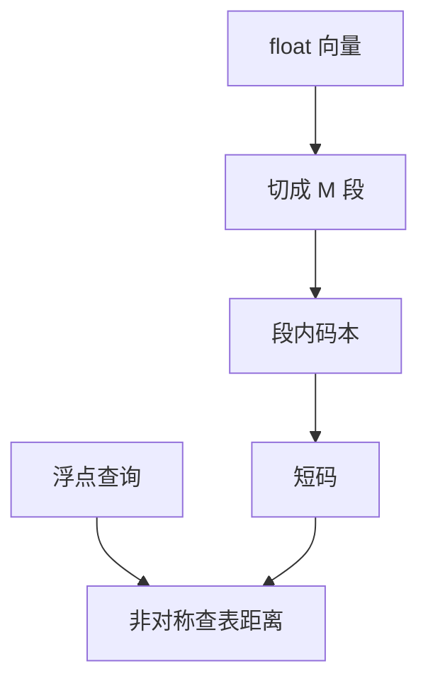

# PQ 向量索引

把向量切成子段，每段用小码本表示，内存按字节计而不是按浮点计。近似近邻的误差里，有一部分来自量化而不是来自图。

<footer>—— Jégou, Douze, Schmid, Product Quantization</footer>

[上一课](/llm/hnsw-ivf)用图或列表缩小扫描范围，向量仍常是 float32。十亿级库会先爆内存。Jégou 等人的乘积量化（Product Quantization, PQ）把向量分成 $M$ 段，每段量化到码本下标，距离用查表近似。缺口是量化误差进检索。后课 RAG 对微调默认：索引可以很省，但过时知识不一定该靠更密的码本解决。

## 问题

PQ 存 $M$ 个 uint8（或更短）代替 $d$ 个 float。非对称距离：查询保持浮点，文档用码字，避免查询也被量化毁几何。IVF+PQ 是常见组合：先 IVF 缩小列表，列表内用 PQ 距离。误差：码本对数据分布失配、段切分切坏相关维、$M$ 太小。难负例附近的近邻差会被量化抹平，细粒度检索先坏。

与 Matryoshka 不同：MRL 是训练时排维；PQ 是推理时有损编码。二者可叠：先截维再 PQ。

重建向量再算精确距离只对短候选列表可行。重排应用未量化向量或更高精度残差（OPQ / 残差量化）。

## 方法

训练码本：在文档向量上 k-means（或 OPQ 先旋转）。索引卡写：$M$、每段比特、是否 OPQ、是否 IVF。评测：同一查询集上 float 精确 vs PQ 的 Recall 差，按延迟分层。RAG 最终 $k$ 很小时应对 PQ 候选用精确向量重排，把量化留在召回段。

## 机制

段内 k-means 把局部空间换成最近码心。乘积结构假设段近似独立；相关维被切开则码本浪费。OPQ 学旋转，让段更独立。距离查表是码心与查询子段的预计算点积/欧氏，加速来自不碰原向量。误差在决策边界上被放大——正是难查询切片。

## 边界

PQ 不加密、不防投毒，只压缩。下一课把「知识放索引还是放权重」写成 RAG 对微调。再下一课投毒：压缩后的索引同样会被污染文档击中。

## 小结

- PQ 用子空间码本换内存，误差要单独报 Recall 差。
- 查询侧保持浮点；最终短列表用精确重排。
- 与 IVF、MRL 可叠加，职责不同。
- 出处：Jégou, Douze, Schmid 乘积量化。
