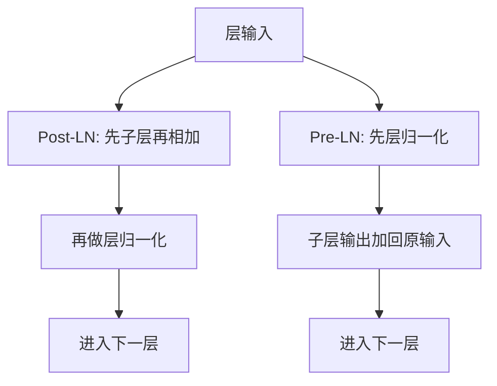

# Pre-LN 与 Post-LN

把层归一化移到残差分支之前，深层 Transformer 更好训；放在残差之后，表示可以更强，但深网容易炸。

<footer>—— Xiong 等，On Layer Normalization in the Transformer Architecture，2020</footer>

原版 Transformer 把 LayerNorm 放在残差加法之后，称为 Post-LN。GPT-2 之后的绝大多数解码器把 LayerNorm 放在注意力与前馈之前，残差在未归一化的主干上相加，称为 Pre-LN。Xiong 等人 2020 年的分析指出：这不是风格差异，而是梯度尺度与初始化下的稳定性差异。现代大模型几乎一边倒选 Pre-LN，并不等于 Post-LN 的表示更差；而是在几百层、大学习率、少 warmup 的约束下，Pre-LN 能先把损失拉下来。

## 问题

记子层为 $F$（注意力或 FFN）。Post-LN 写

$$
x_{l+1} = \mathrm{LN}\bigl(x_l + F(x_l)\bigr)
$$

Pre-LN 写

$$
x_{l+1} = x_l + F\bigl(\mathrm{LN}(x_l)\bigr)
$$

Post-LN 里，主干上的每个 token 每层都被重新拉回单位尺度，输出进入下一层前已经归一。直觉上很干净。深层时却出现梯度在残差与归一化之间的病态：初始化附近，$F$ 的输出相对 $x_l$ 并不小，LN 的雅可比把残差通路压扁，靠近嵌入的层分到的梯度过小，必须靠精心 warmup 与小学习率才能过临界点。

Pre-LN 的主干是纯残差求和，梯度有一条不经过 $F$、也不经过 LN 的高速公路，深层也能把信号送回底层。问题于是成为：为了这条公路，我们付出什么？最后一层的尺度不再被 LN 钉死，输出进入线性分类头前往往还要再做一次归一化；而且有人观察到，同样训得收敛时，Post-LN 的最终质量可以更好——只是深了以后它常常根本训不成。稳定性与上限不是同一指标。Pre-LN 降低的是「训崩」的概率；Post-LN 在浅网、充分 warmup 时仍可能给出更干净的层输出。大模型选 Pre-LN，首先是因为深度与批量已经不允许碰运气。

## 方法

Xiong 等人用理论与消融固定其余结构，只交换 LN 位置。他们观察：Post-LN 在深层初始化时梯度范数随深度衰减更剧；Pre-LN 的梯度沿残差几乎不衰减。对应的训练处方是：Post-LN 更依赖学习率 warmup，Pre-LN 可以更大学习率、更短甚至省略 warmup。

工程实现上二者都只需改残差块里三行：LN 作用在 $x$ 上还是作用在 $x+F(x)$ 上。Pre-LN 解码器通常在最后一层后再加一个 LN，以免未归一的残差和进入词预测头时尺度漂移。Post-LN 的最后一层已经归一，头可以直接接。

方法不包括改注意力公式或 FFN 宽度；它只规定归一化与残差的相对顺序。后续 RMSNorm、DeepNorm 都建立在「顺序已经选定」之后。

## 机制

### 梯度流与初始化

残差网络的希望是 $\partial x_{l+1}/\partial x_l$ 接近单位阵。Post-LN 在加法之后接 LN，LN 对输入的导数包含投影到与特征均值、方差有关的子空间，且与当前层的 $\sigma$ 成反比。初始化时各层 $F$ 尚未学会「输出小残差」，$x+F(x)$ 的尺度层间跳跃，LN 的缩放把残差通路的增益打成深度的减函数。底层参数更新过慢，顶层相对过快，必须用 warmup 把有效学习率从接近零抬起，等待 $F$ 学会小更新。

Pre-LN 中 $x_{l+1}$ 对 $x_l$ 的导数含单位阵，外加一条经过 $F\circ\mathrm{LN}$ 的支路。单位阵不随深度消失，底层始终有梯度。LN 只调节 $F$ 的输入尺度，使注意力与 FFN 的数值范围稳定，而不切断主干。这解释了为何几百层的解码器可以在大学习率下起步。

### 表示能力差异

Post-LN 强迫每层输出落在相近的归一化流形上，层与层之间的特征尺度可比，有利于浅层与深层用同类算子组合。Pre-LN 的主干尺度可以随层增长，信息写在残差流的方向与幅度里，最后靠出口 LN 一次性收住。训练充分时，Post-LN 有时给出更好的下游指标，因为表示被定期「洗牌」到标准尺度，优化不会把有用信号藏进越来越大的范数里。深层 Post-LN 却很难走到「训练充分」这一天。

不要把 Pre-LN 理解成「LN 更早所以更稳」的口号。稳的是残差主干没被 LN 切断。若误做成既在分支前 LN、又在相加后 LN，而不调整残差尺度，可能同时失去 Post-LN 的表示约束与 Pre-LN 的梯度公路，需要另一套处方，例如后续的 Sandwich 或 DeepNorm。

### 现代大模型的选择

从 GPT-2、GPT-3 到 LLaMA 一类开源解码器，默认 Pre-LN（或 Pre-RMSNorm）。编码器仍可见 Post-LN 的 BERT 式结构，但深度通常远小于当前解码器。Xiong 等人的结论与这一产业选择一致：深度上升时，先保训练，再谈同一算力下的上限。若深度有限、且可以负担长 warmup，Post-LN 仍是合法选项，而不是过时错误。

## 边界与工程取舍

Pre-LN 不自动允许任意大学习率：注意力 softmax、FFN 激活与混合精度仍会炸。它只移除「LN 切断残差」这一项。出口 LN 不能省，否则logits 尺度随训练漂移，温度解码失真。与并行 Attention-FFN 组合时，两条支路共享同一个 $\mathrm{LN}(x)$，仍属 Pre-LN 家族。

把已训好的 Post-LN 改成 Pre-LN 不能无损：归一化统计与残差尺度都绑在旧顺序上，必须重训。比较二者质量时，应匹配深度、warmup 与学习率，而不是用训崩的 Post-LN 去证明 Pre-LN 更强。

DeepNet 后来证明：通过残差缩放与初始化，Post-LN 风格也能推到极深。那是在承认 Xiong 等人指出的病态之后，用 $\alpha$ 去改残差增益，而不是否定 Pre-LN。日常大模型仍以 Pre-LN 为默认，DeepNorm 是另一条深网支线。

### 调试时看哪一层的范数

Pre-LN 训练中若某层残差流范数单调暴涨，检查学习率与是否缺失出口 LN。Post-LN 若底层梯度近零而顶层已饱和，先加长 warmup，而不是先改宽度。位置编码与 LN 顺序正交：RoPE 加在 $Q$、$K$ 上，不替代块级 LN。

## 小结

- Post-LN 在残差加法之后归一化，层输出尺度整齐，深层初始化时梯度易衰减。
- Pre-LN 在子层之前归一化，残差主干保持单位通路，深层更好训、对 warmup 更不敏感。
- 收敛充分时 Post-LN 有时表示更强；实践中深网往往无法充分收敛。
- 现代解码器默认 Pre-LN，并在出口再加一次归一化。
- 二者不能靠改几行 LN 位置来热切换已训权重。
- DeepNorm 等后续工作通过缩放残差，部分修复 Post-LN 的深网训练，但不改变「顺序即稳定性」这一判断。
- 出处：Xiong 等，*On Layer Normalization in the Transformer Architecture*，ICML 2020；原 Post-LN 结构见 Vaswani 等 2017；LayerNorm 定义见 Ba、Kiros、Hinton，2016。
