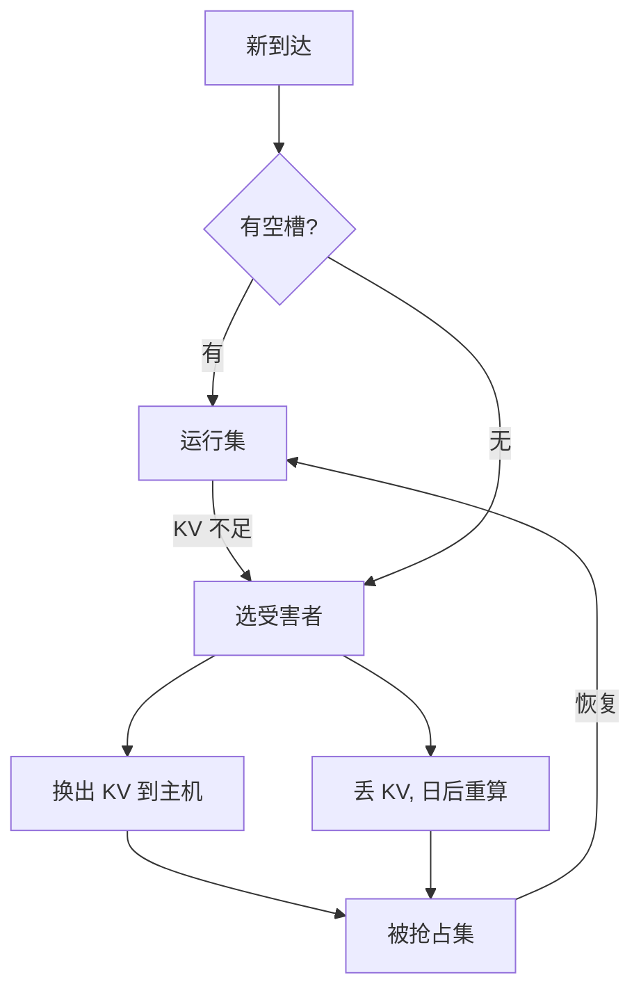

# 抢占与公平性

迭代级调度让批次可以中途改写成员；一旦 KV 槽或算力不够，就必须决定谁留下、谁让路，以及让路是否还算公平。

<footer>—— 在 Yu et al., Orca, OSDI 2022 的迭代边界上讨论抢占，而不是把抢占写成论文原义</footer>

[连续批处理](/llm/continuous-batching) 解决了「批内陪跑」：写完的请求立刻走。它没有解决「槽位被占满」：长 decode 一直合法地留在 $\mathcal{B}$ 里，新到达的短请求没有 KV 块可写，TTFT 崩掉。抢占（preemption）是在迭代边界把某些未完成请求请出运行集，把资源转给别人；公平性是问这套请出规则会不会饿死某一类用户。Orca 给出了可以每步改成员的钩子，抢占策略是钩子上的政策，不是 Transformer 公式的一部分。

## 问题

生成服务的资源有两种硬约束。算力：一次迭代能同时走多少 token 步。存储：KV 池还能不能再放下一条提示的前缀。算力不够时，请求可以留在 GPU 上排队等下一迭代，KV 仍占着。存储不够时，新请求连 prefill 都做不了，除非有人释放块。若从不抢占，策略退化为 FCFS 占槽：先到的长生成把池子坐穿，后到的交互请求在门外。这在「先到先服务」字面上公平，在「每人的排队时间与自身工作量成比例」意义上不公平。

抢占要处理的失败模式还有 convoy：一条超长、超宽上下文的请求占着与它的剩余工作不相称的块数，后面一串短请求的等待时间被它主导。操作系统里这是长作业占 CPU；这里是长作业占 **KV 字节 × 剩余步数**。只看到达序会把 convoy 当成正常排队。

### 运行集、等待集、被抢占集

把请求分成三类。运行：本迭代进入引擎，KV 在 GPU。等待：尚未开始 prefill，或已结束。被抢占：已经有部分 KV（可能在 GPU、CPU 或需要重算），但不在本迭代的 $\mathcal{B}$ 里。公平性讨论的是三类之间的转移：谁从运行被打到被抢占，谁从被抢占恢复，等待者是否可以越过被抢占者插队。没有这张状态机，谈公平只是口号。

抢占的对象是请求在运行集中的席位，不是用户账号。同一用户的两条请求仍可能一条在跑、一条被挤出。多租户公平要另加租户配额；本篇先把单池内的请求级规则写清。

## 方法

常见两条让路手段。**换出**：把受害者的 KV 块搬到主机内存或更慢层，腾出 GPU 块给新请求；恢复时搬回。**重算**：丢掉受害者的 GPU KV，恢复时从提示重做 prefill（加已生成 token 当前缀）。换出付 PCIe 与主机内存；重算付 FLOPs 与 TTFT 式的再次前填。上下文短、算力闲、总线忙时重算更划算；上下文长、HBM 紧、主机内存充裕时换出更划算。混合策略可以按受害者的 $n$ 与剩余 $T$ 二选一。

### 选谁当受害者

规则必须可解释。FCFS 不抢占：只在自然结束时回收，简单，易 convoy。最短剩余作业：挤出估计剩余 token 最多的，利于 TTFT，伤害长写作，估计还可能错。按 KV 字节：挤出占用块最多的，专门打超长上下文。轮转：运行集内每人跑固定步再换出，平滑但抖动 TPOT。老化：等待时间超过阈值的请求获得不可抢占窗口，防止饿死。

公平的最低标准通常是：**不饿死**（每个已接受请求在有限步内能前进或被明确拒绝）以及**工作量公平**（完成同等 token 数的请求，看到的延迟不应差出一个数量级，除非显式优先级不同）。后者与抢占频率冲突：抢得太勤，每条的 TPOT 都抖；抢得太懒，短请求的 TTFT 崩。

### 抢占发生在迭代边界

与操作系统中断不同，LLM 引擎几乎总在一次前向结束之后才改成员——这正是 iteration-level 的含义。半步抢占没有意义：注意力核跑到一半没有稳定的 KV 可搬。因此抢占粒度是「至少一步 decode 或一段 prefill」。流式客户端会看到受害者 TPOT 突然出现一个大间隙；间隙长度 ≈ 换出/重算时间 + 等待重新进入运行集的时间。产品上应把这个间隙当成调度事件，而不是模型「卡词」。

## 机制

抢占改善的是**准入之后的等待时间分布**：把资源从已经持有很多步的请求，转到持有很少步或尚未持有槽的请求。它不增加 GPU 的瞬时 FLOPs，只改变谁在瞬时集合 $\mathcal{B}$ 里。吞吐可能略降，因为换出带宽、重算前填、以及运行集抖动让 CUDA Graph 失效。用吞吐单一指标会得出「永远不要抢占」；用 TTFT 分位数会得出「必须抢占」。

公平性的机制核心是避免两种饥饿。运行饥饿：某人一直在被抢占集，永远回不来——需要老化或保留份额。等待饥饿：运行集被不可抢占的长作业锁死，等待者永不准入——需要强制让路。Orca 式的每步调度提供了执行这些规则的频率；规则本身要写进调度器，论文并不指定某一条生产公平准则。

「先到先服务」在 KV 池上并不自动公平。先到者占用的是随自身长度膨胀的字节，后到者看到的空闲是残差。字节–时间乘积才是真正被独占的资源。按到达序排队，等于让长上下文用户多占公共池而不付额外等待。

## 边界与工程取舍

抢占与 [优先级](/llm/priority-sla) 正交：可以在同一优先级内做公平抢占，也可以让高优先级无条件挤低优先级。不要用抢占去模拟 SLA——SLA 还要准入控制，池子已经过载时抢占只是在已接收请求之间搬椅子。换出过多会把 PCIe 打满，所有人的 TPOT 一起坏，出现「公平地变慢」。应给换出带宽设上限，超出则拒绝新请求或对低优先级直接失败。

重算策略在提示带不可重放的副作用时危险（工具调用、非确定性检索）。已发出去的流式 token 与重算后的续写必须接在同一前缀上，否则用户看到改写历史。实现上被抢占请求的已输出文本是只读的，恢复时强制以该文本为前缀继续 decode。

评测公平不要只报平均值。至少看：短请求 TTFT 的 P95、长请求 E2E 的 P95、以及最长饥饿时间。一套抢占规则很容易优化其中一列、打穿另一列。

## 小结

- 连续批回收的是已结束者的槽；抢占回收的是未结束者的槽，为的是让后来者或短作业能跑。
- 让路手段是换出或重算，选谁是政策：FCFS、剩余工作、字节占用、轮转、老化。
- 公平的底线是不饿死，以及按工作量而不是按到达序分配 KV–时间。
- 抢占发生在迭代边界，流式上表现为 TPOT 间隙。
- 换出带宽与重算前填都会吃吞吐，过勤会公平地变慢。
- 优先级、准入、抢占是三层；不要用一层冒充另外两层。
- 出处：调度钩子见 Yu et al., *Orca*, OSDI 2022。抢占与公平是其上的系统设计，需按 KV 池与延迟分位数单独规定。
