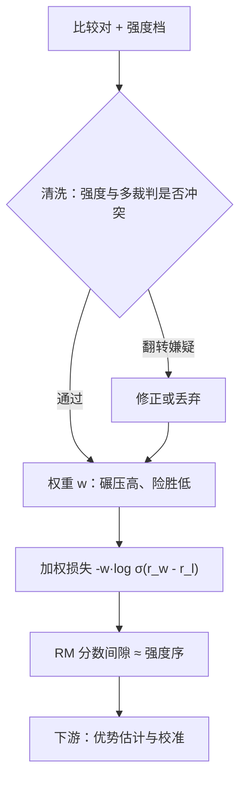

# 偏好强度的标定

「A 比 B 好」和「A 比 B 好得多」在二元标签里是同一行数据；把强度扔掉，等于把噪声对和金子对同等加权。

<footer>—— 强度采集与加权见 Wang 等 Secrets of RLHF Part II 2023、Cui 等 UltraFeedback 2023；概率底座见 Bradley-Terry</footer>

[上一课](/llm/annotation-agreement)把分歧归因时留了一个出口：真模糊的对降权或「转强度档」。本课把那个档位补完：偏好强度怎么采、怎么变成损失里的量、怎么反过来清洗标签。二元标签是 BT 损失的接口，但标注员判断里天然带着强度——把「险胜」与「碾压」都记成 1，是采集端最大的一笔信息丢弃。[Bradley-Terry](/llm/bradley-terry) 的潜在分数本来就允许间隙存在，本课讨论怎么把间隙请回损失。

## 问题

无强度的损失对所有对一视同仁：$\mathcal{L}=-\log\sigma(r_w-r_l)$ 里，标注员犹豫再三的险胜和一眼定案的碾压给出同样长的梯度。这带来两类错。第一类是权重错配：数据池里大部分对本来就是容易对，训练被容易对支配，难对（真正界定分辨边界的那些）贡献占比失衡。第二类更隐蔽：险胜对里混着大量翻转噪声——上一课的机制面说过，难分的对恰好是标签最不可靠的对，不加区分地全权重训练，等于在最不可信的数据上花最多梯度。不这么做会错在哪：RM 学到一堆弱偏好的大间隙，分数的尺度被噪声撑大，下游 RL 的优势估计跟着被污染。

### 强度怎么采

两端口径。标注端：在赢/输之外加强度档，常见四级——明显更好、稍好、差不多、不确定；UltraFeedback 让裁判模型按细粒度维度打分再综合，Secrets of RLHF 用多裁判与一致性反推强度。两端的共同点是把「有多确定」从标注员的肌肉记忆里显式地问出来，而不是丢掉。协议上强度档要进指南、配案例：什么算「明显」，要用示例对钉住，否则档位只反映标注员的个人尺度（上一课一致性的教训在强度上更严重，因为档更多）。

## 方法

强度进训练有三条路。加权：$\mathcal{L}=-\sum_i w_i\log\sigma(\Delta_i)$ ，碾压对 $w$ 大、险胜对 $w$ 小，$w$ 从强度档映射，也从翻转嫌疑反推（强度标「差不多」却被记成硬胜负的对降权）。加间隔：$\sigma(\Delta_i-m_i)$ 把强度转成目标间隙 $m_i$，比加权更直接地约束尺度。软标签：把强度档转成期望胜率 $p$，损失写成 $-p\log\sigma(\Delta)-(1-p)\log\sigma(-\Delta)$，保持 BT 概率语义，与校准（[RM 校准](/llm/rm-calibration)）衔接最顺。三条路都先过清洗：强度信息最大的工程价值不在加权，而在它是免费的标签质检器——强度与最终标签矛盾的对，就是翻转嫌疑对。

## 机制

强度为什么承载噪声信息：BT 模型里比较结果 $P(w\succ l)=\sigma(r_w-r_l)$，标注员报告的强度是这个概率的主观估计。「险胜」意味着 $r_w-r_l$ 接近 0，该对落在判别边界附近——恰好是翻转率最高、梯度噪声最大的区域。压低它的权重，梯度期望几乎不变（边界附近的对两种标签各半，贡献互相抵消），方差显著下降，等价于做了免费的方差缩减。同时，「明显更好」的对把间隙拉开，分数尺度恢复语义，下游 RL 里优势 $\hat A$ 的量级不再被噪声对撑爆——这与后课「奖励方差与策略稳定性」直接相连：数据端的强度标定是策略端稳定性的第一道闸。

反推口径：不额外问标注员，也可用多个独立裁判（或多个 RM）的分歧度当强度代理——全员同向为「碾压」，分裂为「差不多」。成本是多次前向，好处是强度与主标签同源，协议不用加档位。

## 边界

强度标尺跨人不可比：A 的「明显」是 B 的「稍好」，所以强度档主要用于同标注员内部的相对加权，或按标注员分层归一后再用；跨员直接混档会引入新的系统偏差。强度也不能替代一致性与仲裁：档位只是多一路测量，噪声对仍是噪声对，翻转嫌疑要送上一课的仲裁流程而不是自动清洗——自动清洗会把难例整个赶出数据集，RM 的边界随之退化。最后，强度进损失的幅度要消融：权重压得过狠，训练分布被「容易对」主导，验证准确率看着高，边界附近反而更糊。强度是先验不是真值，这是本课全部方法的适用前提。

## 小结

- 二元标签丢掉强度；强度档是采集端最便宜的增量信息，案例必须写进指南。
- 强度有三条进损失的路：加权、目标间隔、软标签，均保持 BT 概率语义。
- 机制上强度是噪声探测器：边界附近的对翻转率高，降权是免费的方差缩减。
- 间隙恢复语义后，下游优势估计与校准都受益；幅度要消融。
- 出处：Wang 等 Secrets of RLHF Part II，2023；Cui 等 UltraFeedback，2023；Bradley-Terry 底座见主干课。
