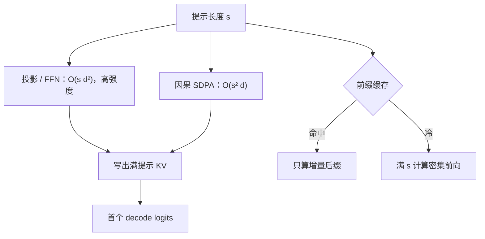

# Prefill 计算特征

提示预填充是大矩阵乘与二次注意力主导的计算密集型阶段；它决定首 token 延迟，与随后逐步生成的带宽画像不是同一条屋顶线。

<footer>—— 对照 Pope 等对 Transformer 推理阶段的分析，以及服务系统把 prefill 与 decode 分调度的公开做法</footer>

自回归服务把一次请求切成两段。Prefill（预填充）吃完整用户提示，一次性算出所有提示位置的隐状态，并把 KV 写入缓存。Decode 每次只追加一个新 token。两段的算术强度差一个数量级：prefill 的序列长度 $s$ 大，GEMM 与 $QK^\top$ 都能喂饱 Tensor Core；decode 的查询长度是 1，算力闲、HBM 忙。本篇只写 prefill 的计算特征；decode 的容量与带宽限制见[显存墙](/llm/decode-memory-wall)。不要用「推理 FLOPs」一个数同时描述 TTFT 和 TPOT。

## 问题

首 token 延迟（TTFT）几乎就是 prefill 墙钟（加上排队）。长文档、多轮里拼接的历史、视觉 token 前缀，都会把 $s$ 推到数千以上。注意力在 prefill 上对当前合法的全部键做满二次项，代价 $O(s^2 d)$ 外加投影与 FFN 的 $O(s d_{\mathrm{model}}^2)$，见[二次复杂度](/llm/attention-quadratic-cost)。$s$ 中等、模型很宽时，FFN/投影的大 GEMM 主导； $s$ 再长，二次项追上。无论哪一项主导，算术强度都远高于 decode：每个从 HBM 读入的权重字节会被许多 token 复用。

若把 prefill 与 decode 混在同一批，计算密集的长提示会堵住本可以低延迟吐词的短生成，这是分离式服务（如 DistServe 一类工作）的动机。问题不是「要不要做注意力」，而是识别 prefill 是 **compute-bound**：加卡、加 Tensor Core 吞吐、切序列并行，对 TTFT 的一阶导数大；只加 HBM 容量而不加算力，对已经算得动的中等 $s$ 帮助有限。

### 算术强度为何高

权重 $W$ 在 prefill 中与形状 $(s,d)$ 的激活相乘。$s$ 增大，同一份 $W$ 被更多行用，强度 $\propto s$。注意力的 $QK^\top$ 进一步按 $s$ 复用投影后的 $K$。屋顶线模型里，这一点把工作点推向计算屋顶而不是带宽屋顶。Decode 每步 $s_{\mathrm{q}}=1$，复用消失，工作点掉回带宽屋顶。用同一套「利用率 90%」的口号描述两段，会在 decode 上误判瓶颈。

前缀缓存命中时，prefill 只算增量后缀，TTFT 掉到增量长度决定的计算量。讨论 prefill 特征必须声明是冷提示还是前缀命中。把命中后的延迟写成模型算力，会高估硬件、低估缓存策略。

## 方法

实现上 prefill 就是一次（或分块的）训练式前向，掩码为因果：位置 $t$ 只看 $\le t$ 的键。输出侧丢弃中间 token 的 logits（除非要做预填充侧打分），只保留最后位置的 logits 供第一个生成步使用，以及整段 KV。分块 prefill（chunked prefill）把长 $s$ 切成块，块间仍写 KV，使调度器能在块间隙插入 decode 步，避免一条超长提示独占计算队列。块长是延迟与核效率的折中：太短则 GEMM 变瘦，prefill 失去计算密集优势；太长则 TTFT 排队恶化。

并行轴：张量并行切宽，减轻单卡 GEMM；上下文/序列并行切 $s$，减轻单卡二次注意力与激活。后者不降低全局 FLOPs，只摊墙钟。MoE 在 prefill 上唯一专家数随 token 增多而升，专家缓存命中率往往低于稳态 decode，TTFT 可能被冷专家搬运主导，而不是被稠密 FLOPs 主导。

### 与训练前向的差别

训练还要存激活做反传，prefill 推理可以不要。FlashAttention 一类核在 prefill 上收益明确：避免物化 $s\times s$ 分数。精度上 prefill 可用与 decode 不同的策略（例如注意力 logits 更高精度），但 KV 写入精度一旦定下来，decode 全程跟着吃。不要在 prefill 用一份宽 KV、decode 再偷偷量化而不声明分布偏移。

## 机制

TTFT $\approx T_{\mathrm{queue}}+T_{\mathrm{prefill}}$。$T_{\mathrm{prefill}}$ 在计算屋顶上近似 $\mathrm{FLOPs}/(\eta\cdot \mathrm{peak})$，$\eta$ 为核效率。长 $s$ 时 FLOPs 中二次项占比上升，出现「上下文再长一点，首 token 突然不可接受」——这是二次项，不是 decode 带宽。视觉或音频前缀把 $s$ 抬高一截，prefill 特征与纯文本相同，只是 $s$ 的来源变成了切块与合并，见视觉 token 压缩一类专文。

批处理：把多条冷提示拼成一个大 $s$ 维或 batch 维，能进一步提高 GEMM 强度，但 TTFT 变成批内最慢请求。连续批处理若让长 prefill 与短 decode 抢同一 SM，decode 的间隔延迟抖动，用户感知成卡顿。调度上把 prefill 当成作业、decode 当成流，是承认两段屋顶线不同，而不是营销。

GQA / MLA 主要减 *decode* 要搬的 KV 字节，对 prefill 的 FLOPs 只是常系数。长提示的 TTFT 不会因为改成 8 个 KV 头就按 8 倍下降。规划首 token SLA 时不要抄 decode 吞吐表。

## 边界与工程取舍

### 用计算屋顶规划 TTFT，用带宽屋顶规划吐词

容量规划应分两张表：冷启动 TTFT 对 $s$、模型宽、并行度；稳态 TPOT 对并发、KV 长、量化。把它们平均成「每秒 token」会选出错误的卡型——算力很强但 HBM 窄的卡擅长 prefill，HBM 宽的卡更擅长长 decode。分离部署时，prefill 池与 decode 池之间要搬 KV，体积 $\propto s\cdot L\cdot h_{\mathrm{kv}}\cdot d$，图像前缀上这笔搬运可能吃掉分离的收益。

不要用训练 MFU 直接当 prefill MFU：推理图无反传、可能有 CUDA Graph 切分、可能有 chunk。安全与预填充侧注入不在本篇；计算特征不因提示内容改变阶，只改变 $s$ 与缓存命中。评测 TTFT 必须区分：空缓存、前缀命中、分块、以及是否与 decode 混批。少写一项，数字不可比。多轮对话里「历史」往往已经在 KV 里，真正的 prefill 只是最新一句；把它当成每次从零算满上下文，会把计算屋顶上的需求高估一个数量级，也会把缓存策略的收益写没。

Pope et al., *Efficiently Scaling Transformer Inference*（MLSys 2023）与 Zhong et al. DistServe（OSDI 2024）讨论阶段异质性。算术强度用 Williams 等屋顶线模型理解即可。不要给「prefill 优化」编造不存在的 arXiv。

## 小结

- Prefill 对整段提示做因果前向，写出 KV；主导 TTFT，工作点通常在计算屋顶。
- 代价是 $O(s d^2)$ 的投影/FFN 加 $O(s^2 d)$ 的注意力；$s$ 大时二次项上升。
- 前缀缓存把工作量变成增量后缀；讨论延迟必须声明命中与否。
- 分块 prefill 用核效率换调度公平；块过短会失去计算密集优势。
- GQA/MLA 不是 prefill 的一阶加速器；不要用 decode 吞吐去承诺 TTFT。
- 与 decode 混批会让吐词抖动；分离则要为 KV 搬运付费。
- 出处：Pope et al., MLSys 2023；Dao et al., FlashAttention, 2022；Zhong et al., DistServe, 2024；Williams et al., Roofline, 2009。
