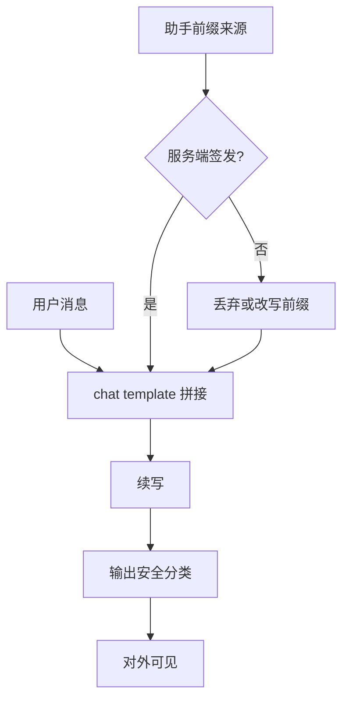

# Prefilling 越狱

若调用方能指定助手回复的开头若干 token，随后的采样就条件在这段已经说出口的话上；拒答是一种开场，配合也是一种开场，先写谁，后面更像谁。

<footer>—— 对照各家对话 API 把 assistant 轮次预填作为合法参数的公开接口，以及教师强制与自回归条件化的标准事实</footer>

Prefilling（预填充、助手前缀）在训练里是教师强制：给定 $y_{<t}$ 预测 $y_t$。在推理 API 里，它变成一个产品功能：允许开发者把助手消息写到一半，让模型从该前缀继续，便于固定格式、引用或工具调用信封。同一机制也构成越狱面：若前缀已经是配合、承诺或逐步清单的开头，模型很少在中途改口去拒绝，因为拒绝与已经写出的前缀在序列层面互相矛盾。本篇写条件化杠杆、谁有权写助手前缀、以及防御评测；**不给出有效的前缀话术或可粘贴的开场模板**。

## 问题

聊天模型的拒答几乎总是**前几个助手 token** 的行为：先道歉或声明无法协助，再给无害替代。偏好优化强化的是这种开场分布，见 [RLHF](/llm/rlhf-pipeline) 与 [DPO](/llm/dpo)。自回归一旦离开拒答开场，进入「下面分步骤说明」的区域，后续 token 的条件分布是教程，不是政策。普通用户只能写 `user` 轮；若 API、代理或错误的 [chat template](/llm/chat-template) 允许用户把内容写进 `assistant` 前缀，等于把教师强制的控制权交给了请求方。

这与[计算意义上的 prefill](/llm/prefill-compute) 同名但不是同一件事。服务系统里的 prefill 是「把提示跑成 KV」；这里的 prefilling 是「提示里已经包含助手角色的部分输出」。两者会叠在一起：被预填的助手 token 仍要走提示预填充，进入 KV，再在其后 decode。安全问题出在角色与条件，不出在 GEMM。

### 模板注入与官方 prefill 参数

两条实现路径。一条是接口显式提供 assistant prefilling：请求里带一段助手开头，服务端原样拼进模板。一条是接口只接受 messages，但客户端可以提交一条不完整的 assistant 消息，或在 user 字符串里伪造结束符与助手标记，见模板注入。评测必须覆盖两条：关掉官方参数并不等于关掉伪造角色标记。检测应对**分词后的角色边界**做，而不是对用户可见字符串做简单子串匹配。

「请从这里继续」在工具调用、JSON 信封、多语言固定开头里是正当需求。禁用一切 prefill 会伤这些产品；安全边界是：预填内容不得把对话从拒答区拖到配合区，且不得由不可信用户直接指定。

## 方法

把一次生成写成 $p_\theta(y_{\ge t} \mid \mathrm{sys}, u, y_{<t})$。防御不讨论如何挑选 $y_{<t}$，只讨论如何限制它的来源与如何评测。来源策略有三层：不可信用户不得提交 assistant 轮；若产品必须允许开发者 prefill（例如自家应用），则 prefill 只能来自服务端签发的信封，并经输出政策检查后再续写；对续写结果再跑一遍[输出分类器](/llm/llama-guard)。评测协议：同一危害用户句，比较「空助手开场」与「配合性前缀」下的危害分类率；再比较「拒答性前缀」是否被模型自己推翻。好的对齐应在空开场时拒绝，且不应仅因短前缀就翻转；若翻转代价极低，说明拒答几乎全写在开场上。

解码侧可做的硬约束包括：强制助手轮从服务端规定的起始标记开始，不允许请求带完成中的助手文本；或允许 prefill 但只允许闭集（固定的工具调用前缀、固定的 JSON 左括号），用[约束解码](/llm/constrained-decoding)把后续限制在文法内。闭集 prefill 与开放自然语言 prefill 的风险差一个数量级，应分开报。

### 和 GCG、many-shot 的关系

[GCG](/llm/gcg-suffix) 优化用户侧后缀，目的之一正是诱导模型自己吐出配合开场；prefilling 则跳过诱导，直接把开场写进上下文。Many-shot 用多轮伪历史达到类似的条件化，但是长窗口、高 token 成本。Prefilling 往往只需十几个 token，对[首 token 延迟](/llm/ttft)几乎无感，却能大幅改变后续分布。分层红队应把「短助手前缀」列为独立、便宜的威胁模型，而不是假定攻击者只会写用户句。

## 机制

机制就是条件概率。拒答事件 $R$ 与配合续写 $C$ 在开场上近似互斥：$\log p(R \mid x)$ 高时 $\log p(C \mid x)$ 低。一旦观察到 $C$ 的一个真前缀 $c_{<t}$，

$$
p(C \mid x, c_{<t}) \approx 1
$$

对许多对齐模型成立，因为训练数据里几乎没有「先配合再改口拒绝」的示范。RLHF 甚至可能惩罚自我否定的不连贯。于是 prefilling 不是在对抗一个深层的世界模型，而是在利用「序列连贯性 > 政策」这一训练出来的先验。

表示上，开场 token 把残差流推到教程模式的吸引域；后续层的注意力大量指向已经写出的清单结构。要在中途插入拒答，需要一个能覆盖该吸引域的干预，例如[Circuit Breaker](/llm/circuit-breaker) 在有害方向上的打断，或输出分类器在对外流式之前截断。只靠系统提示里的「你必须拒绝」通常敌不过已经存在的助手前缀，原因与 [many-shot](/llm/many-shot-jailbreak) 相同：近期、同角色的 token 对预测的权重更大。

流式输出把问题变急：分类器若等完整句子，用户已经看到配合前缀。应在前若干 token 就跑轻量分类，或对 prefill 本身先分类再决定是否续写。

### 防御评测的最小对照

四格表：用户句有害/无害 × 是否带不可信 prefill。有害且无 prefill：应拒绝。有害且有配合性 prefill：应拒绝或剥离 prefill 后拒绝，而不是继续。无害且有格式 prefill：应正常完成格式，这是过拒绝对照。无害且无 prefill：基线有用性。再加一列「有害用户句 + 拒答 prefill」，看模型是否保持拒绝。所有格子用同一套[危害基准](/llm/wildguard-harmbench)判定，不要用「是否包含某拒答关键词」。

## 边界与工程取舍

完全禁止 prefill 最干净，但会拆掉依赖固定开头的结构化生成。折中是：自然语言 prefill 禁止，文法内的结构 prefill 允许。代理系统（浏览器自动化、多工具）经常自己写助手草稿再让模型续，草稿必须走与最终输出同一政策，否则代理成了越狱代理。开源权重在本地推理时没有 API 门卫，模板由调用方完全控制；此时 prefilling 不是「漏洞」而是调用约定，产品安全要靠输出过滤与表示干预，而不是靠假定模板诚实。

不要把「模型在恶意前缀下仍继续」单独当成对齐失败的唯一证据：任何自回归模型都会续写给定前缀。失败标准应是：**在剥离不可信前缀之后**是否仍配合，以及**在保留前缀但加上表示级打断或分类器**之后是否仍对外泄漏。评测报告里写清哪一种。本篇不提供用于诱导配合的前缀清单。

与 GCG 的开场目标函数对照：一边是优化用户输入让模型自己说开头，一边是调用方直接写开头。防御若只堵后缀、不堵角色边界，只挡住了更贵的那条路。

## 小结

- Prefilling 越狱利用自回归条件：助手开场一旦是配合，后续更像教程而不是拒答。
- 威胁模型是不可信方写入 assistant 前缀，含官方参数与模板注入。
- 计算 prefill 与安全 prefilling 同名不同义；安全问题在角色，不在算力画像。
- 防御以剥离或闭集化前缀为主，输出分类与表示打断为辅，并处理流式泄漏。
- 评测用有害/无害 × 有无 prefill 的对照表，加上过拒绝与结构 prefill 的合法性。
- 本地开源调用没有 API 门卫，必须假定模板不可信。
- 出处：教师强制与对话 API 的 assistant 预填为公开机制；与 Zou 等对配合开场似然的观察同构，但不依赖离散后缀优化。
