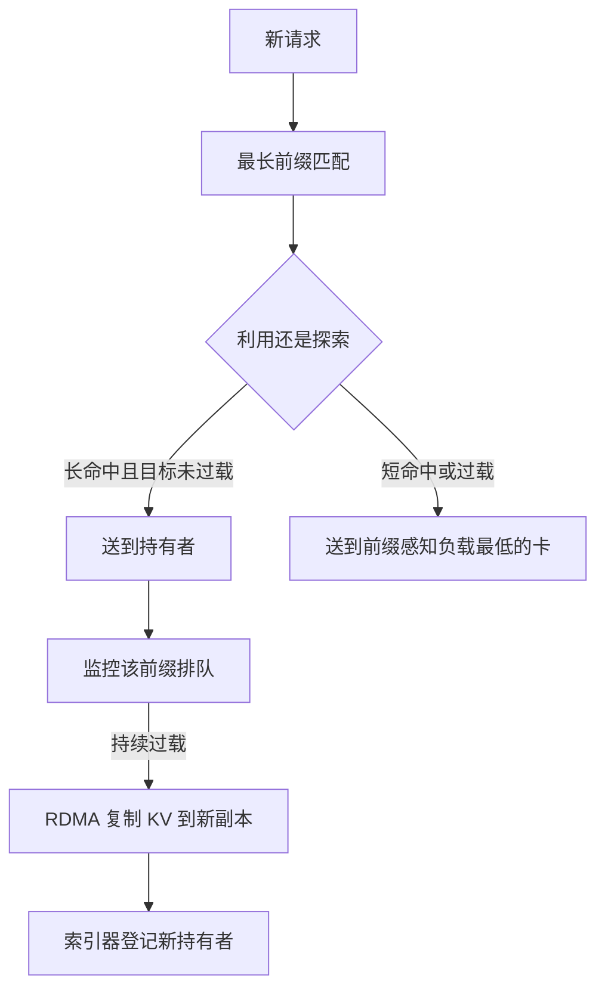

# 前缀感知扩缩容

    
热前缀打满一张卡时，正确的扩容是把这段 KV 复制到更多 GPU，而不是再开一个空副本去把同一段提示重算一遍。

<footer>—— Srivatsa 等，Preble：对流行前缀做自动复制；对照 DistServe 按阶段独立加副本</footer>

水平扩展对无状态 HTTP 是加机器、摊请求。对带 KV 的语言模型，新副本是空的：系统提示、工具说明书、文档前缀都要重新预填充，集群越大，随机路由把同一前缀打散得越碎，单机 [前缀缓存](/llm/prefix-caching) 的命中率按 $1/R$ 掉。前缀感知扩缩容把「副本数」和「某段 KV 的副本数」分开：流量涨时，先复制已经算好的热前缀，而不是只加冷实例；流量降时，先收叶子、再收根，避免把所有人还在用的系统提示从集群里删掉。本篇写这一层控制面，路由键见 [KV 感知路由](/llm/kv-aware-routing)，单机树见 [RadixAttention](/llm/radix-attention)。

## 问题

Srivatsa、He、Abhyankar、Li、Zhang 等人的 Preble（arXiv:2407.00023，后续 ICLR 2025）指出：生产流量里提示远长于生成，且 85%–97% 的提示 token 与其他请求共享。单卡前缀缓存（vLLM、SGLang）已经能复用；分布式默认却按算力均分，共享前缀被送到不同 GPU，KV 在每张卡上各算一份。若矫枉过正、永远把共享前缀打到同一张卡，那张卡成为热点，队列爆炸。Preble 的 E2 算法在「利用已有前缀」与「探索更空的卡」之间按节省的预填充是否大于新计算来选；当单个前缀的负载超过一张卡，系统**自动扩展该前缀**——把 KV 复制到更多 GPU 并按子树切负载。

这与 DistServe（Zhong 等，OSDI 2024）的「按阶段扩」互补。DistServe 让预填充池与解码池独立加 GPU，因为 TTFT 与 TPOT 的资源形态不同。前缀感知是在同一阶段内部：预填充池里也要决定「这段 8K 系统提示该有几份缓存」。Mooncake 的 KV 中心调度在过载时用预测做提前拒绝，同样假设调度器看得见缓存位置；看不见位置的 HPA（只看 GPU 利用率）会在缓存命中最高的时候错误地加冷副本，把命中率打下去，利用率看起来更「需要再扩」。

### 利用率不是正确的扩容信号

一张卡 HBM 很满、SM 很忙，可能是因为它持有热前缀、正在用缓存吃高 QPS——再加冷副本会分流走本该命中的请求。另一张卡很闲，可能只是还没分到任何热前缀。按 GPU 指标扩缩，会在错误的时间制造冷启动。正确信号是：该前缀的队列延迟、可复用 token 数、以及「再复制一份 KV 的传输成本」对比「重算这份 KV 的成本」。

复制前缀不是复制模型权重。权重本来每张卡都有一份；复制的是激活态 KV，体积随长度线性涨。8K 前缀在 MLA/GQA 下仍可能数十到数百 MB 每层合计，复制本身要走 [RDMA 拉取](/llm/kv-rdma-fetch)。扩容决策必须把这次拷贝算进 SLO。

## 方法

### 利用、探索、再复制

E2 的利用：新请求的最长公共前缀已经在某 GPU 上，且省下的预填充大于把请求放到别处的收益，则送到该 GPU。探索：共享段短、或目标卡已经过载，则选「前缀感知负载」最低的 GPU——负载计入近期算力、驱逐代价、以及新请求在该卡上因命中而免掉的计算。自动扩展：重平衡之后，某前缀的平均排队仍在恶化，则把该前缀的 KV 复制到另一张卡，并把子树按负载切开。缩容相反：副本的命中跌到阈值以下，先停止新调度，等引用计数归零再释放块，最后才下线实例。

控制面要维护「前缀指纹 → 持有者列表」，与引擎块表同一套哈希（chat template 之后的 token id，外加模型、LoRA、模板版本）。Mooncake Conductor 一类索引器按实例返回最长匹配与介质；扩容进程是这条表上的写者：复制完成后才把新持有者发布出去，否则路由会把请求送到块表尚未插入的副本上，造成假命中。

### 与 PD 分离的两级扩容

预填充池按「未命中 token 的算力」扩，解码池按「并发会话的 KV 体积与 TPOT」扩。前缀命中高的流量，在 Preble 的叙述里更接近解码形态（几乎不必再预填充），应避免再往预填充池扔。DistServe 按 TTFT/TPOT 约束分别选并行度再复制实例；前缀感知在复制时优先克隆已有 KV 的实例镜像，而不是从检查点冷拉起一个空 worker。滚动升级等于定期缩容热前缀，必须先迁缓存或接受一次性 TTFT 回归。

## 机制

### 为什么复制比重算更值

预填充代价随未命中长度 $n-p$ 走，注意力部分还带二次项。复制代价随已有 KV 字节 $M$ 与链路带宽走，且可与后续请求重叠。当 $p$ 接近 $n$、QPS 高，一份 KV 被反复读，复制的摊销成本按 $1/\mathrm{QPS}$ 下降。当 $p$ 很小，复制几乎等于搬一整段马上要重算的东西，不如探索空卡。E2 用「共享 token 是否多于剩余 token」做一阶启发式，正是在比较这两条屋顶线。

公平性不能丢。只按命中率调度会让短提示、冷用户永远排在热前缀后面。Preble 按命中率分优先级再给配额，避免多租户里某个系统提示独占集群。扩缩容若只服务热前缀，冷启动租户会在扩容事件里被饿死——控制面应保留一定比例的探索容量。

缩容最容易写错：HPA 看到利用率低就杀 pod，杀的恰好是持有根前缀的那张卡，集群立刻回到全量预填充。正确顺序是：摘流量 → 等 in-flight 结束 → 可选把根前缀迁到幸存者 → 再删实例。

### 缓存感知调度是扩容的微观形式

Zheng 等人在 SGLang 里按最长共享前缀排序请求，是单卡上的「把热子树走完」。集群扩容是同一原则的宏观形式：先让热前缀有足够副本，再让空闲算力去探索。没有微观调度，多副本上的块会被无关流量挤出 HBM，复制等于白做。没有宏观扩容，微观调度只能在一张过载卡上排队。

## 边界与工程取舍

Preble 的 1.5×–14.5× 延迟数字绑在他们的五类长提示负载、Azure 到达过程、以及 A6000/H100 规模上，不能当成任意聊天机器人的保修。短提示、无共享、纯解码主导的流量，前缀感知扩容几乎没有杠杆，回到 DistServe 式按阶段扩即可。索引器是单点风险：它滞后会导致假命中，必须与引擎的 BlockStored/BlockRemoved 事件同事务。

不要用用户 ID 粘滞代替前缀指纹。不要在 LoRA 多适配器上只哈希文本。不要假设复制 KV 与复制容器镜像是同一 K8s 对象——前者要走传输引擎，后者只是权重。

出处：Srivatsa 等，*Preble: Efficient Distributed Prompt Scheduling for LLM Serving*，arXiv:2407.00023；Zhong 等 DistServe，OSDI 2024；Qin 等 Mooncake；Zheng 等 SGLang RadixAttention。没有一篇名叫「prefix-aware autoscaling」的必须伪造的经典论文，产品名应落到上述系统。

## 小结

- 前缀感知扩缩容复制的是热 KV，而不只是冷的模型副本。
- 利用已有命中、探索空卡、过载时复制前缀，三者缺一就会热点或冷启动。
- GPU 利用率不是可靠信号；看该前缀的排队与复用 token 数。
- 与 PD 分离叠加时，命中流量更像解码，不要盲目加预填充卡。
- 缩容必须先迁或放弃根前缀，再删实例。
- 出处：Preble；DistServe；Mooncake；SGLang。
