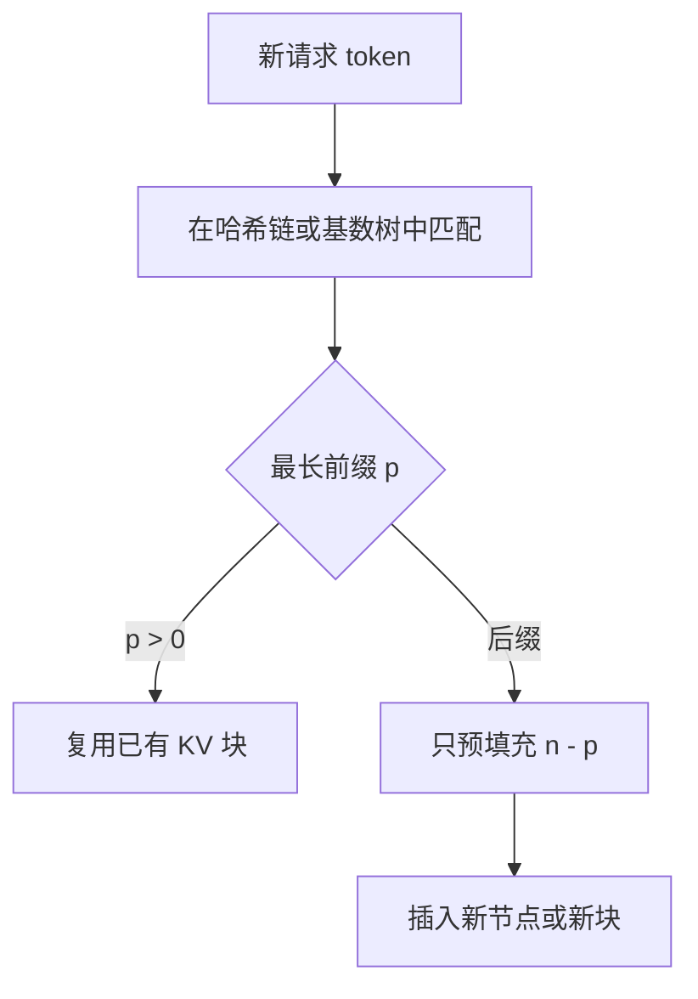

# 前缀缓存 / 自动前缀共享

    
同一段已经算过的键值，不该因为请求 ID 不同就再算一遍；引擎要能自己认出最长公共前缀，而不是等用户把 cache 句柄传进来。

    <footer>—— 对照 SGLang 的 RadixAttention 与后续服务栈里的自动前缀缓存</footer>

预填充按序列长度二次涨。服务流量里却反复出现同一段开头：系统提示、工具说明书、少样本示例、检索模板。把这段 KV 留下来，下一条只算差集，是最直接的加速。早期做法是显式缓存——调用方传入一个 prefix id，引擎保证这段不被回收。自动前缀共享把识别交给运行时：按 token 内容查找，命中多少算多少。本篇写自动共享的索引、对齐和失效规则；树形实现见 [RadixAttention](/llm/radix-attention)，多轮场景见 [多轮前缀命中](/llm/multi-turn-prefix)。

## 问题

显式缓存有两处脆。第一，调用方必须知道哪些字节是稳定前缀，还要在提示迭代时手动失效。模板改一个换行，旧 id 仍指向旧 KV，于是出现「提示看起来对、模型像在读另一份说明书」的事故。第二，共享常常不止一层。系统提示之下，同一用户的历史、同一批少样本的题干，构成更深的前缀；显式 API 很难让用户把整棵树描述清楚。

自动共享要在引擎内回答三个问题：如何判断两段 token 相同、共享停在哪个边界、显存不够时谁让路。判断必须是精确匹配。语义相近、同义改写、不同分词器，都不能命中——KV 对 token 身份和位置编码都敏感。RoPE 若已旋进键里，相同词出现在不同下标上也不是同一份 KV。所以「自动」不是「模糊检索」，而是「精确前缀的字典」。

位置是契约的一部分。把缓存的键当成与下标无关的内容向量，去拼一条新文档的中间段落，相位是错的。自动前缀只分享从位置 $0$ 起逐 token 相同的那一截。

## 方法

### 哈希链与基数树

两条主流索引。一条是按分页块做哈希：一块内的 token（加上父块的哈希）得到指纹，查表得到物理块。父哈希把块串成链，保证「这块的前缀」也一致，避免不同历史碰巧在某一块上 token 相同。vLLM 一类自动前缀缓存走这条路，和块表天然同构。另一条是 [基数树](/llm/radix-attention)：边上天挂可变长 token，查找就是从根走路。树更适合任意分叉和叶子 LRU；哈希更适合固定块、O(1) 探查。

无论哪条，查找结果都是一个长度 $p$（通常对齐到块大小 $B$）：前 $p$ 个逻辑位置指向已有物理槽，从 $p$ 起分配新槽并做预填充。插入在预填充（以及可选的解码）结束后发生，使生成出的 token 也能成为下一请求的前缀。引用计数钉住仍在使用的路径，防止把正在解码的请求脚下的块回收掉。

### 自动而不等于永远命中

未命中是正常态。第一次见到的提示、$p$ 小于 $B$ 的短差集、采样参数并不阻止 KV 复用，但 **LoRA 适配器、模型权重、是否开 chunked prefill 的切法** 都必须进入缓存键。漏掉任何一项，就会把 A 模型的 KV 喂给 B。实现上常在根上先用「模型 + 适配器 + 模板版本」分命名空间，再在空间内做 token 索引。

调度会改变命中率。先来先服务可能让两条本可共享的请求中间夹进无关流量，把热前缀挤走。缓存感知调度优先跑当前命中更长的请求，见 RadixAttention 的最长前缀优先。自动共享若只做索引、不做调度，帐面缓存很大，有效命中仍平庸。

## 机制

### 命中是确定性函数

因果注意力的前 $p$ 步输出，以及对应的 $K,V$，是前 $p$ 个输入的确定性函数（在权重与精度固定时）。因此精确前缀的 KV 可以指针级复用，数值上应与重算一致——这是在相同精度、相同核、相同随机性（若有 dropout，推理应为零）下的等式。量化 KV、不同核的累加顺序，可能引入「可接受的」微小差；自动共享默认假设差为零。若一层用 FP8 KV、另一请求用 FP16 重算，不能混在同一条哈希链里。

块对齐把 $p$ 变成 $\lfloor p/B\rfloor\cdot B$。差集哪怕只有一个 token，也要为最后这一块重算最多 $B$ 个位置。$B$ 越大，自动共享越「钝」。这是 [块大小](/llm/paged-kv-block-size) 与前缀缓存必须一起选的原因。树若以一 token 为页，钝化消失，核变慢，又是另一笔交易。

命中率要按「省下的预填充 token」计，不要按「请求是否至少命中一块」计。只命中系统提示的第一个块、后面整段重算，对 TTFT 几乎没有帮助。

## 边界与工程取舍

安全与隔离是产品边界。多租户必须保证用户 A 的对话节点对用户 B 不可见，即使 token 碰巧相同（例如大家都在用同一句「你是一个助手」——系统提示共享是有意的，用户正文共享通常不是）。命名空间应按租户切开；公共系统提示单独做成只读、可共享的根。

失效比插入难。权重热更新、提示配置中心推送、分词器升级，都要弃掉整棵树或整个哈希表。只改采样温度不必弃 KV；改 `chat_template` 必须弃。把模板哈希写进缓存键，比发公告让人重启更可靠。显式 cache id 在「调用方比引擎更知道哪段稳定」时仍有用，例如内部把一份 20K 的政策文档钉死。自动与显式可以并存：显式段作为树的 pinned 根，之上再自动长叶子。

不要把自动前缀共享宣传成「提示缓存 90%」。那是特定流量形状（长系统提示、短用户话、对话回访）下的结果。随机短补全、每次换一份检索文档且文档互不共享时，索引是纯开销。上线前用真实前缀长度直方图估 $p/n$，再决定值不值得开。

chunked prefill 会把一次长提示切成多段算。若切点与块边界、与树节点不一致，可能出现「同一提示两次进来、切法不同、哈希全变」。切分策略要进入缓存键，或固定切点规则。

## 小结

- 自动前缀共享按精确 token（及位置）查找已有 KV，调用方不必传 cache id。
- 索引主要是块哈希链或基数树；命中长度常对齐到块大小。
- 复用合法，因为因果 KV 是前缀的确定性函数；RoPE 已写入时不能跨下标挪用。
- 模型、适配器、精度、模板必须进入缓存键；租户要隔离，公共系统提示可单独钉住。
- 调度影响有效命中；只建索引不够。
- 流量没有长公共前缀时不要开：树和哈希表都有维护成本。
- 出处：Zheng 等 SGLang 中的 RadixAttention 给出树形自动复用；Kwon 等 PagedAttention 给出块表上的共享原语。后续开源引擎的自动前缀缓存是二者的工程合流。
