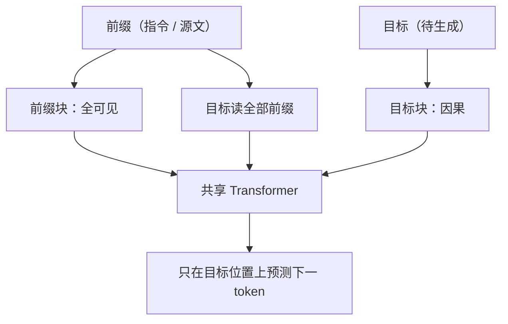

# Prefix LM

前缀已经完整可见，没有理由对它再施因果掩码；只有尚未写出的目标段，才需要从左到右的约束。

<footer>—— 对照 Dong et al., UniLM, NeurIPS 2019；Raffel et al., T5 中的 prefix LM 讨论</footer>

前缀语言模型（Prefix LM）把一条序列切成前缀与目标：前缀内任意两点可以互相看见，目标段仍是因果的，且可以看见整个前缀。它既不是纯 Causal LM（前缀内部也下三角），也不是纯 Masked LM（目标必须能自回归展开）。Dong 等人的 UniLM 用同一套 Transformer 权重，靠换注意力掩码在单向、双向与序列到序列之间切换，其中 seq2seq 就是前缀全可见、目标因果。Raffel 等人在 T5 里把 prefix LM 列为与编码器—解码器、纯语言模型并列的结构，并指出 text-to-text 里源端应全可见。本篇写这张掩码，而不是写 T5 的全部迁移实验。

## 问题

条件生成时，源端（指令、原文、已给定的表格）在预测第一个目标 token 之前就已经完整存在。Causal LM 仍对源端做下三角：源句后半不能进入前半的表示，等于用单向编码器去读源。这对翻译、摘要、填表都不自然。Masked LM 能双向读源，却没有自回归因式分解，不能直接逐 token 写出目标。Prefix LM 要的是第三种条件集合：

- 前缀位置 $i$ 可以读前缀内任意 $j$；
- 目标位置 $t$ 可以读全部前缀，以及目标里 $t$ 以左；
- 任何位置都不能读目标里尚未发生的符号。

这样，训练时每个目标 token 的监督与推理时逐步展开一致，同时源端表示是双向的。

### 掩码是结构，不是另一套权重

UniLM 的要点是：**参数共享，掩码切换**。双向任务用全 1 掩码（再挖 MLM 的洞），单向任务用下三角，seq2seq 用分块掩码。不必为理解与生成各训一个模型。T5 最终主力是编码器—解码器，但论文把 prefix LM 画成「共享参数的编解码器、且交叉注意力改成对前缀加目标的满注意力」的近亲。Liu 等人更早在 text-to-text 设定下用过前缀全可见的掩码；T5 文中回顾了这条线。写 Prefix LM 应指向掩码图案，而不是指向某一个产品名。

前缀边界必须在训练和推理用同一规则切开。若训练把指令和回答混成一条因果链，推理却对指令做双向，表示会偏。反过来，训练是 Prefix、推理框架只实现了因果，前缀内部的右侧信息会在部署时丢失。

## 方法

令序列为 $[\mathrm{prefix};\mathrm{target}]$，长度为 $n_p+n_t$。注意力掩码 $M$ 满足：前缀块 $n_p\times n_p$ 全可见；目标对前缀的块全可见；目标对目标是下三角；前缀对目标全屏蔽（前缀表示不依赖尚未生成的目标，以免泄漏）。损失通常只在目标 token 上计算因果交叉熵；前缀位置可以不预测，或另加 MLM，取决于是纯 Prefix LM 还是 UniLM 的混合。

T5 风格的 text-to-text：前缀是「任务名 + 输入 + 哨兵」，目标是要生成的文本。编码器—解码器把前缀放进双向编码器、目标放进因果解码器，用交叉注意力读编码器输出——条件集合与 Prefix LM 同类，只是参数是否共享、注意力是否分成两次。Prefix LM 把两次合成一次自注意力加分块掩码，实现更简单，深度上前缀与目标共用层。

### UniLM 的三种掩码如何混训

UniLM 在同一 batch 里为不同样本画不同 $M$：一部分做 BERT 式双向 MLM，一部分做 GPT 式单向 LM，一部分做 Prefix 式 seq2seq。共享参数被迫同时服务三种条件集合，微调时按下游任务选一张掩码。这解释了它能在 GLUE 一类理解任务和摘要一类生成任务上都微调：不是魔法数据，是预训练覆盖了三种可见性。纯 Prefix LM 若从不做双向 MLM，理解任务上可能弱于 BERT；从不做纯因果，开放续写可能弱于 GPT。混合是为了折中，代价是每种目标分到的步数变少。

## 机制

从信息流看，Prefix LM 的前缀位置经过多层之后，每个前缀 token 的表示都是整段前缀的函数，类似于编码器输出。目标位置则类似解码器：查询可以读这些「已编码的前缀」以及已经写出的目标。与标准编解码器的差别是：目标层与前缀层是同一组权重，目标 token 也会作为键被后续目标读取，且前缀层能看见的只有前缀（没有单独的编码器深度专用于源）。深度被前缀和目标分摊，长前缀加长目标时，计算是一次 $(n_p+n_t)^2$ 的自注意力，而不是 $n_p^2+n_t n_p$。

泄漏路径：若前缀对目标的块没有屏蔽，前缀表示会含有未来答案，MLM 式的理解头会作弊；生成时这些未来又不存在。因此「前缀双向」不等于「全序列双向」。分块上三角必须画对。

推理时前缀可以一次预填充：前缀内部双向，KV 写成全可见结果；之后每个新目标 token 只追加一行因果查询。实现上很像「先跑一遍非因果预填充，再跑因果 decode」，但权重仍是一份。与纯 Causal 预填充的差别仅在前缀块的掩码。

### 和 Causal / Masked 的条件集合对照

Causal：$t$ 见 $\{1,\ldots,t\}$。Masked：被预测位置见未挖洞的全体，无自回归链。Prefix：前缀见全体前缀；目标 $t$ 见全体前缀加目标前缀。UL2 的 S-denoiser 把 Prefix 再当成去噪混合物中的一种，见 [UL2](/llm/ul2)。选择 Prefix 的理由通常是：有明确的源、要生成、又想单栈部署。若源极长、目标极短，独立编码器可以更深地只处理源，编解码器可能更划算；若源目标同量级且要单栈，Prefix 更干净。

## 边界与工程取舍

Prefix LM 的前缀长度受双向注意力二次代价约束：前缀 8K 时预填充按 $n_p^2$，端侧往往吃不消，需要窗口只加在前缀内部或改成编解码器。目标段一旦开始生成，前缀 KV 必须常驻，预算公式仍是 [端侧 KV](/llm/on-device-kv) 那一条，只是预填充掩码不同。微调若把对话历史整段当因果，会丢掉 Prefix 预训练的源端双向偏置。

不要把「提示放在左边」自动叫做 Prefix LM。许多 Causal 聊天模型只是把提示当因果前缀，提示内部并不能互相看见右侧。只有掩码改了，才是 Prefix。T5 的主力实现是编解码器，引用 T5 时不要写成「T5 就是 Prefix LM」；应写成 T5 讨论并对照了 Prefix LM，UniLM 是单栈掩码切换的代表。

分块掩码在实现里常与 padding 掩码相加。batch 内前缀长度不同时，要对齐到最大前缀并挡住 pad，否则短前缀会读到邻居的 pad 或错位目标。

## 小结

- Prefix LM：前缀全可见，目标因果且可读全部前缀；参数可以仍是一份解码器栈。
- UniLM 用掩码切换统一单向 / 双向 / seq2seq；T5 把 Prefix LM 列为 text-to-text 的一种结构并与编解码器对照。
- 条件集合介于 Causal 与 Masked 之间，专为「源已完整、目标要生成」。
- 前缀对目标必须屏蔽，以免答案倒灌进源表示。
- 推理可对前缀双向预填充，再对目标逐步 decode；二次代价在前缀长度上更刺。
- 出处：Dong et al.，*UniLM*，NeurIPS 2019；Raffel et al.，*T5*，JMLR 2020（文中的 prefix LM 讨论）。
