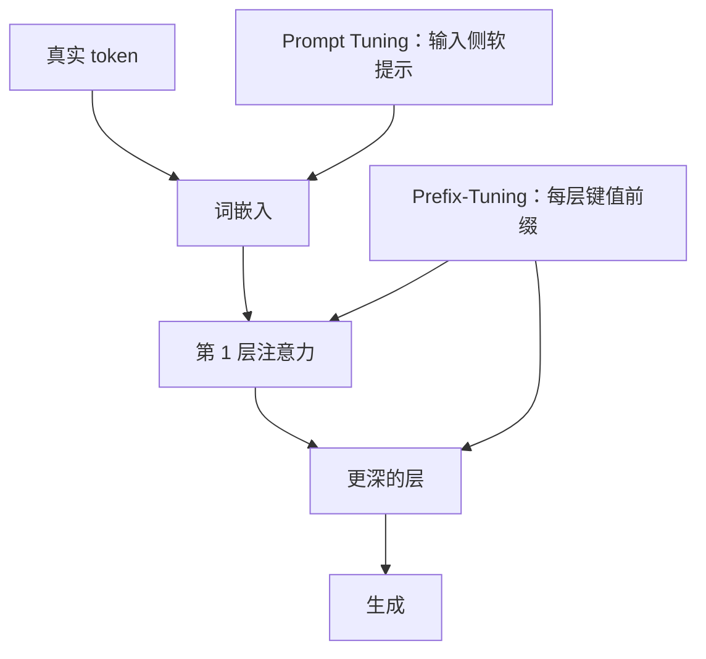

# Prefix / Prompt Tuning

不必改权重；在键值或词嵌入前面接一段可训练的连续前缀，冻结的语言模型就会把这段虚拟上下文当成自己读过的话。

<footer>—— Li 与 Liang，Prefix-Tuning，ACL 2021；Lester 等，Prompt Tuning，EMNLP 2021</footer>

适配器与 LoRA 在权重矩阵上长出增量。另一条参数高效路线根本不碰 $W_0$：只优化一段连续向量，让它以「前缀」或「软提示」的身份进入注意力。Li 与 Liang 的 Prefix-Tuning 把可训练前缀接到每一层的键与值上，面向生成任务。Lester 等人的 Prompt Tuning 把软提示只放在输入嵌入层，参数量随模型变宽而相对更小，并指出规模变大后这条极瘦的提示可以逼近全参微调。二者常被写成同一家族，但注入深度、参数量与优化难度并不相同。

## 问题

全参微调改所有权重，任务一多就要存多份模型。权重侧 PEFT 把增量缩成低秩或瓶颈，仍要在每个目标矩阵上挂模块。若任务差异主要是「先读一段任务说明再生成」，自然想法是优化这段说明。离散提示难搜、不可微；把提示改成连续向量，就可以用梯度下降。问题立刻变成：提示应出现在哪一层、多长、如何参数化才训得稳。

只改输入嵌入，等于让模型在第一层注意力里看见若干虚拟 token，后续层只通过残差与注意力间接受影响。这极省参数，但浅层提示要穿过整个网络才到达输出，深层可能把它们稀释掉。若每一层注意力都允许读一段自己的前缀，控制更直接，参数也随层数线性增长。Li 与 Liang 与 Lester 等人分别站在这两端。还需要解决连续提示的优化地形：直接把前缀矩阵当自由参数，早期训练容易发散或塌到无信息的点。

### 连续提示不是词表里的词

软提示不经过 tokenizer，也没有保证落在词嵌入流形上。把它们理解成「可学习的伪 token」只在形状上成立：长度 $l$、宽度等于模型隐维度或头维度。它们不必能被解码成可读句子；强行最近邻成词，往往得到无意义碎片。评估时应看生成任务指标，而不是看提示能否读懂。

Prefix-Tuning 的「前缀」出现在注意力的键值里，不占用生成时的输出位置；Prompt Tuning 的软提示占用序列最前面的位置，会进入位置编码与因果掩码。二者对长度预算的含义不同。

## 方法

Prefix-Tuning 为每一层（或每一注意力块）维护前缀 $P_k$、$P_v$，拼到该层的键与值前面：

$$
K \leftarrow [P_k; K],\qquad V \leftarrow [P_v; V].
$$

查询仍来自真实 token，于是每个位置都可以关注这段虚拟上下文。为了好训，前缀不直接存成大矩阵，而是由更小的 $\tilde P$ 经过一层 MLP 再展开成 $P_k$、$P_v$（重参数化）。训练结束后可以丢掉 MLP，只存展开后的前缀。语言模型权重全部冻结。Li 与 Liang 在表到文、摘要等生成任务上显示，前缀长度几十到上百时，即可接近全参微调，而可训练参数只有百万量级。

Prompt Tuning 只在嵌入层拼接 $l$ 个可学习向量 $E_{\mathrm{soft}}\in\mathbb{R}^{l\times d}$，其后所有层与词表投影冻结。参数量是 $ld$，与层数无关。Lester 等人强调：在 T5 这类编码器–解码器做到 XXL 规模时，软提示与全参微调的差距收窄，即「规模本身在替提示补表达力」。这与「小模型上 Prompt Tuning 明显弱于 Prefix-Tuning / 适配器」并不矛盾。

## 机制

### 前缀如何改注意力分配

拼上 $P_k$、$P_v$ 后，softmax 在更长的键上归一化。前缀位置没有对应的查询来自真实序列（它们不是因果链上的已生成 token），却能被所有真实查询看见——在解码器里，这相当于一段全局可访问的记忆。训练把任务相关信息写入这段记忆：风格、领域约束、输出格式。因为 $W_Q$、$W_K$、$W_V$ 冻结，前缀必须待在这些投影已经定义好的空间里才能被读懂；这是连续提示有效的前提，也是它与「改权重」的差别：它不能旋转投影空间，只能在既有空间里摆放新的键值。

输入侧软提示还要经过位置编码。它们通常占据序列最左的若干位置，位置编号固定。长上下文任务里，这 $l$ 个位置挤占长度预算，且与 RoPE 的相对位置纠缠：提示与正文的相对距离被位置编码写死。Prefix-Tuning 把前缀放进键值缓存的额外槽，不占正文位置编号，对长度更友好，但每层都要存前缀，多适配器切换时体积大于 Prompt Tuning。

重参数化 MLP 是优化装置，不是推理装置。直接优化大前缀矩阵往往梯度尺度不稳；先映过 MLP 相当于对前缀做平滑的低维坐标。收敛后折叠 MLP，推理只读最终前缀。

### 规模为何抬高 Prompt Tuning 的上限

模型越宽、越深，冻结权重已经包含的任务方向越多，输入侧一小段向量更容易「选中」这些方向，而不必新学投影。Lester 等人把这写成随规模提升的参数高效性：小模型缺的是可被提示选中的特征，大模型缺的只是任务开关。因此在 7B 以下把 Prompt Tuning 当成默认 PEFT，常常失望；在已经很强的基座上做多任务开关，它的参数量优势才明显。Prefix-Tuning 对小模型更宽厚，因为每层都能直接改注意力读出。

## 边界与工程取舍

连续提示与 chat template 不是同一件事。模板是离散特殊 token 与角色分隔，必须与训练数据一致；软提示是额外的连续参数，推理时必须加载对应向量，漏加载等于没微调。把二者混在一个「prompt」名词下，会在部署时只复现了模板、忘了软提示。

前缀长度 $l$ 是容量也是计算：注意力分数多 $l$ 列，Prefill 成本涨一段。$l$ 过长会过拟合小指令集，过短则表达不够。多任务时每个任务一份前缀，可以切换；与 LoRA 不同，前缀不能按矩阵加法随便融合——两段键值前缀拼接会改变长度与位置语义，相加则破坏已学的键方向。

因果语言模型上，输入侧软提示必须落在可被后续 token 关注的位置，并在损失里通常不计算提示位置自身的预测。若错误地对软提示位置算语言模型损失，优化会把它们当普通词去预测下一个词，任务信号被冲掉。

P-Tuning 一类工作把提示深度做到多层但不必像 Prefix-Tuning 那样改键值拼接，工程形态介于二者之间。选型时看的是「注入有多深」与「参数随层数还是只随 $l$ 增长」，而不是商标。

### 与 LoRA 如何选

要改写内部知识、换领域分布，权重侧 PEFT 通常更直接。要在同一基座上挂大量任务开关、且基座已经足够大，Prompt Tuning 的存储最省。生成任务需要较强的格式与风格控制、模型又不是特别大，Prefix-Tuning 更常作为中间项。它们可以叠：LoRA 改权重，前缀当任务标识；叠用时要防止两边抢同一注意力通路，学习率需分开。

## 小结

- Prefix-Tuning 在各层键值前拼接可训练前缀，并用 MLP 重参数化以稳定优化。
- Prompt Tuning 只优化输入侧软提示，参数量 $ld$，随模型规模增大而更有竞争力。
- 前缀改的是既有注意力空间里的记忆槽，不能旋转冻结的 $W_Q$、$W_K$、$W_V$。
- 输入侧提示占序列位置与位置编码；键值前缀占注意力额外槽，对正文长度更友好。
- 连续提示必须在推理时加载，与离散 chat template 是不同对象。
- 小模型上浅提示易被稀释；大模型上它更像任务开关。
- 出处：Li 与 Liang，*Prefix-Tuning: Optimizing Continuous Prompts for Generation*，ACL 2021；Lester、Al-Rfou 与 Constant，*The Power of Scale for Parameter-Efficient Prompt Tuning*，EMNLP 2021。
