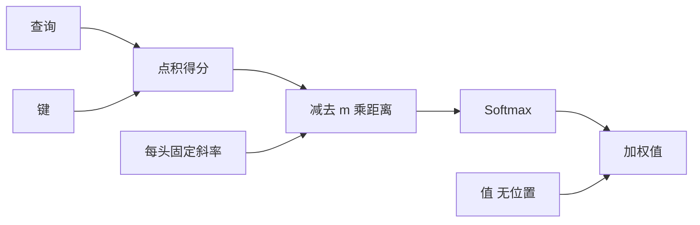

# ALiBi 原文

    
先在短序列上训练，再在长序列上测试：给注意力加上与距离成正比的线性偏置，输入长度就能外推。

    <footer>—— Press, Smith & Lewis, Train Short, Test Long: Attention with Linear Biases Enables Input Length Extrapolation，arXiv:2108.12409，2021</footer>

Press、Smith 与 Lewis 2021 年的 ALiBi 论文把标题写成一句协议：**Train Short, Test Long**。位置不进入表示，只进入注意力 logits，而且是一条按距离下降的直线。训练可以停在一两千词，推理却常常还能走到更长。本篇按原文把线性偏置、几何斜率、以及「去掉位置嵌入之后凭什么还能外推」写完。导读见 [ALiBi](/llm/alibi)。它和后来的 YaRN、位置插值不是同一类补丁——ALiBi 从一开始就按外推来设计，针对的是正弦、绝对表、相对桶在训练长度边界上垮掉的现象。

## 问题

Transformer 若不注入顺序，因果掩码之外几乎分不清谁在谁前面。绝对嵌入在 $L_{\mathrm{train}}$ 之内很稳，一出界就没有对应行。正弦编码看似对任意下标有定义，外推时相位仍落到训练分布之外，Press 等人的实验显示它同样掉得很快。T5 相对偏置可学习，桶在训练里从未见过更大距离，外推同样失败。于是出现工程循环：按短窗口预训练，再为长窗口重训或插值。

原文把失败诊断得更尖锐：难点往往不是缺一个下标，而是训练时从未要求模型给「更远」分配注意力。高频局部模式被学死，长程交给碰巧出现的绝对名字。下标变大，局部统计还在，长程结构对不齐。问题因此很具体：能不能让位置只作为「离得越远越不该看」的归纳偏置，从而训短、测长，而不准备一套会过期的位置表？

### 外推协议必须写进评测

「能跑更长」与「在更长上困惑度不崩」不是一回事。原文的协议是：在固定的 $L_{\mathrm{train}}$（如 512、1024）上训语言模型，在 $2\times$、$3\times$ 乃至更长的输入上测困惑度，对比正弦、旋转、T5 偏置、可学习绝对嵌入。只有在这一协议上赢，才叫他们所说的 extrapolation。同长度训测的胜负是另一张表：ALiBi 需要先证明短窗口内不弱于正弦，外推优势才不是用质量换来的。

线性负偏置把「更远」写成一条在训练里就已经成立的直线，推理时只是把直线延长。绝对表无法延长（没有行）；正弦延长的是波形，不是训练见过的注意力分配。这是 ALiBi 相对其它位置方法的全部差别所在。

## 方法

不加位置向量。第 $i$ 个查询与第 $j$ 个键的分数为

$$
\mathrm{score}(q_i,k_j)=\frac{q_i^\top k_j}{\sqrt{d}}-m|i-j|.
$$

因果 LM 里 $j\le i$，距离即 $i-j$，偏置为 $-m(i-j)$。距离为零时偏置为零；距离增大，logits 线性变负，softmax 之后远处质量被压低。$m>0$ 是该头固定的斜率，**训练前定死，不随数据学习**。这与 T5 相对偏置相反：可学习的距离项会在训练长度处过拟合，外推时没有合法的参数。

### 几何序列斜率

八个头时斜率取 $1/2,1/4,\ldots,1/256$。头数不是八，则在这条几何序列上插值，使最小与最大斜率仍覆盖「几乎只看近邻」到「衰减很慢」的谱。有的头衰减很快，充当局部窗；有的头衰减很慢，远处信号仍在可计算的动态范围里。斜率不学习，是为了让「更远」在训练与测试上是同一条直线的延长，而不是另一套参数。几何公比沿用 $2^{-8/h}$ 一类形式，使头数变化时谱的形状稳定。

### 与正弦、RoPE、T5 的对照实验

原文在 WikiText-103、Toronto BookCorpus 等 LM 设定上做同长度对照与外推对照。主张是：ALiBi 在训练长度内匹配或超过正弦；拉长输入时正弦与绝对嵌入迅速变差，ALiBi 的困惑度曲线平得多。RoPE 在 2021 年的对照里并非后来的默认实现，读表格时要看他们实际接入的旋转或相对方法变体。T5 偏置在训练长度内很强，外推弱，支持「可学习距离桶不能延长」这一诊断。这些数字绑定在当时的模型规模与数据上，不是 7B 指令模型的 128K 评测。

## 机制

线性偏置是对 softmax 的位置先验：无论内容点积多大，距离项都在减。内容可以压过中等距离的罚，但指数级的距离最终会把质量打到近零——除非该头的 $m$ 极小。几何谱保证模型同时拥有「几乎局部」和「几乎平」的头，不必学习何时衰减。训练短窗口时，模型见到的最大距离是 $L_{\mathrm{train}}$；直线在这段区间上已经规定了远近秩序。测试时距离变成 $2L$，秩序仍是同一条直线，只是更远的点更负。这就是「训短测长」能成立的机制：测试没有引入新的位置符号，只是延长一条训练里已经用过的函数。

### 为何不学习斜率

若 $m$ 可学习，优化倾向于把慢衰减头变得更适合训练长度内的平均距离，快衰减头变得更局部。出界之后，这些 $m$ 未必仍是好的外推斜率。固定几何序列牺牲了训练长度内的一点适应力，换来测试长度上的可预测性。原文认为这一牺牲是值得的，并且用同长度实验表明牺牲不大。这与 RoPE 把外推留给频率设计、把训练适应力留给内容旋转，是相反的哲学：ALiBi 把位置通道做成不可学习的硬先验。

没有位置嵌入意味着词向量不携带下标。顺序全靠注意力里的直线。FFN 看不见位置，除非位置已经经注意力写进残差。这对「在 FFN 里做位置敏感的计算」不友好，对「位置只应影响读哪些 token」很友好。因果 LM 更接近后者。

### 与滑窗的差别

固定大斜率的头行为像软滑窗：远处指数小，近似局部。小斜率的头仍是全局的，只是带倾斜。硬滑窗把窗外设为结构零，ALiBi 从不把边删掉，只是让远处在 softmax 里自然变小。因此复杂度仍是二次——ALiBi 解决的是外推，不是 $n^2$ 显存。把 ALiBi 写成线性注意力，是把归纳偏置与计算复杂度混为一谈。要线性，仍需窗、核化或压缩记忆；ALiBi 可以和那些方法叠加，原文没有做这一叠。

## 边界与工程取舍

ALiBi 的二次复杂度在 2024 年之后的超长窗口里不免费。它也没有 RoPE 那种可分段的频谱可供 YaRN 打补丁——没有 $\theta_i$ 可改。已经用 RoPE 训好的模型，不能靠推理时加一条线性偏置来「变成 ALiBi」：相位与线性项会双重计算位置。二者择一作为主位置通道。斜率几何序列是经验选择，换头数、换深度时应复查，而不是当成物理常数。

外推不是无限的。直线延长到极远，几乎所有头的远处质量都进噪声区，模型变成有效滑窗；若任务需要极远的尖峰，内容必须强到打穿偏置，而训练从未用那么远的监督去练这种打穿。原文的 $2\times$–$3\times$ 外推是甜区。书籍级、百万 token 不是这篇 2021 年 LM 论文的主场。双向编码器里距离取绝对值 $|i-j|$，未来与过去对称惩罚；因果里只有过去。不要把因果实验的斜率谱直接抄到双向 BERT 上而不改评测。

Press 等人强调实现极简单：几行加偏置，无额外参数。这是相对复杂相对表的工程论点。简单不等于在所有规模上最优。后来生态选择 RoPE，更多是旋转与长度扩展工具链的路径依赖，不能倒过来证明 ALiBi 的外推协议无效。

### 不要用 ALiBi 解释 RoPE 外推失败

RoPE 出界是相位卷绕；ALiBi 出界是罚得过狠或从未见过的内容距离。把 YaRN 的频率分段套到 ALiBi 上无的放矢。反过来，在 ALiBi 模型上做位置插值也没有下标可压。读 2021 年原文，应把它当成「位置作为不可学习的线性先验」这一设计点的完整论证，而不是长上下文工具箱里的一个开关。

## 小结

- ALiBi 原文的协议是训短测长：位置只以 $-m|i-j|$ 进入 logits，无位置嵌入。
- 每头斜率取固定几何序列，不学习，以便直线在测试时可以延长。
- 同长度上不弱于正弦，外推上明显更稳；T5 可学习桶不能外推。
- 它不降低二次复杂度，软衰减不是硬滑窗，也不是线性注意力。
- 与 RoPE 择一作为主位置通道；极远距离上仍会退化为有效局部。
- 出处：Press, Smith & Lewis，*Train Short, Test Long: Attention with Linear Biases Enables Input Length Extrapolation*，arXiv:2108.12409，2021。
