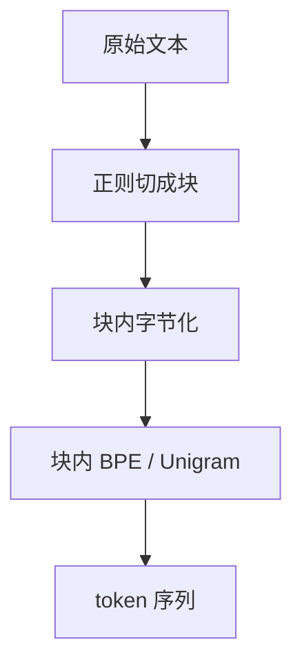

# 预分词正则

我们先按字符类别把文本切成块，再在块内做字节对合并，以免 BPE 把空格、字母与标点焊成无法解释的跨界符号。

<footer>—— 据 Radford 等，GPT-2，2019；对照 Kudo & Richardson，SentencePiece，EMNLP 2018 整理</footer>

[上一课](/llm/expert-granularity-law)把 MoE 的容量收成专家粒度与数量的折中。预训练真正吃进去的，却仍是一条已经切好的离散序列。本课不重讲专家，也不重讲 [BPE 合并规则](/llm/bpe-merge-rule)里那张有序焊对表。缺口是焊对之前那一层：预分词正则决定哪些边界永远不会被合并。后课的字节回退、数字切分、特殊 token，都默认你会本课的「先切块、再合并」。

## 问题

[BPE](/llm/bpe-merge-rule) 与 [Unigram](/llm/unigram-segmentation) 都假定输入已经是一条符号序列。若把整页 HTML 或一整句中英混排直接丢进合并，频率会把 `the(`、`.\n`、甚至跨词的碎片焊成原子，推理时无法再拆。Sennrich 原实现用空格分词，英语干净，中文、代码、无空格脚本会把整句当成一个超长「词」。需要一种不依赖语言词表、却能禁止跨类合并的前置切分。

正则预分词要回答的不是「词是什么」，而是：字母、数字、空白、标点各成一类，类与类之间的边界在合并表里不可见。GPT-2 把这件事写成一条 Unicode 属性正则；SentencePiece 选择几乎不做预分词，把空格当普通字符。两条路对后续词表的形状完全不同。

### 空格预分词盖不住的脚本

空格切分默认「词」已经在空白处断开。中日文、泰语、代码缩进、Markdown 表格都不满足。若仍强行按空白切，一整段汉字会作为单块进入 BPE，合并名额被超长块吃掉，短词反而焊不出来。[分词器设计](/llm/tokenizer-design)已经指出预分词是冻结的承诺；本课只补这条承诺在工程里长什么样。

正则切出的块不是语言学词。`'s`、`'ll` 出现在 GPT-2 的模式里，只因为英语缩写频率高，不是因为词法分析器懂助动词。

## 方法

GPT-2 一类字节级 BPE 的前置步骤是：用正则把原文打成互不重叠的片段，再把每个片段编成 UTF-8 字节，最后只在片段内部跑合并表。典型模式会匹配：英语缩写、可选空格加字母串、可选空格加数字串、可选空格加非字母数字串、以及尾部空白。字母块与数字块之间没有可合并的相邻对，于是 `GPT2` 与 `2024` 不会焊在一起。

SentencePiece 的默认路径相反：不做语言特定正则，把空格映射成特殊标记 `▁`，整句在同一条序列上训练 BPE 或 Unigram。压缩率往往更高，因为「空格+词首」可以焊成一个符号；代价是词界变得只能靠 detokenize 还原，跨语言的公平性也更依赖训练语料的字符分布。

### 正则是词表的一部分

推理必须使用与训练完全相同的正则。改一条 `\p{L}+` 为 `\p{L}*`，同一段原文会变成另一条 token 序列，嵌入全部错位。部署时把正则、字节映射、合并表、特殊符号绑成一个快照，与模型版本一一对应。tiktoken 一类实现把这条正则编译进词表文件，而不是留在业务代码里随手改。

代码对正则极敏感。按「可选空格加字母」切，会把 `foo_bar` 拆开或整块留下，取决于 `_` 算不算字母。词表必须在含代码的混合物上训练，否则配置里的代码配比不等于模型看见的代码 token 数。

## 机制

预分词把合并的搜索空间从「任意相邻字节」收成「块内相邻字节」。块边界是硬约束：即使某跨块对在语料里出现百万次，合并表也看不见它。这保证 detokenize 时空白与标点仍按类别还原，也让英语词干大多落在同一块内，形态后缀有机会被单独焊住。

代价是压缩率的上限被正则锁死。数字若被 `\p{N}+` 收成整块，后续 BPE 仍可能把 `2024` 焊成奇怪碎片——那是下一课数字切分要补的缺口。字符类别定义依赖 Unicode 属性：全角数字、上标、罗马数字是否算 `\p{N}`，会改变科学文本与 CJK 混排的切法。

## 边界

正则预分词不是句法分析。它不会识别 URL、邮箱或公式；复杂模式会把训练变慢，且几乎无法与 GPU 分词内核融合。过度定制的语言特定规则（例如单独列出所有英语缩写）会在其他语言上制造空洞。多语言词表更常见的做法是：一条相对粗的 Unicode 类别正则，加上字节回退兜底。

若任务需要跨空格的短语原子（命名实体、多词函数名），应在特殊 token 或后处理里解决，而不是把正则写成一部词典。预分词只负责「哪些边界永不合并」；「哪些片段值得占一个编号」仍由 [BPE](/llm/bpe-merge-rule) 或 [Unigram](/llm/unigram-segmentation) 在块内完成。

## 小结

- 本课不重讲合并表；只补合并之前的硬边界。
- 预分词正则按字符类别切块，禁止跨类焊对，是 GPT-2 一类字节 BPE 的前置承诺。
- SentencePiece 可几乎不做预分词，空格参与合并，压缩更高、词界更糊。
- 正则与合并表必须同快照冻结；改正则等于换词表。
- 数字块、未见字节、特殊符号仍未处理，留给随后几课。
- 出处：Radford et al., *Language Models are Unsupervised Multitask Learners*, 2019；Kudo & Richardson, *SentencePiece*, EMNLP 2018；Sennrich, Haddow, Birch, ACL 2016。
