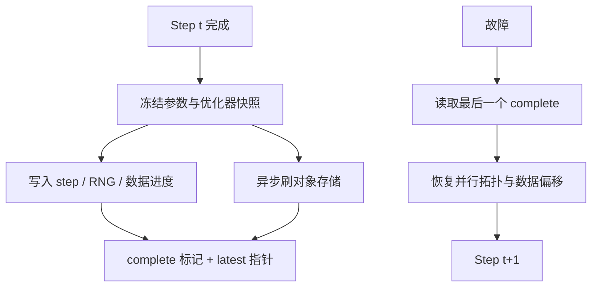

# Checkpoint 与 resume

能 resume 的不是「存了权重」，而是权重、优化器、进度与随机源在下一次 step 能接上同一条轨迹；缺任何一项，都只是从一份快照重新开训。

<footer>—— 综合 PyTorch 分布式检查点与 Megatron / DeepSpeed 预训练实践</footer>

预训练跑在会掉电、会抢占、会坏盘的集群上，墙钟以周计。检查点（checkpoint）把一次训练状态落到可靠存储，resume 从该状态继续。这与 [激活重计算](/llm/activation-checkpointing) 不是同一件事：后者在一步反向里用重算换显存，前者在步与步之间用磁盘换容错。AdamW 要把一阶、二阶矩一起存，分片的 ZeRO 还要把各 rank 的切片拼回或按同样拓扑加载。本篇写必须保存什么、如何与数据进度对齐、以及「能跑下去」和「数值接上」之间的差别。

## 问题

一步训练的状态包括：参数 $\theta$、优化器状态（Adam 的 $m,v$、步数）、学习率日程的进度、梯度缩放器（若用损失缩放）、RNG（CPU、CUDA、dataloader worker）、以及数据迭代器位置。只存 $\theta$，resume 后用新的空优化器，等效于在该点做一次学习率与动量重置，损失曲线会跳，不能当同一实验。只存 $\theta$ 与优化器、不存数据位置，会重复或跳过文档，packing 后的样本顺序一旦错位，所谓续训是另一条数据轨迹。

分布式下问题更硬。ZeRO-3 参数分片、流水线各段、张量并行切片，检查点必须记录并行拓扑。用 64 卡保存的分片，不能假装在 32 卡上直接 `load_state_dict`。故障模型也不同：单步失败要回滚到上一个完整检查点；存储写到一半的文件是损坏检查点，resume 必须能选「最后一个完整的」，而不是目录里时间戳最新的。

### 完整轨迹 vs 够用的续训

精确复现要求：同一软件版本、同一并行度、同一 RNG、同一数据顺序，从检查点接着 step。实践里常放宽：换卡数、换框架版本、只加载权重做退火。放宽应改实验名，不要与原 run 画在同一条损失曲线上假装连续。够用的续训（例如丢了 dataloader 状态但优化器还在）对最终质量可能够用，对论文里的 step-wise 对比不够用。先定义这次作业要哪一种，再决定保存清单。

「异步检查点不阻塞训练」只说明拷贝与计算重叠。若后台线程还在写，前台已经改了被拷内存，存下来的是撕裂状态。必须先冻结一份快照（拷到预留缓冲或用版本计数），再异步刷盘。速度优化不能破坏原子性。

## 方法

保存清单最低应是：模型、优化器、日程、global step、RNG、数据进度（样本索引或 shuffle epoch + 偏移）、以及并行配置与代码/配置哈希。格式上，PyTorch Distributed Checkpoint（DCP）按张量名与分片元数据写，便于改并行度加载；Megatron 一类则按 TP/PP rank 落文件。两者都要写 `latest` 指针与 `complete` 标记：先写临时目录，fsync，再原子改名。保留最近 $N$ 个与每隔 $K$ 步的永久点，避免磁盘被逐步文件填满，也避免坏掉最后一个时无路可退。

数据进度在 web 语料上要用确定性 shuffle：种子加 epoch，记录已经消费的全局索引。packing 后应以 packed 样本 ID 为进度，而不是原始文档 ID，否则 resume 会把半个桶再装一次。评估循环不要破坏训练 RNG：eval 用独立生成器，或保存/恢复训练生成器。混合精度的 scaler 状态必须存，否则 resume 后第一步可能溢出或过度缩放。

### 异步、频率与转换

检查点频率是故障平均时间（MTBF）与写放大之间的权衡。步间隔太短，HBM 到对象存储的带宽吃掉有效训练；太长，故障回滚丢失几天。异步写把「序列化 + 上传」移出关键路径，但需要双缓冲内存。对象存储上应用分片并行上传，并校验 ETag / 校验和。需要对外发布时，另做一份「仅权重」转换（HF、Megatron 导出），不要让研究 resume 依赖发布格式——发布格式通常丢掉优化器。从 ZeRO 分片合并成整模型，是另一次作业，应在空闲时做，失败不得影响训练目录里的权威检查点。

## 机制

Resume 的数值机制是：优化器的 $m,v$ 与当前 $\theta$、当前 lr 必须来自同一 step。Adam 的自适应尺度依赖历史梯度平方；清零 $v$ 会让更新突然变大。数据机制是经验分布的遍历：有放回或无放回、是否按 token 加权，都由迭代器状态编码。RNG 机制覆盖 dropout、数据增强与任何随机层；CUDA 图与异步核使「只存 Python RNG」不够，还要 `torch.cuda.get_rng_state_all()` 一类。并行机制是切片对齐：加载时按当时的 TP/PP/DP 重切或用 DCP 的 reshard。

完整性机制靠两阶段提交：数据可见之前不更新 `latest`。读侧只跟随 `latest` 指向的 complete 目录。这与数据库 WAL 思想相同，只是粒度是「整个训练状态」。

激活重计算检查点与训练检查点都叫 checkpoint，日志里应分开说。前者是 autograd 图上的保留张量；后者是作业级快照。混淆二者会导致有人「开了 checkpoint」却在节点被杀后从 step 0 重来。

### 与 ZeRO、流水线的耦合

ZeRO-1 只分片优化器，保存时要 all-gather 或按 rank 各写一份再在 resume 时校验步数一致。流水线并行下，各 stage 的模块不同，必须所有 stage 都写完才算 complete，否则会出现「后段新、前段旧」的拼接模型。张量并行的 embedding 与输出头切片同样。故障若只杀掉部分 rank，不要试图从活着的 rank 内存拼一份检查点，除非明确实现了一致性协议；默认回滚到上一个 complete。

## 边界与工程取舍

精确复现与弹性扩缩冲突。允许改卡数 resume，就要接受 DCP reshard 的代价与可能的数值微差（归约顺序）。允许换 CUDA / 框架版本，RNG 与内核实现都会变。对象存储最终一致时，「写完立刻在另一区域读」可能读到旧 `latest`，应用版本号或强一致列表。安全上，检查点含完整模型与数据进度，访问控制应与训练数据同级；不要把带优化器的目录公开成 HF 仓库。

测试 resume 应纳入 CI：训几步、存、再训几步，与不中断的损失对比（允许浮点噪声）。从未测过的检查点格式，等于没有容错。长跑中途改 packing、改过滤配方，即使权重接上，数据轨迹也断了，应升实验版本。

「最后一个检查点的损失更低」不能证明 resume 正确。正确性看 resume 后第一步的 loss 是否与保存前一步连续，以及数据指纹是否接上。损失碰巧下降，可能只是重复数据或 lr 被重置到更甜的点。

## 小结

- 训练检查点要覆盖参数、优化器、日程、scaler、RNG 与数据进度，外加并行拓扑。
- Resume 分精确轨迹与够用的续训；混画损失曲线是实验错误。
- 用临时目录 + complete 标记做原子发布；`latest` 只指向完整快照。
- 异步保存必须先冻结快照，防止撕裂；频率按 MTBF 与写放大权衡。
- 发布用的仅权重格式不是 resume 权威源。
- ZeRO / 流水线必须全 rank 一致完成才算一次检查点。
- 出处：PyTorch Distributed Checkpoint 文档；Shoeybi et al., Megatron-LM；Rajbhandari et al., ZeRO / DeepSpeed。
