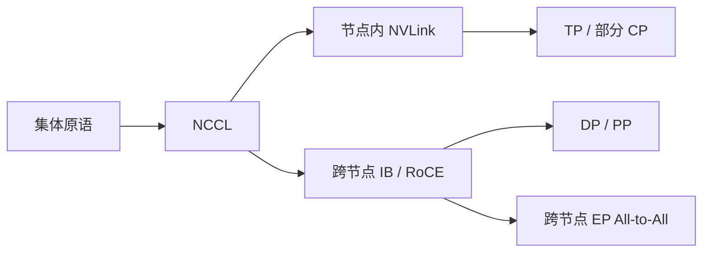

# 通信：NCCL、NVLink、跨节点

    
并行算法写在进程组上，真正跑起来的是节点内的 NVLink 和节点间的网络。同一条 All-Reduce，走哪条链路，决定这一步是算力墙还是通信墙。

    <footer>—— NVIDIA NCCL 文档与 GPU 集群上的 Megatron 类预训练实践</footer>

预训练的并行维最终都要落到集体通信。数据并行要同步梯度，张量并行要在层内归约或聚集激活，流水线要在阶段之间递交激活，专家并行要 All-to-All，上下文并行要沿序列传键值。GPU 集群上这些调用大多经过 NCCL。NCCL 再往下，节点内尽量走 NVLink，跨节点走 InfiniBand 或 RoCE。算法论文里一个「All-Reduce」符号，在机柜里可能是 NVLink 上的环，再拼一条跨节点的树；带宽可以差出一个数量级。本篇把这三层——库、节点内互连、跨节点网络——放到同一张图里，说明预训练为什么对拓扑如此敏感。

## 问题

单卡算力逐年涨，单卡显存与单卡对外带宽不按同样比例涨。模型一旦跨卡，每一步都有一部分时间在等别人的张量。等的时间由两件事决定：集体算法要搬多少字节，以及这些字节走的物理链路能提供多少有效带宽。只优化前者（少通信）或只升级后者（更快的网）都不完整：张量并行把大量短消息放在层内，必须吃最胖的链路；数据并行消息大、可重叠，更能容忍跨节点。

若把所有进程当成全连接的抽象机器，NCCL 会在错误的链路上跑正确的算法。节点内本来可以走 NVLink 的 All-Reduce，被拆到 PCIe 或网卡上，利用率立刻掉一截。跨节点的 All-to-All 若没有层次化，会把节点内的高带宽闲置，所有流量挤到几张网卡。预训练通信的问题因此是：在给定拓扑上，为每一种集体操作选择进程组与算法，使有效带宽接近链路的物理上限。

### 三种延迟与带宽尺度

同一节点内，NVLink 提供 GPU 之间的高带宽、相对低延迟通道，不经过主机内存。PCIe 慢一截，且常与 CPU、网卡争用。跨节点则经过 NIC、交换机，单向带宽以百 Gb/s 计，延迟明显高于 NVLink。一次几 MB 的层内 All-Reduce 在 NVLink 上可能是几十微秒量级的可重叠操作，换到跨节点就变成这一层的主墙。看 `nccl-tests` 的 busbw 比看标称 Gb/s 更接近训练。集体算法有环、树、倍增等实现，算法效率、消息大小、GPU 直连是否启用，都会让有效带宽远低于网卡标称。调预训练通信，先用同样消息大小的微基准对齐拓扑，再改模型并行度。

## 方法

NCCL 对训练暴露的常用原语包括 All-Reduce、Reduce-Scatter、All-Gather、All-to-All、Broadcast，以及流水线用的 Send/Recv。数据并行的梯度同步走 All-Reduce，或 ZeRO 的 Reduce-Scatter 加 All-Gather；张量并行按实现走 All-Reduce 或 All-Gather / Reduce-Scatter 对；专家并行走 All-to-All；流水线走点对点。库负责选算法、切 chunk、用 GPU 内核做归约，并在可能时走 GPU Direct RDMA，避免绕道主机。

拓扑感知是配置的一部分。同一节点的 GPU 应划进需要高带宽的进程组（张量并行，必要时包括上下文并行）。跨节点的组承担数据并行与流水线。NCCL 通过查询 NVLink、NVSwitch、NIC 的连接来建图；用户则通过并行网格保证「通信最密的组」落在图里最密的子图上。关闭 GPU Direct、误绑 NUMA、或让网卡与 GPU 不在同一 PCIe 交换机下，都会让这条图退化。

### 层次化集体通信

跨节点 All-Reduce 的常见实现是层次化的：先在节点内用 NVLink 做 Reduce，再把每节点一份结果打到 InfiniBand 上做跨节点 Reduce，最后再在节点内 Broadcast 或 All-Gather。这样跨节点只走「每节点一份」的体积，而不是每 GPU 一份。All-to-All 更难层次化，因为置换没有可加的中间结果，流量往往必须真正跨到对端 GPU。MoE 预训练因此特别怕 EP 组跨满整个集群：NVLink 帮不上置换的跨节点段。

流水线的点对点可以跨节点，是因为激活递交的频率按层段而不是按每一个 GEMM，消息更大、次数更少。把张量并行组跨到节点外，等于把最频繁的集体通信放到最慢的链路上，通常是最后才考虑的办法。

## 机制

有效带宽可以粗写成 $\min(B_{\mathrm{nvlink}}, B_{\mathrm{nic}}\cdot \eta) $ 再乘算法效率。$\eta$ 包含 RDMA 是否直达、交换机争用、以及多租户干扰。消息很小时，延迟项主导，公式变成 $T \approx \alpha + n\beta$，其中 $\alpha$ 是启动延迟。张量并行的短 All-Reduce、专家并行在小 microbatch 下的 All-to-All，都可能掉进延迟区：再增加链路标称带宽也救不了启动开销。这时应减通信次数（融合通信、更大的层切分）、或把该进程组缩回 NVLink 域。

与计算重叠是另一条轴。数据并行的梯度 All-Reduce 可以在反向的前几层还在算时发出去；流水线可以在计算当前 microbatch 时递交上一个。层内张量并行很难重叠，因为它卡在正向或反向的关键路径上。通信库提供的 `group` 与流（stream）让重叠成为可能，但前提是内核调度没有把计算流堵住，以及缓冲区已经预注册。BF16 / FP8 训练会改变通信体积。梯度用 BF16 通信能减半字节，但需要和缩放、损失精度策略一致。有的系统对梯度做 FP8 通信，进一步减跨节点压力，代价是数值协议必须在所有 DP 副本上对齐。通信 dtype 是训练配方的一部分，不是网卡开关。

### 故障与噪声

大规模预训练的通信墙不一定来自算法。单条 InfiniBand 链路抖动、一台交换机丢包、一张网卡降速，都会让一次 All-Reduce 的尾延迟变成整步的 step time。NCCL 超时、挂起，常常是拓扑或网卡问题而不是模型代码。监控上应同时看每组集体通信的耗时分布，而不是只看平均吞吐。专家并行的 All-to-All 对负载不均更敏感：热专家所在节点既是计算热点也是网络热点。

## 边界与工程取舍

NCCL 不是唯一后端。TPU 有自己的 mesh 通信，AMD GPU 有 RCCL 一类实现，CPU 集群走另一套。语义可以类比，带宽数字不能搬。单机多卡若只有 PCIe、没有 NVLink，张量并行的收益会大幅下降，这时应更多依赖数据并行加参数分片，而不是强行 8 路 TP。

也不是所有通信都该走 NCCL。主机侧的数据加载、检查点写入、以及某些参数服务器式的稀疏更新，走别的路径更合适。把检查点挤在同一条 InfiniBand 上与梯度 All-Reduce 抢带宽，会造成周期性的 step 尖峰。调度上应错开，或给存储网单独的平面。「带宽够」是相对消息模式说的。NVLink 够张量并行，不一定够把检查点瞬时打到本地 SSD 再转发。跨节点网够数据并行，不一定够把 MoE 的 All-to-All 铺到上百个节点。并行网格写完之后，要用与真实消息大小相近的微基准验证，而不是只看硬件规格表。

最后，通信优化不能替代正确的并行切分。链路再快，把该切的专家或序列硬塞进单卡，显存仍会爆；切错进程组，再快的 NVLink 也在闲置。NCCL 与 NVLink 是把已经设计好的网格跑满的工具。

## 小结

- 预训练集体通信在 GPU 上多经 NCCL；节点内走 NVLink，跨节点走 InfiniBand 或 RoCE。
- 张量并行等层内高频通信必须落在 NVLink 域；数据并行与流水线更能容忍跨节点。
- 层次化 All-Reduce 先在节点内归约，再走网卡，以减少跨节点体积。
- All-to-All 难以同样层次化，跨节点 EP 容易成为墙。
- 小消息落在延迟区，加标称带宽不如减次数或缩进程组。
- 尾延迟、拓扑绑核与 GPU Direct 往往比平均带宽更能解释 step 抖动。
- 出处：NCCL 作为 NVIDIA 集体通信库的公开文档与实现；NVLink 为节点内 GPU 互连。并行侧的实践与 Megatron-LM 等 GPU 预训练系统一致。
