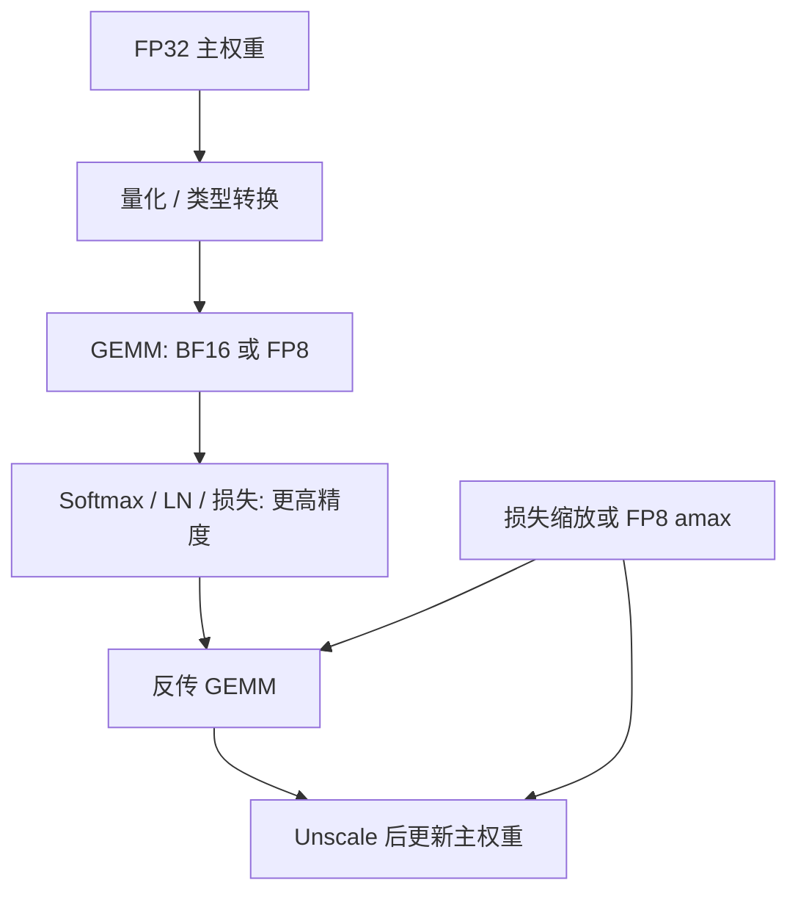

# 混合精度 BF16 / FP8 训练

用更窄的尾数做矩阵乘，用足够的指数位保住梯度不消失；主权重仍在较宽的格式里累积。

<footer>—— Micikevicius 等，混合精度训练；NVIDIA Transformer Engine 的 FP8 路径</footer>

预训练的算力墙几乎总是矩阵乘。把 GEMM 从 FP32 换成 FP16、BF16、再换成 FP8，吞吐按硬件峰值涨，显存按字节数降。代价是动态范围与精度同时变窄：小梯度下溢成零，大激活溢出成 Inf，softmax 与损失在窄格式里先饱和。混合精度的意思是：**计算用窄格式，需要累加和需要保护的状态用宽格式**。Micikevicius 等人 2018 年的 FP16 配方给出了主权重加损失缩放。BF16 改指数位，通常不再依赖损失缩放。FP8 再窄一档，NVIDIA Transformer Engine 用每张量（或分块）的缩放因子与延迟统计把范围搬回可表示区间。本篇按 FP16 → BF16 → FP8 把同一套问题重写一遍，不谈推理量化。

## 问题

FP32 的指数 8 位、尾数 23 位，对反向传播里跨层相乘的梯度来说过于奢侈，也对 Tensor Core 不友好。FP16 把指数收到 5 位，动态范围大约 $6\times 10^{-8}$ 到 $6\times 10^{4}$。许多合法梯度的幅度落在下限以下，反传结束时变成全零，权重不再更新——这是损失缩放要救的对象。上限附近，注意力分数与未归一的 logits 容易 Inf。于是出现一对矛盾：既要把梯度乘大以免下溢，又不能把激活乘大以免溢出。

BF16（brain floating point）把指数恢复到与 FP32 相同的 8 位，尾数只留 7 位。动态范围不再是瓶颈，缺的是精度：累加与小更新会有量化噪声。FP8 更极端：常见两种布局 E4M3（指数 4、尾数 3，偏向前向）与 E5M2（指数 5、尾数 2，偏向梯度）。没有额外缩放，绝大多数张量根本塞不进 FP8。混合精度训练要回答的不是「用哪种字面格式」，而是「缩放放在哪、主权重用什么、哪些算子不准降」。

### FP16 为什么要损失缩放

损失缩放把目标乘一个因子 $s$（例如 $2^{10}$ 到 $2^{16}$），反传链路上的梯度整体乘 $s$，使小梯度进入 FP16 可表示区；更新前再除以 $s$。动态损失缩放观察是否出现 Inf/NaN：连续若干步干净则尝试增大 $s$，一溢出就丢掉该步并减小 $s$。主权重以 FP32 保存，FP16 只用于前向、反传和通信。没有 FP32 主权重，FP16 的更新量化误差会把小学习率下的步长吞掉。

损失缩放不是改损失函数的定义。评测、日志里的损失应是未乘 $s$ 的值。优化器看到的梯度必须在进入 Adam 之前 unscale，否则二阶矩 $v$ 会按 $s^2$ 膨胀，学习率含义全乱。

## 方法

当代预训练默认 BF16：前向与梯度用 BF16，主权重与 Adam 状态用 FP32（或不存单独主权重、在 BF16 权重上用 FP32 动量——这是实现分歧，数值上后者更糙）。BF16 的指数与 FP32 同宽，动态损失缩放通常关闭。仍建议把 softmax、损失、部分归约留在 FP32，因为尾数短，指数和的消除误差大。

FP8 训练（Transformer Engine 思路）在 BF16 配方上再插一层张量级缩放。每个参与 GEMM 的张量配一个缩放因子 $\alpha$，存储的是 $x_{\mathrm{fp8}}\approx x/(\alpha)$ 或硬件约定的倒数形式，使 $x$ 的最大绝对值（amax）映射到 E4M3/E5M2 的最大有限值附近。前向常用 E4M3（尾数多一点），梯度常用 E5M2（范围大一点）。这不是唯一拆法，但是 NVIDIA 文档与 TE 的典型路径。

延迟缩放（delayed scaling）：本步用历史若干步的 amax 统计来选 $\alpha$，本步的 amax 写入历史，供后续步使用。避免为了当前 amax 先做一次额外的全张量扫描再量化。amax 窗口过大，缩放跟不上突然的激活暴涨，溢出；过小，统计噪声让 $\alpha$ 抖动，等效额外的学习率噪声。出现溢出时，实现通常跳过该步或回退到较宽格式——与动态损失缩放是同一类控制回路，只是对象从「全局 $s$」变成「每张量 $\alpha$」。

### FP8 与 Transformer Engine 的缩放

TE 把线性层的输入、权重、梯度分别量化。权重可以每步从 FP32/BF16 主副本转 FP8，也可以维护一份 FP8 权重再定期刷新。矩阵乘在 Tensor Core 上以 FP8 输入、较高精度累加（通常 FP32 累加器）。缩放因子要进入这次乘的元数据，使数值等于 $\alpha_x\alpha_w$ 意义下的真值。漏乘一个 $\alpha$，相当于给该层乘了一个随机的学习率。流水线与张量并行下，amax 的归约必须跨参与该张量的设备，否则每张卡各用各的范围，分片拼接后尺度不一致。

全局损失缩放在 FP8 里仍然可能出现：梯度的 E5M2 再窄，光靠 per-tensor $\alpha$ 不够时，用 $s$ 把损失抬一层。两条缩放叠在一起时，unscale 的顺序必须与正向乘 $s$、量化除 $\alpha$ 互逆。这是实现里最容易静默出错的地方：训练能跑、损失看起来在降，但有效学习率已经不是配置文件里的数。

## 机制

窄格式伤害两类运算不同。GEMM 是乘加，Tensor Core 的累加器比输入宽，个别乘的尾数误差被大量项平均，预训练对这种噪声相对耐。逐元素的归一化、softmax、交叉熵，是先减最大值再指数再除，对动态范围和尾数都敏感：最大值一溢出，整行 NaN；尾数不够，小概率 token 的梯度消失。所以混合精度的边界画在「矩阵乘可以窄、归约与归一化要宽」。

BF16 相对 FP16 的本质是把预算从尾数挪到指数。梯度下溢减少，更新噪声增加。大 batch、大模型上噪声被平均，BF16 成为默认；极小模型或对数值极敏感的对比学习，有时仍能测到与 FP32 的差。FP8 把这条路再走一步：必须靠 $\alpha$ 把张量搬进窄格子。$\alpha$ 若按张量全局取 amax，一张量里大多数值挤在量化格子的少数档，等于有效位数更少；分块（block / mx）缩放把局部范围分开，精度更好，元数据与内核更复杂。OCP 的微缩放格式属于后一方向，本篇不展开标准文本。

「BF16 不需要损失缩放」是经验默认，不是证明。若某层梯度系统性小于 BF16 的最小正规数，它们照样变零。遇到「某些层完全不更新」时，先看梯度直方图，而不是先开 FP8。

### 哪些算子必须留在高精度

最低限度：损失、softmax（注意力与词预测）、LayerNorm / RMSNorm 的统计量。嵌入查找可以用 BF16 存、FP32 累加梯度。梯度裁剪的范数应在 unscale 之后、在约定的宽格式里算。检查点存主权重的宽副本；只存 FP8 权重无法无损恢复训练。

通信精度是另一处权衡。All-Reduce BF16 梯度省带宽，但多次累加的误差大于 FP32。ZeRO 的 Reduce-Scatter 同理。FP8 通信需要各 rank 对同一缩放约定，否则求和无定义。多数系统仍用 BF16 通信梯度，只把本地 GEMM 降到 FP8。

## 边界与工程取舍

不要把训练 FP8 和推理 INT8/FP8 当成同一套缩放。推理可以离线校准、可以权重量化感知训练；预训练的 FP8 每步都在变 amax，目标是匹配 BF16 的更新轨迹，而不是压缩部署体积。用推理量化的校准集去「验证」预训练 FP8，问错了问题。

动态范围突发（损失尖峰、数据尖峰）会让延迟缩放滞后一拍：$\alpha$ 仍按旧 amax，新激活溢出。这是 FP8 训练与尖峰互相放大的通道。应对是溢出则跳过该步、缩小 $\alpha$、或该层回退 BF16。把 clip 阈值收得很紧可以减少溢出，也会扭曲有效学习率。

主权重的格式决定「小学习率是否还能积累」。只把 GEMM 换成 FP8、却用 BF16 存权重又关掉 FP32 主副本，小更新会被量化台阶挡住，表现为损失早停在一个平台。省显存之前先确认优化器状态仍在 FP32。

硬件绑定：没有 FP8 Tensor Core 的设备上模拟 FP8 没有吞吐意义。BF16 在 Ampere 及以后、以及 TPU 上是一等公民。同一配方在只支持 FP16 的卡上必须重开损失缩放，不能只改 dtype 名字。可复现实验应写明：计算 dtype、通信 dtype、主权重 dtype、是否动态损失缩放、FP8 的 E4M3/E5M2 分配与 amax 窗口。

## 小结

- 混合精度用窄格式做 GEMM，用宽格式存主权重与做 softmax、归一化、损失。
- FP16 依赖损失缩放把梯度抬进可表示范围；BF16 指数与 FP32 同宽，默认不再用全局 $s$。
- FP8 需要 per-tensor（或分块）缩放与 amax 统计；Transformer Engine 典型前向 E4M3、梯度 E5M2，并可与损失缩放叠用。
- Unscale 顺序、amax 的跨设备归约、通信精度，都会静默改写有效学习率。
- 训练 FP8 的目标是跟上 BF16 更新，不是完成部署量化。
- 出处：Micikevicius 等，混合精度训练，2018；BF16 作为硬件格式的工程实践；NVIDIA Transformer Engine 文档中的 FP8 配方与延迟缩放。
