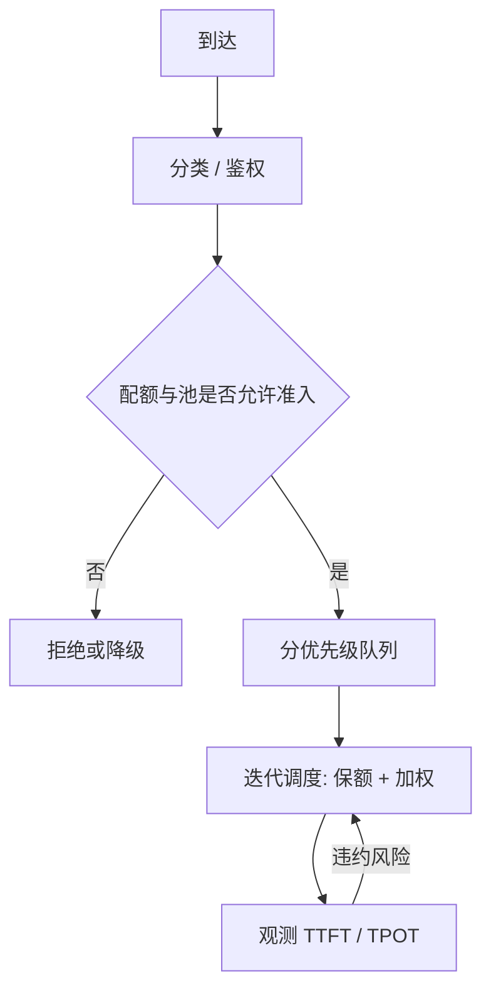

# 优先级与 SLA

吞吐曲线上的一个工作点不能满足所有人的截止时间；要把延迟写成可执行的类别与配额，再在每一次迭代里落实。

<footer>—— 对照 Yu et al., Orca, OSDI 2022 提供的迭代级钩子，把 SLA 写成调度输入而不是事后报表</footer>

连续批把 GPU 填满之后，默认行为是「谁能进运行集谁就跑」，优化的是吞吐。产品要的往往不是最大 token/s，而是分类承诺：交互聊天的 TTFT 与 TPOT、批作业的完成时间、付费租户不被免费流量挤死。SLA（服务等级目标）把这些承诺写成可测量的截止时间与达成率；优先级决定过载时谁先用迭代、谁先用 KV 槽。二者都建在 [iteration-level 调度](/llm/iteration-scheduling) 上：没有每步改成员的能力，优先级只能在整批结束时才换人，对生成式延迟太晚。

## 问题

生成延迟不是一个数。用户感知至少拆成：排队等到第一次前填开始、[TTFT] 首 token、[TPOT] 后续 token 间隔、整段 E2E。同一条请求在 prefill 阶段是算力密集、在 decode 阶段是带宽密集，两种 SLA 互相抢资源。把「平均延迟小于 2 秒」写成唯一目标，调度器会做出奇怪的事：拒绝长请求、或把 decode 批加到极大以抬吞吐却让 TPOT 掉出交互范围。

多租户让问题再乘一层。租户 A 的离线摘要可以等一分钟；租户 B 的补全要 100 ms 级 TPOT。若不设优先级，连续批的自然倾向是把运行集填满——离线大包最能填满，交互被挤到队列。这不是引擎 bug，是目标函数还停留在吞吐。

### SLA 必须写成可调度的约束

能进调度器的 SLA 通常是分位数加类别，例如：交互类 TTFT P95 $< t_1$、TPOT P95 $< t_2$；批处理类 E2E P95 $< t_3$；每类有最大排队深度。达不到时的动作也要写清：降级（缩短 `max_tokens`、关投机解码）、拒绝（429）、或抢占低优先级。只写「努力尽快」的 SLA 无法变成比较函数，调度器最后仍会退回 FCFS。

SLA 是对外承诺，优先级是对内比较器。承诺没有比较器就无法在过载时执行；比较器没有承诺就只是偏袒。两者要成对出现：每个优先级对应一档可测量的延迟目标与配额。

## 方法

把请求打上类别 $c$，每类有权重 $w_c$、KV 配额 $Q_c$、可抢占性。调度器在迭代边界构造运行集时，先保证高优先级的最低份额（例如至少 $k$ 个 decode 槽，或至少 $Q_c$ 字节的 KV），再用剩余容量填低优先级。这是加权公平排队在 token 步上的变体：每类维护虚拟时间，跑一步就推进 $1/w_c$。纯严格优先级（高类有货就不上低类）实现简单，过载时低类会饿死，只适合「付费 vs 尽力而为」这种允许饿死的产品。

### 指标与控制环

TTFT 主要被等待 prefill 和 prefill 本身长度驱动。控制手段：为交互类保留 prefill 槽、限制同时进行的大前填条数、把超长提示丢到批处理类。TPOT 被当时 decode 批大小、是否混入 prefill、是否被抢占驱动。控制手段：给交互 decode 设最大批、禁止在其迭代里塞进大块 prefill、限制对交互类的抢占。E2E 对批处理类更有意义，可以用静态大包在空闲时打满。

准入是 SLA 的第一道闸。KV 池已超过高优先级预留线时，低优先级新请求直接拒绝，而不是先准入再靠 [抢占](/llm/preemption-fairness) 在内部折腾。抢占是第二道闸，处理「已经准入但更高优先级突然到达」。两道闸都缺时，优先级只是队列排序，池子满了大家一起超时，SLA 变成大家一起违约。

### 与连续批的配合

连续批提供填充效率；优先级决定填充谁。实现上不要维护两套引擎，而要在同一 $\mathcal{B}$ 里用有序挑选：候选 = 未结束且 KV 可放置的请求，按（类别、到达时间、已获得步数）排序，直到算力或块上限。投机解码、更大草稿、更长窗口，都应看成**可剥夺的加速器**：先保证 SLA 类别的正确性与截止时间，再把剩余算力拿去换加速比。低优先级可以开激进投机；交互类在 TPOT 已贴线时关掉草稿，避免验证步把间隔顶破。

## 机制

优先级起作用，是因为它改变了每一步 $\mathcal{B}$ 的期望组成，从而改变各类看到的排队论参数。高优先级的有效服务速率上升，低优先级下降；系统总吞吐可能不变甚至略降（因为不再永远选「最能填满 GPU」的包）。SLA 达成率改善来自减少高优先级的等待，不是来自模型更快。

分位数比均值难控制。平均值可以被大量容易请求拉低，P95 仍由长提示和抢占间隙决定。调度器若优化均值，会继续优待短请求、忽视刚好落在 P95 附近的那些。实践上要对「已排队时长 / 截止时间」排序，让接近违约的请求获得临时提升——这是老化，也是把 SLA 从报表塞进比较器。

不要用单一 QPS 压测给所有类别签发 SLA。压测应分列：只打交互、只打批处理、以及按预计配比混合。混合压测里批处理会「帮助」填满 GPU，把交互的 TPOT 画像变得过分乐观或过分悲观，取决于你是否做了保额。

## 边界与工程取舍

优先级不能创造容量。过载且全部是同一高优先级时，比较器失效，必须靠拒绝或限流。多级优先级若超过三到四档，运维无法解释为何某条请求被挤，调试成本压过收益。配额要按字节而不是按请求数：一条 128K 提示等于几十条短聊天的 KV，按条数保额会被长上下文打穿。

SLA 数字必须含模型与模板。同一 GPU 上换一个更大的模型或打开思维链，TTFT 与长度乘数都变，旧 SLA 作废。R1 类长链尤其不能和短补全共用一档 TPOT。跨区域、跨精度（FP8 / BF16）同样。把 SLA 写进服务目录时，应钉住：模型、精度、最大提示、最大生成、是否投机解码。

对外 SLA 与对内 SLO 分开：对外写得保守，对内阈值更紧，留出抢占和重试的余量。把压测峰值写成合同数字，第一次发生换出风暴就会集体违约。

## 小结

- SLA 把延迟拆成 TTFT、TPOT、E2E 分位数；优先级是过载时落实这些分位数的比较器。
- 调度器在迭代边界按类别保额、加权公平挑选运行集；准入是第一道闸，抢占是第二道。
- 连续批优化吞吐，不会自动满足交互延迟；二者目标冲突时以类别配额裁决。
- 配额按 KV 字节而不是按条数；档位宜少、数字钉模型和精度。
- 过载且同优先级时只能拒绝或降级，优先级不创造算力。
- 投机等加速器应可按 SLA 余量开关。
- 出处：迭代钩子见 Yu et al., *Orca*, OSDI 2022。SLA 与多类排队是服务政策，需与抢占、连续批一并设计。
