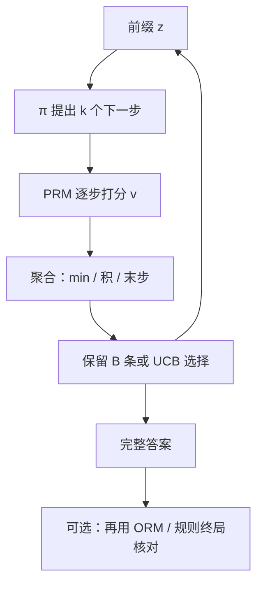

# 过程奖励引导的搜索

对推理链的每一步给反馈，比只看最终答案更能教会模型找到并修正中间错误；测试时也可以用逐步分数来引导搜索。

<footer>—— Lightman et al., Let's Verify Step by Step, 2023</footer>

结果监督（ORM）只给完整解答一个标量；过程监督（PRM）给每个步骤一个「这一步是否正确」的分数。Lightman 等人在数学题上表明，过程标签能训练出更好的验证器，用同一验证器做最佳候选选择时，过程路线更数据高效。Snell 等人 2024 年进一步把 **对过程验证器做搜索** 写成测试时计算的一条主路径。本篇写 PRM 如何进入束、lookahead 与 [MCTS](/llm/mcts-llm)，以及聚合函数如何把逐步分变成一条轨迹的 $s$。训练 PRM 的数据工序留在过程监督专文的位置，这里只取对 *搜索* 必要的接口。

## 问题

终局 0/1 让[Best-of-N](/llm/best-of-n) 在长链上方差很大：一百步里一步算错，整条 $R=0$，搜索不知道错在哪，只能整条扔掉。逐步分数把树的边变成可比较的 $Q$，使束能在分叉处剪掉已经错的前缀，把预算留给仍可能对的分支。问题立刻变成两个估计误差：PRM 假阴性会剪掉正确前缀；假阳性会保护一条写得很像证明、中间已经错的链——「假推理」被搜索放大，而不是被消灭。

没有逐步模型时，人们用模型自身的 $\log\pi$ 当逐步分，那是在做[束搜索](/llm/beam-vs-sample)，目标仍是似然不是正确性。PRM 引导意味着评分函数与生成器可以来自不同训练信号。二者分布一偏，搜索就在最大化一个错误的势。

### 步骤边界是接口的一部分

PRM 假设文本已被切成步骤（换行、编号、「Step k」）。切错则分数对齐到错误的跨度：把两步粘成一步，局部错误被稀释；切得过碎，标点也会收到独立分数。搜索实现必须与 PRM 训练时的切分器一致，否则报告中的优势不会出现。不要在推理时用另一种分句器去跑同一检查点。

过程奖励引导的是 *搜索*，不是自动等于过程强化学习。可以用 ORM 训练策略、只用 PRM 在测试时打分；也可以反过来。写实验要声明 PRM 是否进入梯度，还是只在解码器里。

## 方法

对前缀 $z$（题目加已写步骤），生成器提出 $k$ 个下一步 $a$，PRM 输出 $v(z,a)\in[0,1]$ 或 logits。搜索用 $v$ 代替或混合 $\log\pi$：

- **PRM 束**：每步保留 $B$ 个逐步分最高的前缀（或 $\log\pi+\lambda v$ 的混合）。
- **Lookahead**：对候选步骤先用贪心或短采样续写若干步，再让 PRM 看更长的上下文后打分，减少「一步看起来对、下一步立刻崩」的近视。Snell 等把 lookahead 写成去掉随机探索的 MCTS 特例。
- **树 / MCTS**：把 $v$ 当作边的回报或叶的价值，回传后选访问最多或累计 $v$ 最好的路径。

轨迹级分数还需 **聚合**：对逐步序列 $v_1,\ldots,v_T$，常用末步 $v_T$、最小值 $\min_t v_t$、乘积 $\prod v_t$、或对数和。最小值对「一步错则整条不可信」最严；末步分假设 PRM 在最后能看见全局。聚合选错，束宽再大也在优化错误的标量。

### 与规则终局核对并用

数学题上，搜索过程中用 PRM 剪枝，结束时仍应用规则解析最终答案。PRM 高、答案错，应丢弃，这条轨迹是验证器失败样本，可进入 PRM 的再训练，而不应交给用户。只有 PRM、没有独立终局核对的任务（开放证明、写作），失败会静默，必须另设人工或更强模型抽检。

## 机制

逐步 $v$ 改变束的存活集：softmax 或 Top-$B$ 作用在 $v$ 上，低分前缀的后续 token 不再被生成，decode 预算从「生成完再扔」变成「早停」。这在系统上同时减少生成量与 KV 增长，比同等准确率的大 $N$ BoN 更省[显存墙](/llm/decode-memory-wall)一侧的字节——前提是 PRM 前向本身不比省下的 decode 更贵。PRM 通常是同类模型的一个头或一个小验证器，每步对 $B\times k$ 个候选跑一遍，成本要写进测试时 FLOPs，不能只报生成器的 token 数。

假推理机制：PRM 若在表面形式上过拟合（「因此」「易得」后面接正确格式），高 $v$ 与真值脱钩。搜索专门寻找高 $v$ 文本，过优化比 $N=1$ 更严重。缓解是过程标签的质量、对抗性错误步骤、以及终局规则的硬约束。Wang 等人 2023 年的 Math-Shepherd 一类工作用自动构造的逐步标签降低人工成本，但自动标签的噪声会进入 $v$，搜索同样会放大。

混合 $\log\pi+\lambda v$ 里的 $\lambda$ 是目标函数的一部分。$\lambda=0$ 退回似然束；$\lambda\to\infty$ 忽略生成器的流畅性，可能得到高分但不合法的步骤文本。应在验证集上扫 $\lambda$，不要假设 PRM 分数已与 logits 同量纲。

## 边界与工程取舍

### PRM 校准差时，少搜比多搜更安全

验证器 ROC 平庸时，加大束宽等于加大过优化。应先报 PRM 在逐步标签上的 AUC / 错误步骤召回，再报搜索准确率。不要用「带 PRM 的束超过 BoN」作为 PRM 质量的唯一证据——也可能是 BoN 的 $N$ 没给够，或温度不同。

开放域、多答案、无法逐步对齐的任务，过程切分没有自然真值，PRM 引导不适用，应退回 ORM、多数票或工具执行。把聊天助手的每一句都当「步骤」打分，会把文风当成正确性。蒸馏：用 PRM 搜索得到的轨迹去 SFT，学生会模仿教师的逐步表面，也会模仿 PRM 的偏见；学生推理时若不再跑 PRM，测试时缩放的收益不会自动保留。

Lightman et al., 2023（Let's Verify Step by Step）与 Snell et al., 2024 是搜索侧的主要公开出处。不要给 o1 的内部验证器编造论文名或 arXiv。

## 小结

- PRM 给步骤打分，使搜索能在前缀上剪枝，而不是等终局 0/1。
- 束、lookahead、MCTS 都只是把 $v$ 接到不同的选择规则上；聚合函数（min/积/末步）改变轨迹级目标。
- 切分器必须与训练一致；假阳性会被搜索放大成假推理。
- PRM 前向成本计入测试时 FLOPs；早停省 decode 的前提是验证器足够便宜且足够准。
- 能规则核对的任务，终局应再跑独立解析，PRM 不能当唯一真值。
- 校准差时加大搜索有害；先报逐步检测指标再报端到端准确率。
- 出处：Lightman et al., *Let's Verify Step by Step*, 2023；Snell et al., 2024；过程自动标注如 Math-Shepherd（Wang et al., 2023）仅作数据侧对照。
