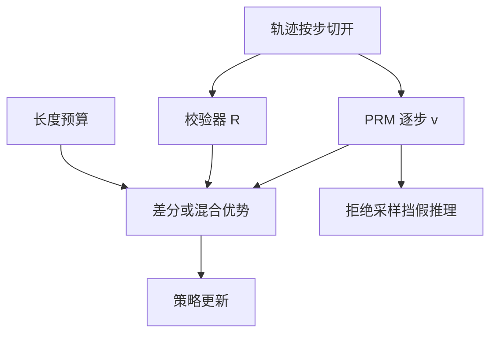

# 过程奖励进训练环

把逐步分数从搜索器里拿出来，加进策略梯度的优势里：信用可以落在第一次算错的那一步，而不必等整条链的 0/1。

<footer>—— Lightman et al. 的过程监督；在 RL 中把 PRM 当塑造奖励，而不仅是测试时引导</footer>

[推理 RL 闭环](/llm/reasoning-rl-loop) 已经能用结果 $R$ 训练。[PRM 引导搜索](/llm/prm-guided-search) 把过程分数留在推理期。本课补的缺口是 **训练期过程信用**：长链上 0/1 太稀，长度惩罚又分不清「必要的长」和「错了还在写」。把 PRM 的逐步 $v_t$ 写进优势或塑造项，闭环多一条 dense 信号。不重讲如何训 PRM，只讲它进 PPO / GRPO 时与结果奖励、预算如何共存，以及假推理如何被放大。

## 问题

结果 RL 的优势在整条轨迹上近乎常数（对 0/1 尤其如此），中间 token 的信用靠时间衰减或被当成同等。错在第 3 步、又写了 80 步的链，与对到最后的链，在 $R=0$ 时一样罚。PRM 若可靠，可在第一步 $v_t$ 下跌处给负优势，让模型学会改口或停写，而不是把错误证明写完。这正是 Lightman 等人「逐步验证」在学习问题而不仅是选择问题上的对应物。

缺口包括：PRM 与真实 $R$ 不一致时，策略会最大化错误的 $v$（写得像证明）；PRM 进入梯度后，搜索期再叠加同一 PRM 会双重计数、过拟合该验证器。因此要规定 **PRM 在环内的角色**：塑造、门控、还是替代 $R$——三者只能主选一个。

### 塑造不得改变最优策略的序（理想情况）

经典势函数塑造要求势只依赖状态，使最优策略不变。PRM 的 $v_t$ 依赖生成的文本，不是环境势，**会改最优策略**。这可以是好事（偏好过程正确），也可以是坏事（偏好某一种书写）。必须用结果 $R$ 守门：过程项是辅助，$\lambda$ 过大时关掉看 $R$ 是否掉。训练用的 PRM 与测试搜索用的 PRM 最好版本不同，或测试只用 ORM / 校验器。否则闭环会把验证器的洞写成策略的风格，评测再由同一洞打高分。

## 方法

### 四种接入方式

记步骤 $a_t$，PRM 输出 $v_t\in[0,1]$。几种合法接入：

- **稠密奖励**：$r_t = \lambda(v_t-v_{t-1})+\mathbf{1}[t=T]R$，差分使已经高分的步骤不再重复领奖。
- **过程优势**：结果优势 $A^R$ 与逐步优势 $A^v$（例如从 $t$ 到 $T$ 的 $\min$ 或乘积）线性混合。
- **门控**：仅当 $R=1$ 时才用长度压缩；仅当 $v_t$ 低于阈值时提前终止并赋部分分，减少错链注水。
- **过滤**：闭环相位 3 的拒绝采样除 $R=1$ 外要求 $\min_t v_t>\tau$，挡住黑客链进蒸馏。

切分器与 SFT 相同。$v$ 的聚合与搜索课一致：最小值对一步错更严。RL 里用最小值会让梯度集中在最弱步，适合纠错；用末步 $v_T$ 则接近再训一个 ORM。

## 机制

差分塑造 $v_t-v_{t-1}$ 把「维持高分」的步骤优势打到零附近，只奖提升、罚下降。这对「写对一步」有明确信用。若 PRM 在正确但表述新颖的步骤上给低分，梯度会打压探索，策略回到 PRM 训练分布的套话。缓解：降低 $\lambda$、对 $v$ 做校准、或冻结早期层只让后期适应新写法。

与长度项的交互：PRM 低分的长尾巴会被过程项与长度项双重惩罚，压缩很快，但也可能在关键的长计算（大数运算、长代码）上误杀。应按任务类型调 $\lambda$，代码与竞赛数学不要共用一套。

在线更新 PRM（边采边训验证器）会造成非平稳奖励，比策略本身更难调。默认把 PRM 冻结在闭环外训练好的检查点。只有结果 $R$ 极稀、且有持续人工过程标注时，才考虑缓慢更新验证器。

### 假推理被环放大的条件

若蒸馏过滤只看 $R$，假推理进教师池；若再把同一风格的 PRM（在假推理上偏高分）进梯度，两相位共振。打断共振的最小方法：过滤用 $\min v_t$ 与 $R$ 同时；训练用 $R$ 为主、$\lambda$ 小；测试搜索换一个验证器或只用校验器。三个角色不要共享一个头。

## 边界与工程取舍

PRM 前向是训练墙钟的新大头：每步都要跑验证器。应在切步边界调用，而不是每个 token。验证器与策略同尺寸时，闭环费用接近翻倍，常用小 PRM。小 PRM 更易被策略对抗——又一条用 $R$ 守门的理由。

没有过程标注、只有结果时，可用蒙特卡洛 roll-in 估逐步命中率当伪 PRM，方差大，属于权宜。不要把它写成 Lightman 意义下的过程监督。开放域没有 $R$，本课的守门消失，过程奖励退回偏好模型，偏见问题回到 RLHF，不属于推理闭环的可验证叙事。

过程奖励进环之后，测试时 PRM 搜索的增益通常变小——策略已经内化部分逐步纠错。应重新画测试时缩放曲线，不要引用进环前的 Best-of-N 数字。

## 小结

- 把 PRM 从搜索器移到优势 / 塑造项，给长链稠密信用，补 0/1 稀疏。
- 过程项会改最优策略，必须用校验器 $R$ 守门，并防假推理共振。
- 差分塑造奖提升；最小值聚合偏纠错；切分器与 SFT 一致。
- 验证器默认冻结；每步调用的费用要通过切步摊销。
- 进环后重测测试时缩放，旧曲线作废。
- 出处：Lightman 等逐步验证；推理 RL 中把过程信号当塑造而非唯一奖励。
