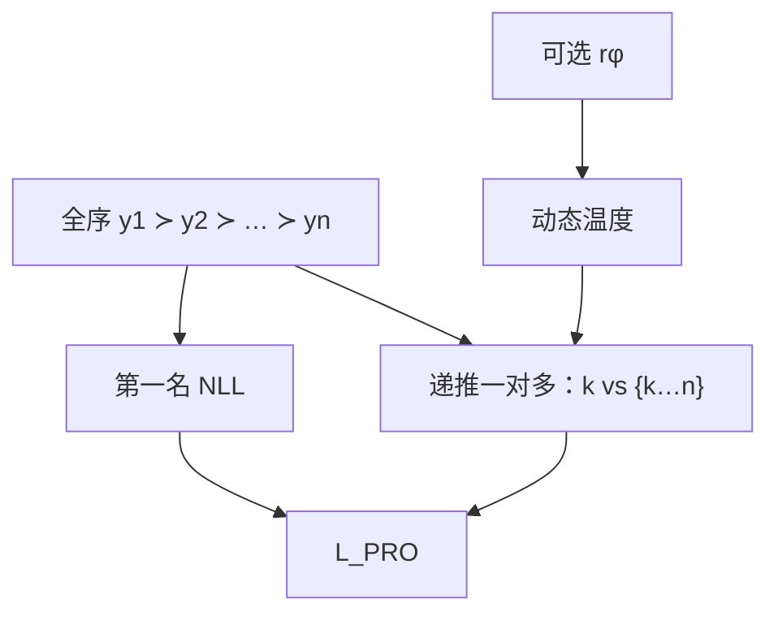

# PRO / Preference Ranking Optimization

    
不要把一条长度为 n 的人类排序切成若干对再分别做 Bradley–Terry：按名次递推，每次把当前最好的与后面所有回答做一次一对多对比，直到排完。

    <footer>—— Song, Yu, Li, Yu, Huang, Li, Wang，Preference Ranking Optimization for Human Alignment，AAAI 2024</footer>

成对方法把多次采样的信息收成 $y^1\succ y^2$。更长的序若再被切成对，名次之间的全局结构消失：第三名与第五名的差距、第一名相对其余全体的独占，都进不了同一条归一化。Song 等人提出 Preference Ranking Optimization（PRO）：把任意长度的偏好排序写成类似 Plackett–Luce 的递推一对多对比，用长度平均对数概率当 $r_\pi$，再加一项对第一名的 SFT。本篇写 AAAI 2024 原文如何从 BT 扩到 listwise、动态温度如何用 RM 分数拉开「略差」与「很差」，以及加长排序（混入 ChatGPT 回答）时他们声称的收益。成对退化（$n=2$）时 PRO 仍是一对一对比，但推导目标是 $n>2$。

## 问题

RLHF 被批评为相对 SFT 更不稳、更吃超参；与此同时，它真正有用的部分往往是「从语言空间里多采、多看」。多数直接偏好方法把这次多采立刻压回成对：DPO、RRHF 的铰链、SLiC 都主要在对上操作。$n$ 条有全序时，切成对会丢失宏观对比——第一名应同时压过其余 $n-1$ 条，而不是只压过相邻那一条。作者把对齐重述为：让模型给这 $n$ 条的平均对数概率排序，与人类（或 RM）的排序一致。

SFT 只拟合第一名，等于扔掉负例。BoN（只对最高分做 SFT）同样浪费其余名次。需要一种仍在监督设置下、一次前向吃完整条序的损失，并且 $n=2$ 时回到熟悉的成对 logistic，以便和 DPO 对照。

### 一对多不是 InfoNCE 随便套用

把第一名当正、其余当负，写成

$$
-\log\frac{\exp r(y^1)}{\sum_{i=1}^n\exp r(y^i)}
$$

只刻画 $y^1\succ\{y^2,\ldots,y^n\}$，后面 $n-2$ 段子序被丢掉。PRO 的关键是**递推**：丢掉当前第一，对剩余列表再写同样的一对多，直到只剩最后一名。这才用满全序，也才和 Plackett–Luce 的逐位置选择概率同构。

PL 模型通常在固定候选上聚合多张排序表。PRO 的每条提示候选不同，参数是整个 LM，理论上对应无限候选。$n$ 增大是在用有限样本逼近「对语言空间的序」；它不是把词表上所有句子真的排一遍。

## 方法

人类或 RM 给出 $y^1\succ y^2\succ\cdots\succ y^n$。策略分数为长度平均对数概率

$$
r_\pi(x,y^k)=\frac{1}{|y^k|}\sum_t\log P(y^k_t\mid x,y^k_{<t}).
$$

listwise 项为

$$
\mathcal{L}=-\log\prod_{k=1}^{n-1}\frac{\exp\bigl(r_\pi(x,y^k)\bigr)}{\sum_{i=k}^n\exp\bigl(r_\pi(x,y^i)\bigr)},
$$

总损失 $\mathcal{L}+\beta\mathcal{L}_{\mathrm{SFT}}$，$\mathcal{L}_{\mathrm{SFT}}$ 只加在第一名。原文把 $\beta$ 设成随排序长度变化的系数（如 $0.05(n-1)^2$ 量级，以论文为准），避免 $n$ 变大时对比项完全压过语言建模。

### 接到 RM 上的动态温度

均匀对待所有负例不合理：略差的 $y^{k+1}$ 与差很多的 $y^n$ 应受不同惩罚。作者用另一个 $r_\phi$ 的分数定义温度

$$
\mathcal{T}^i_k=\frac{1}{r_\phi(x,y^k)-r_\phi(x,y^i)}\quad(i>k),
$$

正例温度取负例温度的最小，以免分子分母失衡。分差大则温度低、对比更锋利。消融表明：去掉 SFT、只靠动态温度时收益更明显；与 SFT 联合时仍有增益。没有可靠 $r_\phi$ 时，退回均匀温度，损失仍是递推 PL。

### 加长排序的实验叙事

数据是 HH-RLHF 四份子集，可用 Alpaca 或 ChatGPT 增补候选，再用 $\mathrm{RM}_{\mathrm{train}}$ 重排，得到长度 3–5 的序；评估用另一份 RM、BLEU、GPT-4 与人类，避免训评同一 RM。叙事有三条。$n=2$ 时 PRO 已超过同设定的 SFT、RLHF、CoH、DPO、RRHF 的部分奖励列（以原文 Table 1 为准）。$n$ 再加长，多数策略上升；混入高质量 ChatGPT 回答时，7B 模型的代理奖励可接近 ChatGPT 那一列——这是蒸馏上限，不是 7B 获得同等世界知识。异构来源（Curie + Alpaca + ChatGPT）往往优于同一弱模型重复采样，负例的多样性帮助模型看见「不该做的行为」。

RRHF 在长序上变弱，被作者归因于它仍是成对铰链，抓不住全局归一。BoN 在高质量增补后变强，因为第一名已经很好，只拟合它也够用；PRO 的论点是其余名次仍有信息。GPT-4 / 人类 pairwise 相对数据集 golden 并非全胜，Helpful-online 子集上会输，说明代理奖励与人的分歧仍在。

## 机制

递推 PL 让每个位置都做一次「在剩余集合里被选中」的 logistic 归一，梯度同时抬当前名次、压后面所有更差的，且经过同一 softmax 互相制约，避免成对铰链那种「只保证相邻序」的局部满足。平均对数概率与 RRHF / SimPO 同族，无参考模型。SFT 项保护流畅。动态温度把 RM 的**标量差**写回对比强度：若 $r_\phi$ 本身偏长度，温度会把长度差放大成更锋利的序，偏差被加重而不是被中和。

$n\to\infty$ 的修辞是「看见更多带标签的语言空间样本」；实现上 $n$ 受显存与标注费限制。把 ChatGPT 塞进序，是在用教师覆盖学生达不到的区域，效果一部分来自模仿教师，一部分来自 listwise 对比。消融必须分开「更好的第一名」与「更好的 listwise 结构」。

$\beta$ 随 $n$ 涨，是为了让第一名 NLL 不被 $n-1$ 个 softmax 项淹没。若不调 $\beta$，加长排序可能只在对比上过拟合 RM，流畅性掉。监控应分列 SFT 项与 PL 项。

## 边界与工程取舍

PRO 需要全序或至少可排的 $n$ 条。只有成对时，$n=2$，优势主要来自平均对数概率 + SFT，而不是 listwise。增补候选要花钱或调用教师；用 $\mathrm{RM}_{\mathrm{train}}$ 排序则把 RM 偏差写进序。LLaMA-7B、HH、生成 128 token 的设定不能外推到长思维链。BLEU 在对话上弱，原文同时报奖励与裁判，读的人应以后者为准。

与 DPO 比，PRO 无 $\pi_{\mathrm{ref}}$，有 SFT 项，吃 listwise。与 RRHF 比，损失是 softmax 归一而非无间隔铰链，对长序更一致。与 SimPO 比，SimPO 仍是成对加 $\gamma$，PRO 是递推一对多。不要和「CPO / IPO」因缩写相近而混名。

出处钉 Feifan Song、Bowen Yu、Minghao Li、Haiyang Yu、Fei Huang、Yongbin Li、Houfeng Wang，北大与阿里，AAAI 2024，arXiv:2306.17492。代码在 AlibabaResearch/DAMO-ConvAI 的 PRO 目录。

### 何时不必上 PRO

只有成对、没有可靠多候选，DPO 或 SimPO 更轻。已有 $k$ 条且满足于 Best-of-N 蒸馏，RRHF 或 BoN SFT 更简单。不能放平均对数概率、必须相对参照 KL 时，用 DPO。

## 小结

- PRO 把任意长度偏好排序写成递推一对多（Plackett–Luce 形），分数是长度平均对数概率，外加第一名 SFT。
- $n=2$ 退化为成对对比；收益声称随 $n$ 与候选质量、多样性上升。
- 可用 RM 分数做动态温度，区分略差与很差。
- 长序实验大量依赖教师增补，部分效果是蒸馏。
- 相对 RRHF 的成对铰链，listwise 归一更能用满全序。
- 出处：Song et al.，*Preference Ranking Optimization for Human Alignment*，AAAI 2024。
