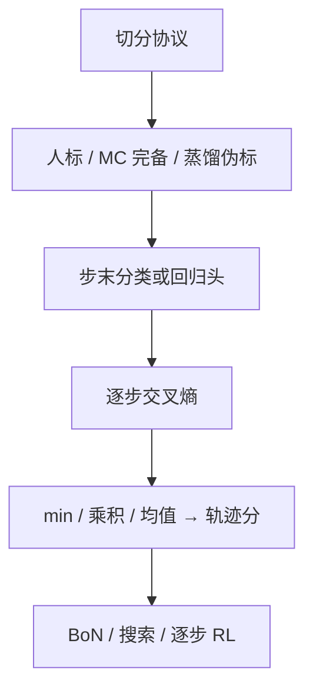

# 过程奖励模型训练

    
PRM 的训练问题不是再发明一种注意力，而是：步骤如何切、标签从哪来、损失写在哪个 token 上、轨迹分如何从逐步 logit 归约。

    <footer>—— 对照 Lightman 等人标 PRM、Wang 等 Math-Shepherd 的自动逐步标签、以及 Skywork-o1 开源 PRM 的推理接口</footer>

过程奖励模型（PRM）把「这一步是否仍然合法」收成一个可对前缀打分的分类器或回归器。概念与切分契约见 [过程监督](/llm/process-supervision)；Lightman 的人标检查点见 [PRM800K](/llm/lightman-prm)；验证器曲线见 [Let's Verify Step by Step](/llm/verify-step)。本篇只写**怎么训**：三类标签来源、步末 token 上的损失、二分类与三分类、以及训完之后如何接到 Best-of-N 或 RL。它不是 DPO，也不等于把 ORM 的最后一层改个名。

## 问题

生成器按自回归吐 token，人与检查器却按「步骤」判对错。训练 PRM 之前必须先有一份与生成器一致的切分协议，否则同一段文字的 $T$ 和对错位置都变，模型学的是换行风格。标签比切分更贵。人可以标正确 / 错误 / 中性，但 MATH 级标注需要能读证明的人，Lightman 用主动学习才把预算压到约 80 万步。没有人时，只能从终点对错反推中间步的价值：这是 Math-Shepherd 的蒙特卡洛完备，也是噪声源——「这步之后碰巧蒙对」会被标成正。

训练目标还要决定输出头。三分类保留中性，避免把脚手架打成负例；二分类实现简单，Math-Shepherd 报告与三分类差别不大，前提是切分里较少「纯叙述」。损失必须钉在步界 token 上：若对整步所有 token 平均，模型会把分数 smeared 到尚未写完的式子上，推理时你却只在步末取值，训练与服务不一致。

### 三种标签不是互相替代的同一数据

人标对准局部真假，能抓住「推理坏、数字对」。蒙特卡洛标签对准「从这步出发还能到达金标答案的频率」，与人标相关但不相同。结果标签（整段对错）只能训 ORM，硬拿来当每一步的监督，等于把终点信用广播到前缀，PRM 退化成延迟的 ORM。混用时必须写清比例：人标种子 + 大 PRM 蒸馏，是 Lightman 附录里的第二条成本曲线；纯 MC，是 Wang 等人走通 7B–70B 的那条。Skywork-o1 开源的是训好的打分器与推理脚本，训练数据配方没有放到与 PRM800K 同级的公开卡上，引用时不要编造他们的逐步标签协议。

切分是契约，标签定义是另一份契约。复制权重却把 `\n` 换成 `\n\n`，等于换任务。Skywork 推理仓库默认 `step_token="\n"`；Lightman 按人工步骤边界。两者不能对同一条生成无说明地比分。

## 方法

设题目 $x$，步骤 $s_1,\ldots,s_K$。PRM $r_\phi$ 在第 $i$ 步结束处输出 $r_i\in(0,1)$ 或三类 logit。人标或硬估计给出 $y_i\in\{0,1\}$（中性可并入正，或单独一类）。二分类交叉熵为

$$
\mathcal{L}_{\mathrm{PRM}}=\sum_{i=1}^{K}\Bigl[y_i\log r_i+(1-y_i)\log(1-r_i)\Bigr],
$$

只在步末位置计损失。三分类则是步末的标准 LM 头或分类头，Lightman 用正 / 负 / 中性。初始化通常来自与生成器同族的指令模型或数学微调模型，因为前缀已经是助手格式的解题过程；从基座冷启动要先学会读 `\boxed{}` 与步骤编号。

自动标签（Math-Shepherd）：从 $s_i$ 用完备器采 $N$ 条后续，硬估计「存在一条到达金标则 $y_i=1$」，软估计 $y_i$ 为到达频率。$N$ 太小，早期步的方差大；太大，标注算力按步数线性涨。人标（Lightman）：预生成整解，选择器把高分错解送给人，标到第一个负步即停，主动学习提高单位标签信息量。两种数据都可以再蒸馏：大 PRM 给小 PRM 打伪标签，校准错误会遗传。

推理归约要在训练时就定下来，至少在验证集上扫过。Lightman 默认各步「仍正确」概率的乘积（中性算正）；Math-Shepherd 评测用各步分数的**最小**；Skywork-o1 模型卡的 Best-of-N 用各步奖励的**平均**，ORM 对照只用末步。min 接近一票否决，适合「一步代数错则全盘坏」的竞赛数学；平均对长解更宽容，也更容易被冗长正确步骤抬高。不要用训练时从未见过的归约去报 SOTA。

### 接到策略时损失会换形状

当验证器：不更新生成器，只对 $N$ 条完整 $y$ 算 $\mathrm{agg}(r_{1:K})$ 再 argmax。当搜索启发式：每扩展一步就算 $r_i$，低于阈值则剪枝或重采样，见 [逐步验证](/llm/step-level-verify)。当 RL 奖励：DeepSeekMath 把逐步奖励在组内标准化后，token 优势取该 token **之后**各步标准化奖励之和，这是过程监督的 GRPO，不是再训一张独立 PRM。Open-R1 主路径用的是结果级规则奖励，没有把 PRM 写进默认 `reward_funcs`。把「我们训了 PRM」说成「我们做了 R1」，检查清单对不上。

规模上 PRM 不必与生成器同大。Skywork 用 1.5B / 7B 的 Qwen2.5-Math 指令模型当 PRM，去给 8B 级生成器做 BoN@64，卡上 7B PRM 在若干数学集上接近 72B ORM。容量不足时 PRM 会走格式捷径：更长、更多「因此」、更像教材。持有集若共享捷径，逐步准确率会表扬捷径。需要「短而关键的正确步 vs 长而空的正确语气」对照。

## 机制

步末分类之所以能变成信用分配，是因为错误在数学解题里通常有**第一破绽**：其后步骤条件在错误前缀上，局部标签与因果大致同向。乘积归约把「每步仍独立正确」当成朴素联合；若步骤强相关，乘积偏保守，长对解被罚。min 把最弱环节当轨迹分，对「最后抄错」极敏感，对「早期小瑕疵、后期挽救」过严。平均则把局部错误稀释，BoN 可能选中「多数步对、关键步错但数字对」的解——这正是 ORM 的病，平均 PRM 会部分复发。

蒙特卡洛标签的机制是用结果预言机当逐步价值的无偏（在完备器与 $N\to\infty$ 时）估计。完备器若与生成器同分布，估计的是「当前策略下这步有没有救」；换更强完备器，标签变成「存在某策略能救」，更接近可达性而不是当前策略的 Q。Wang 等人用与生成器同族的微调模型当完备器，标签与部署分布接近，但也共享盲点。人标不依赖完备器，能标出「这步数学上非法，即使后面蒙对」，这是 MC 给不出的。

PRM 校准差时，绝对分数不能跨题比。组内相对（同一题的多条解）往往比绝对阈值稳，这与 GRPO 用组内 z 分数是同一直觉。跨题用固定 $0.5$ 阈值剪枝，简单题过松、难题过紧。

### 主动学习与蒸馏如何改变有效样本

均匀采样的步骤大量是显然对或显然胡扯，交叉熵被简单例支配。把「模型也觉得对、答案却错」的解送去标，梯度对准 ORM 的假阳性区。Lightman 估计相对均匀标注约 $2.6\times$ 数据效率。迭代重训选择器在他们手里不稳定，说明主动学习不是自动越迭代越好。大 PRM 蒸馏小 PRM 把人标预算变成计算预算，但老师若系统性地看漏某类跳步，学生会继承；应用侧仍要抽检第一破绽。

## 边界与工程取舍

没有局部真假的任务（文风、开放咨询、多真值证明路径）标不了稳定 PRM。代码可以用单测当结果预言机，逐步「这一函数是否保持不变量」往往还要人。生成器与 PRM 同初始化、同数据，搜索只是把共有盲点换顺序写出来，验证器必须有余量：独立人标、异构模型、或符号检查器。DeepSeek-R1 主路径不用 PRM，过程出现在策略自己写出来的文本里；不要把 R1 的长链当成已经训过 Lightman 式分类器。

服务上，PRM 要对每条候选的每个步末做前向。BoN@64、每解 20 步，就是上千次步级打分，虽可一次吃整段得到所有步分（Lightman 的实现），仍是额外一张模型。与生成器共驻时显存翻倍；用平均归约还是 min，会改变延迟—质量曲线，必须在同一候选池上扫。

不要把逐步准确率当成下游唯一指标。逐步分类对、BoN 仍可能选错，因为归约与校准会把分数压扁。报 PRM 时写清：生成器是谁、$N$ 多大、归约、是否允许工具。

### 何时不必训 PRM

终点检查器很硬且假阳性少（竞赛编程全量单测、符号计算），结果监督够用。只能部署一个模型、延迟不允许第二张网，把过程信号写进在线 RL，而不是维护独立 PRM。没有切分协议、标注者不一致，先定指南再谈损失。需要公开可复现人标时，直接用 PRM800K，不要口头「按 Lightman 训」却换了边界与三级定义。

## 小结

- 训 PRM：切分协议 + 步末损失 + 明确的正/负/中性或二分类定义；推理归约（min / 积 / 均值）要与评测一致。
- 标签三条路：人标（局部真假）、MC 完备（到达金标的潜力）、大模型蒸馏；混用必须记账，不能当同一分布。
- 用法分开写：独立验证器、搜索启发式、逐步 RL 奖励，不是同一个检查点义务。
- 主动学习对准高分错解；MC 标签便宜但把「能蒙对」算进逐步价值。
- 出处：Lightman 等，*Let's Verify Step by Step*，ICLR 2024，arXiv:2305.20050；Uesato 等，*Solving math word problems with process- and outcome-based feedback*，2022；Wang 等，*Math-Shepherd*，ACL 2024，arXiv:2312.08935。
