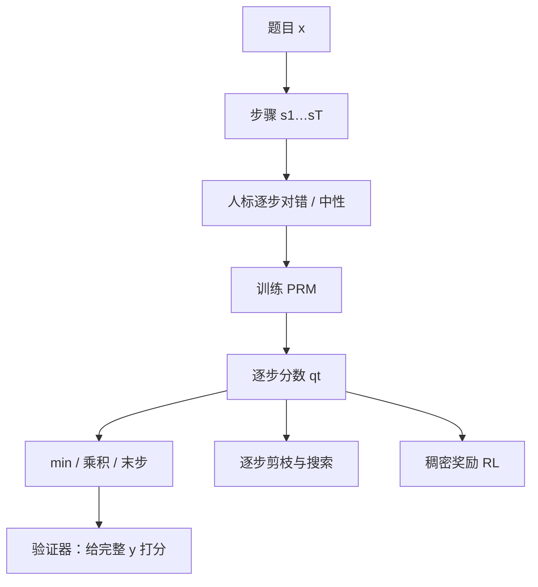

# 过程监督 / PRM

给推理的每一步标对错，训练过程奖励模型去预测下一步是否合法；验证与搜索用的是逐步质量，而不是终点是否碰巧正确。

<footer>—— Lightman 等，Let's Verify Step by Step；Uesato 等对 process-based feedback 的比较</footer>

数学、代码、多跳问答的错误往往发生在某一个中间断言上，后面只是把错推到框里。[结果监督](/llm/outcome-supervision) 看到终点才给分，既奖到蒙对，也罚到「前九步对、最后抄写错」。过程监督（process supervision）把标签对准步骤：这一行是否合法、是否由上文推出、是否与题目一致。Lightman 等人据此训练过程奖励模型（Process Reward Model, PRM），在 MATH 上用它做验证器，Best-of-N 随 $N$ 继续提升，而 ORM 先饱和。Uesato 等人更早在应用题上比较过程反馈与结果反馈，说明稠密的逐步信号改变的是学习到的推理，而不只是最终数字。本篇写 PRM 监督什么、如何标注与打分、以及它不是另一种 DPO。

## 问题

把解答切成步骤 $s_1,\ldots,s_T$ 之后，需要一种局部真假：在 $(x,s_{1:t})$ 条件下，$s_t$ 是否正确。人可以标正确 / 不正确 / 中性（跳过、纯叙述）。自动检查很难：中间式子没有统一的可执行器，除非进入形式系统。于是过程标签贵，但信息密——一条错解也能提供「哪一步开始坏」的负例，一条对解能提供整条正路径。

没有过程标签时，模型与验证器都只能拟合终点。搜索时不能在第 3 步剪枝，必须把错误前缀展开到结束。训练时不能把优势赋给真正的决策点。问题是局部可判定性：若步骤的对错人可以稳定地标，过程监督就成立；若「步骤」只是换行，标注者自己都不同意，PRM 学到的是分段风格而不是推理。

### 步骤边界是标注协议的一部分

同样一段解答，按句切、按「因此」切、按数学换行切，会得到不同的 $T$ 与不同的对错位置。Lightman 等人的数据（公开叙述中的 PRM800K）把 MATH 解答划成人工可评的步骤再标。复制 PRM 而不复制切分规则，等于换了任务。推理时生成器必须能按同一边界吐步骤，否则验证器看到的片段与训练不一致。这与 [chat template](/llm/chat-template) 同类：切分是契约。

「中性」不是偷懒。定义、抄题、过渡句往往既非推理也非错误。强迫二分类会把叙述标成错，PRM 学会打压必要的脚手架，生成变得电报式且更易跳步。

## 方法

人标数据形如 $(x,s_{1:t},z_t)$，$z_t\in\{+, -, 0\}$。PRM 是一个（通常与生成器同结构或较浅的）模型，预测

$$
p_\phi(z_t=+\mid x,s_{1:t})
$$

或对「到这一步为止是否仍全部正确」做前缀正确率。训练用逐步交叉熵，只在有标注的位置计损失。推理时给每个新步骤一个分数 $q_t$。轨迹分数需要归约：常见有最小（最弱环节）、乘积（联合仍正确的概率）、以及末步。Lightman 等人用 PRM 给完整候选打分再选 Best-of-N，归约选择会影响「一步小错是否一票否决」。

Uesato 等人的过程反馈还可以直接当 RL 的稠密奖励：每一步对了给正、错了给负，不必先训一个独立 PRM。两条路的差别是：显式 PRM 可当验证器插在搜索里，与生成器解耦；过程 RL 把信号写进同一策略，部署时不再跑第二份模型。也可以先训 PRM，再把它的 $q_t$ 当奖励训练生成器。

$$
Q(y)=\mathrm{agg}\bigl(q_1,\ldots,q_T\bigr),\qquad
\mathrm{agg}\in\{\min,\,\prod,\,\text{last}\}.
$$

标注预算不够时，可用蒙特卡洛估计步骤价值：从 $s_{1:t}$ 向前 rollout 多次，用结果检查器看最终正确率，当作软过程标签。这仍依赖硬结果预言机，是用计算换人标，不是免费的真过程——早期步骤的 rollout 方差大，估计会糊。

### PRM 与 ORM 的输入差在哪

ORM 必须看见完整 $y$ 才打分；PRM 在前缀上就可打分。这决定搜索能不能中途停。训练目标也不同：ORM 拟合终点 $\ell$，PRM 拟合 $z_t$。不要把 ORM 的最后一层改个名字当 PRM——若标签仍是终点广播到每一步，那是稀疏回报的复制，没有过程信息。反过来，把逐步标签或起来当终点监督，会丢掉「哪一步错」的定位，退回结果监督。

## 机制

### 局部正确如何减少蒙对

若 $s_t$ 在数学上非法，PRM 给低分，即使后来的 $a$ 碰巧对。Best-of-N 会把这条轨迹排下去，生成器若用 PRM 搜索也不会沿这条前缀展开。蒙对不再是高分模式。代价是：标注者必须真能看出局部错误；若人看不出数论里的暗坑，PRM 会把错步标成对，搜索会强化它。过程监督把专家判断的分辨率从终点移到步骤，不创造专家。

前缀正确率形式的 PRM 还有马尔可夫式的解释：一步错则后续「整条仍对」的概率应下降。min 归约近似硬约束；乘积对连续的小扣分敏感，长解答会被系统性压低，可能伤害必要的长证明。归约是产品选择：竞赛要最弱环节否决，讲解要容忍修辞句。应在同一验证协议上比，而不是在训练损失上比。

PRM 分数不是校准过的真实概率，除非另做校准。把它当阈值剪枝时，阈值随题目难度与步骤风格漂移。用分位数或相对排序（同一题内比较）往往比绝对 $0.5$ 更稳。

### 与偏好优化的关系

DPO / [KTO](/llm/kto) 改变的是整段 $y$ 的似然序；PRM 改变的是逐步可判定质量。可以把 PRM 当奖励接到 RL，也可以用 PRM 挑 $y_w$、$y_l$ 再跑 DPO——那时过程信息先被压成一对序列，成对方法看不到步骤。要保留逐步结构，搜索与稠密 RL 比再 DPO 一层更对齐。过程监督不是偏好方法的替代，是另一条监督轴。

## 边界与工程取舍

人标逐步贵，是过程监督的一等成本。切分协议、标注指南、中性类，都必须版本化。PRM 与生成器若同数据同初始化，会共享盲点：都看不出的错步会一起放过。理想情况下验证器应有独立标注或独立模型，这正是 Lightman 把 PRM 当验证器、而不是只当自我打分的原因。自动 rollout 标签便宜，但把结果检查器的捷径漏进逐步估计：某步之后总能蒙对，该步会得到虚高价值。

部署多一份 PRM 的前向。只在离线 Best-of-N 或训练期搜索用，线上仍只跑生成器，是常见折中。线上逐步验证要算清延迟：每一步一次 PRM 前向，对长解答很痛。分数归约、阈值、与 [逐步验证与搜索](/llm/step-level-verify) 的束宽一起定，不要单独「把 PRM 训到高 AUC」就结束。

不要用生成器自己的 token 对数概率当过程奖励。那是流畅度，不是正确性。高似然的错步很常见，这也是 SLiC 要校准似然与质量的原因。

### 何时不必上 PRM

检查器极硬、用户看不见步骤、只关心终点指标，结果监督加拒绝采样通常够。没有稳定的步骤切分（开放聊天、文学），过程标签不可靠，应回到整段偏好。标注者对领域不熟，宁可不标过程，以免系统性地把错步标成对。需要模型自己改稿而不另部署验证器，看 [自我批判与修订](/llm/self-critique-revise)，那是另一套延迟与可靠性。

## 小结

- 过程监督给每个推理步骤局部对错（可含中性），信息密、标注贵。
- PRM 预测前缀上的步骤质量，可当验证器、搜索启发式、或稠密奖励。
- 步骤切分与标注协议是任务定义；换切分等于换 PRM。
- 轨迹分数的 min / 乘积 / 末步归约改变「小错是否否决」，须与产品一致。
- 相对 ORM，PRM 更能抵制蒙对，Best-of-N 更不易随 $N$ 饱和。
- 生成器对数概率不是过程奖励；rollout 软标签仍受结果检查器捷径影响。
- 出处：Lightman 等，*Let's Verify Step by Step*；Uesato 等，*Solving math word problems with process- and outcome-based feedback*，2022。
