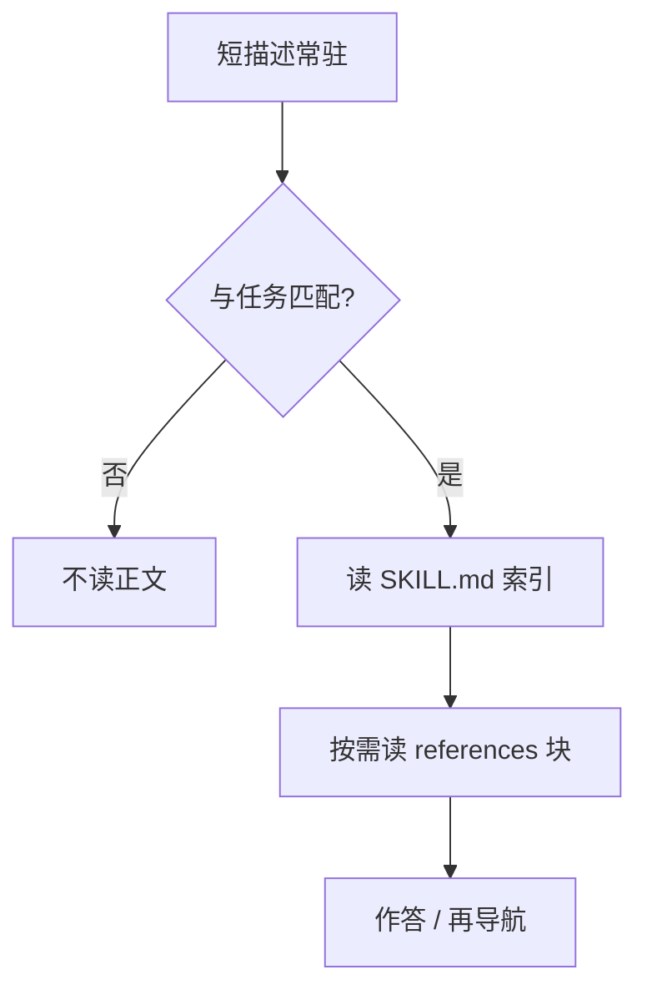

# 渐进式披露

让代理通过探索一层层发现相关上下文：文件大小暗示复杂度，命名暗示用途，时间戳暗示新旧；工作记忆里只留当前必要的子集。

<footer>—— Anthropic Applied AI，Effective context engineering for AI agents，2025-09-29；受控实验见 He 等，Is Progressive Disclosure All You Need for Long-Context Agents?（arXiv:2607.17598）</footer>

渐进式披露本是交互设计用语：先给用户少而可懂的控件，高级项按需展开。Jakob Nielsen 2006 年在 NN/g 的 Progressive Disclosure 一文里把它写成标准模式：一次摊开过多选项会冻结决策。代理上下文把它移植过来： **永远在窗口里的只是短描述与索引，正文与附件在描述匹配任务之后才读**。Anthropic 把它与 [即时检索](/llm/jit-context-retrieval) 连在一起：即时是时机，披露是 **分层的信息架构**。Agent Skills 把专长打成目录，根上 `SKILL.md` 的描述常驻，匹配后才读技能正文与 `references/`。He、Zhao、Wang、Chen 在 ∞Bench 上做了首次受控比较：扁平一层披露在 **书库规模** 上拉开与裸文档导航的差距，再深一层的层级披露从不更好，有时直接把准确率打崩。本篇写分层合同与那篇实验的边界，不把「技能包」写成检索的普遍替代。

## 问题

长文档问答长期在两极摆：整篇进窗口，或外部检索器切块。窗口有腐烂与中间丢失；检索器把结构锁死在索引里，代理看不见目录本身。第三条路是给代理 **文档路径**，让它自己决定读什么。Claude Code 早期用过检索索引，后来改成让模型在仓库里搜——工程师经验，不是对照实验。技能包把「自己读」标准化：描述用于发现，正文用于激活，附件用于执行。实践者很快用同一模式打包整本书，但 He 等之前没有人在标准长文档基准上把它和裸导航、经典混合检索放在同一块切分上比。

要分开两个设计轴。 **披露深度**：一层（一本书一个技能，块索引在正文里）还是两层（每块一个技能，描述全部常驻）。 **索引进窗口的时机**：块描述是常驻还是激活后才读。层级方案把块描述变成永远在线的路由表，token 税打在每一问上；扁平方案只在书被选中后才付块描述的税。这不是风格问题，是注意力预算问题。

### 披露买的是上下文，不是智力

He 等的核心结论可以写死：在 **单本书** 上，扁平披露的增益取决于脚手架——若 Codex 一类已经会按问题里的实体去 grep，技能包几乎为零；若 Pi / Claude-Code 裸导航较差，技能包才拉开。到 **二十本书** 的库规模，裸导航连 Codex 也塌（英文开放问答落到约 0.26），扁平披露仍能维持约 0.46。层级包从未击败扁平包；Pi 上 gpt-5.4-mini 的 En.MC 从约 0.91 掉到约 0.64。含义：披露在语料大到「靠读目录都读不过来」时才决定性；它不让已经会定位的模型更聪明，第二层路由还可能把常驻描述变成噪声。

把每章都注册成始终加载的技能，看起来更「结构化」，实际是反披露：描述集合本身变成一篇会腐烂的长上下文。扁平包把块描述放在激活后的正文表里，才符合「先少后多」。

## 方法

He 等的 book-to-skill 流水线：按章节切块（无标题则约 4000 词、在段落边界切），每块一个 `references/` 文件；用 LLM 写块描述（含实体）与书级描述。扁平包与层级包 **共用同一组块**，只改接线。裸条件：沙箱里放原书，导航策略不约束。混合检索基线作为外部参照。三个脚手架、三个模型族，环境把静态书问答变成可记轨迹的代理任务。

Anthropic 侧没有这份表，但给出运行时图像：每一步交互产生下一决策的线索；代理组装的是层层子集。Claude-Mem 一类记忆插件把同一图像做成三层工作流：索引（标题、时间、类型、token 成本）→ 时间线 → 全文观察。Letta 的上下文仓库用文件系统当检索界面。这些是工程收敛，不是 He 等的实验条件；引用时分开。

发现层的元数据必须可检索。Zhang 等审计大量公开 `SKILL.md` 后强调：合法元数据决定技能能不能被找到。SkillsBench（Li 等）报告：人工策展的技能包有增益，模型自写的整包常常为零——结构应从文档来，而不是让模型凭空写一本说明书。He 等因此 **固定切分、只改披露接线**，避免把「切得好」与「披露得好」混在一个消融里。

### 一层足够，两层有害的机制

层级披露让所有块描述进入每一问的窗口。书库一大，描述表本身超过有效注意力，路由模型开始在描述中部丢失，选错技能或选太多。扁平披露的书级描述很短，选书之后再打开块表，块表长度与 **一本书** 成正比，而不是与图书馆成正比。这是在信息架构上落实注意力预算。第二层还引入错误的「技能边界」：问题需要跨章时，多个始终在线的子技能互相抢路由，不如一张表里并列章节。

## 机制

渐进式披露把检索器的倒排表变成 **代理可读的工件**。工件可检查、可版本管理、可与人类文档共存。代价是路由质量取决于描述是否写对。描述漏了实体，grep 型裸导航反而更稳——这也解释了 Codex 在单书上为何不需要包。库规模下，裸导航要在二十本原书上扫，描述表的 $O(\text{书数})$ 短文本比 $O(\text{总字数})$ 全文更符合窗口。

与 JIT 的关系：JIT 说「别预载载荷」；披露说「载荷分成发现 / 激活 / 执行三层，各层成本递增」。没有分层的 JIT 仍可能一次 `read` 整本书。没有 JIT 时机的分层（把三层都预置进提示）只是换了标题的预检索。两者要一起做。

Nielsen 的原则针对人类短时记忆。移植到 LLM 时，短时记忆换成注意力预算，但「选项过多则失败」的形状类似。差别是：人类会抱怨界面，模型会沉默地选错技能。引用用 NN/g 2006 文，不要把 1994 启发式评估论文误当成披露模式的出处。

### 何时它替代不了检索器

开放域事实池没有可恢复的目录树，Corpus2Skill 一类工作已观察到：有taxonomy 的单域语料上导航优于扁平检索，开放事实池则不然。百科问答、工单海、日志海，倒排与嵌入仍是对的第一层；披露适用于 **一份或一套有内部结构的长工件**（仓库、手册、书、技能）。He 等也强调：随库增大，达到固定准确率的费用上升，更大的图书馆严格更难读——披露减缓崩溃，不取消规模税。

## 边界与工程取舍

arXiv:2607.17598 是受控研究，数字绑在 ∞Bench、所列 harness 与模型。单书「增益可为零」与库规模「扁平必要」应一起引用，避免只拿 0.46 vs 0.26 做广告。层级崩溃是重要负结果：不要在生产里把每一章做成 always-on 技能。技能正文若由模型整篇自写，先对照 SkillsBench 的空增益，宁可从文档结构生成描述。

与 [结构化记忆](/llm/structured-memory-compaction) 的叠用：记忆索引应披露（标题 + 成本），而不是把所有观察全文常驻。与压缩的叠用：披露失败时仍可能读了太多块，需要句级 [RECOMP](/llm/retrieval-based-compaction) 或窗口摘要。权限：描述层若泄漏无权章节的标题，也是泄露；ACL 要作用在发现层，不只在读全文时。

「All You Need」在 He 等标题里是问句，正文的答案是 **否**：强导航的单文档不需要它，深层级有害，开放域检索仍在。需要的是：库规模上的一层披露。

## 小结

- 渐进式披露让短描述常驻、正文与附件按需展开，是给代理用的分层信息架构。
- Agent Skills 用 `SKILL.md` 描述做发现；扁平包把块索引放在激活后的正文，层级包把块描述常驻。
- He 等：单书上增益取决于导航是否已强；库规模上扁平披露明显更稳；第二层路由无益且可能有害。
- 它买的是可管理的上下文，不是更强的推理；描述质量与切分结构决定路由。
- 有内部结构的长工件适合披露；开放事实池仍要用检索器。
- 出处：Nielsen，*Progressive Disclosure*，Nielsen Norman Group，2006；Anthropic，*Effective context engineering for AI agents*，2025-09-29；He 等，*Is Progressive Disclosure All You Need for Long-Context Agents?*，arXiv:2607.17598。
