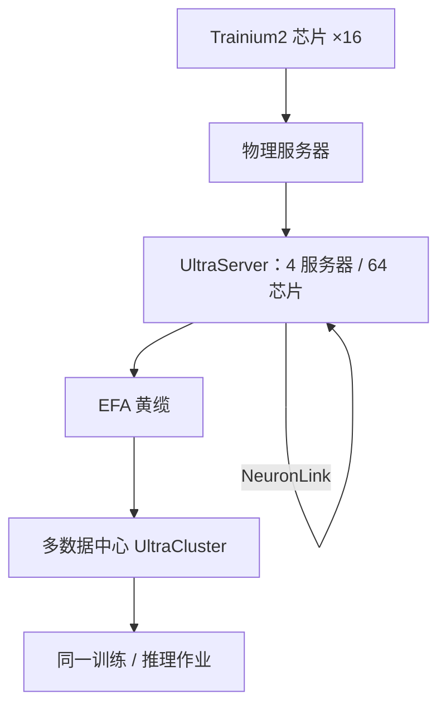

# Project Rainier 超级集群

    
Rainier 是一台由近五十万颗 Trainium2 组成的 EC2 UltraCluster：UltraServer 内部走 NeuronLink，UltraServer 之间走 EFA，Anthropic 用它训练并服务 Claude。

    <footer>—— AWS 官方长文《AWS activates Project Rainier》与 2025-11 周报中的投产说明</footer>

单芯片峰值决定一步 GEMM 有多快；能把多少芯片收成**同一作业的同步域**，才决定能否训下一代稠密或 MoE 模型。Project Rainier 是 AWS 与 Anthropic 共建的超大规模训练 / 推理集群：公开材料把它写成「Trainium2 UltraServers 的 EC2 UltraCluster」，规模是 **nearly half a million** 颗 Trainium2，并声称相对 Anthropic 此前用来训练当时那一代 Claude 的算力超过 **5×**。本篇写集群的两级互连、可靠性与交付时间线，不把后续股权融资里的吉瓦承诺写成 Rainier 投产日的机房功率，也不把未公布的数据中心栋数、MW 或单作业 ExaFLOPS 补进去。

## 问题

把「五十万颗加速器」连成一台逻辑机器，失败模式不在芯片 FLOPS，而在同步半径与故障半径。传统机架各自接外部交换机，集合通信的尾延迟由数据中心网络决定；训练一步若跨过订阅的以太网，MFU 会无声掉下去。AWS 的答案是分层：先把 64 颗 Trainium2 收进一台 **UltraServer**（四台物理服务器 × 16 芯片，NeuronLink 互连），再把数以万计的 UltraServer 用 **EFA**（Elastic Fabric Adapter）织成 UltraCluster。Rainier 要证明的是：这一分层能在多个美国数据中心铺开，并且在宣布后不到一年投产。

第二问是客户模型。公开叙事里 Rainier 为 Anthropic 而建，Claude 的训练与推理都跑在上面；同时 AWS 把同一套 UltraServer / UltraCluster 模板卖给更广的 EC2 用户。规划自己的作业时，不要把「Anthropic 的五十万芯片」理解成你租到的配额。

### UltraServer 是 scale-up，UltraCluster 是 scale-out

一台 Trainium2 UltraServer：64 芯片、芯片间 NeuronLink（官方介绍里强调可辨认的蓝色线缆）。四台 Trn2 服务器先在机内高速域完成张量并行、流水线邻接、以及 64 芯片内存池能覆盖的专家并行。再往上，黄色线缆标识的 EFA 连接 UltraServer，并跨数据中心延伸。两级不能互相替代：NeuronLink 的带宽与延迟合同是 scale-up；EFA 是 petabit 量级、可扩展的 scale-out。把模型并行轴放到 EFA 上，等于回到「独立服务器 + 外部交换机」的旧世界。

芯片代数要写清。Rainier 投产叙事锁定的是 **Trainium2**，不是 [Trainium3](/llm/trainium-3)。后续 Anthropic 与 AWS 的长期协议会覆盖 Trainium3/4 与更多容量，那是另一份合同。不要把 2025 年底的「近五十万 Trn2」改写成 Trn3 UltraServer 的 144 芯片域。

## 方法

作业视角：编译与分片仍在 Neuron / PyTorch 里完成，和单台 Trn2 UltraServer 相同；集群调度把多个 UltraServer 拼成数据并行或流水线并行组。集合通信在 UltraServer 内走 NeuronLink 与 CC-Core 编排，在 UltraServer 间走 EFA。检查点、数据加载落在主机与并行文件系统，路径必须按分片就近写——五十万芯片若先 gather 到单客户端再写对象存储，控制机会先爆。

机房视角：官方写跨多个美国数据中心，并以圣约瑟夫县（印第安纳）等地为水耗与风冷示例。AWS 强调垂直集成：芯片（Annapurna）、服务器、网络、供电与冷却同一套栈上改。这对用户的可见后果是：故障隔离、遥测与 RAS 策略由同一供应商定义，而不是「GPU 盒 + 独立交换机」拼出来的多厂商矩阵。

### 规模数字怎么读

「近五十万」是投产声明里的芯片计数，不是你的 `world_size`。Anthropic 侧另有「到当年年底 Claude 将跑在超过一百万颗 Trainium2 上（含直接使用与 Bedrock）」的预期——那是公司级装机，可能跨 Rainier 与其它 AWS 容量，不要与「Rainier 这一台 UltraCluster」划等号。5× 是相对 Anthropic **上一世代模型所用算力** 的倍数，不是相对某个公开 GPU 集群的第三方测量，也不是 MFU。单芯片「每秒数万亿次运算」是科普量级，规划用 [Trainium2 架构表](/llm/trainium2-inferentia2) 的 TFLOPS，不要用「数到一兆要 31700 年」这类修辞做容量模型。

交付节奏：官方强调从首次宣布到全面运营少于一年。这对工程的含义是：冷却、供电、网络与芯片供给被当成同一条关键路径并行推进；对评测的含义是：早期作业会撞固件与 RAS 的婴儿期，分数波动可能来自集群而不是模型。

## 机制

分层互连之所以能训大模型，是因为并行策略可以和物理层级对齐。张量并行、强同步的流水线阶段放在 64 芯片 UltraServer 内；数据并行梯度、较宽的流水、跨域 MoE 走 EFA。这与 TPU 上「密通信留 ICI、副本走 DCN」是同一条几何，只是 AWS 的 scale-up 量子是 64 芯 UltraServer，而不是某一代 TPU slice 的网格形状。

故障半径随层变化。坏一颗芯片，可能影响一台服务器或一台 UltraServer 的同步域；坏一条 EFA 路径，影响的是跨 UltraServer 的作业条带。AWS 把「全栈可见」说成排障优势：电源、软件协调器、芯片固件可以一起改。用户侧仍要假定：超大同步域的作业在局部故障时更可能整作业中断或回滚到检查点，而不是像单卡那样缩掉一张继续。检查点频率、异步副本、以及是否把关键阶段收进更小的 UltraServer 组，是训练配方的一部分。

Rainier 同时承担训练与推理。同一物理集群上，推理流量会抢 EFA 与主机 CPU。公开材料没有给出训推隔离的定量 SLA。内部若复现「一套模板」，应显式划分 serving 池与 training 池，而不是假设五十万芯片都在做同一步 All-Reduce。

### 可持续性数字不要串台

官方水耗：AWS 数据中心 WUE 约 0.15 L/kWh，对照当时 LBNL 行业参照 0.375 L/kWh；印第安纳站点在 10 月至 3 月宣称冷却不用水，4–9 月平均每天仅数小时用水。电力匹配 2023–2024 年 100% 可再生声明、2040 净零目标，是公司级环境会计，不是 Rainier 的 PUE 表。不要用这些数字反推集群总功率——总功率未在该长文给出。

## 边界与工程取舍

不要把 Rainier 写成「全球任意区域可买的 50 万芯片配额」。不要把 Trainium3 Gen2 的 144 芯片 all-to-all 回溯到 Rainier 的 Trn2 环面 UltraServer。不要用未公开的机房栋数、单栋面积或兆瓦去填容量规划；媒体对印第安纳园区的建筑描述若未出现在 AWS 长文，只作地理背景，不作规格。后续「最多若干吉瓦」的长期购买协议属于商务与装机规划，与 2025 年投产的这一台集群是不同时间切片。

评测与论文若引用 Rainier，应写清：芯片代数（Trainium2）、scale-up 量子（64）、互连（NeuronLink + EFA）、以及 5× 的对照基线是 Anthropic 自己的上一代训练算力。缺任何一项，跨云对比无意义。

出处：aboutamazon.com《AWS activates Project Rainier》；AWS News Blog 2025-11-03 周报；Trainium2 UltraServer 结构见 Neuron / EC2 文档。功率、PUE、精确芯片计数的个位数均未作为本篇规格。

## 小结

- Project Rainier 是近五十万颗 Trainium2 的 EC2 UltraCluster，Anthropic 用来训推 Claude。
- Scale-up 单位是 64 芯片 UltraServer（NeuronLink）；scale-out 是 EFA，可跨多数据中心。
- 公开相对值是「超过 Anthropic 上一世代训练算力的 5×」，不是第三方集群对拍。
- 百万芯片是公司级装机预期，不要与这一台 UltraCluster 的「近五十万」混用。
- 不要填写未公布的 MW、PUE 或把 Trainium3 拓扑写进 Rainier。
- 出处：AWS 官方 Rainier 长文与周报；芯片合同对照 [Trainium2](/llm/trainium2-inferentia2)，下一代对照 [Trainium3 UltraServer](/llm/trainium-3)。
