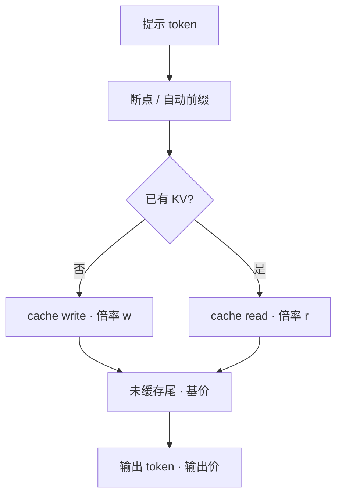

# 提示缓存计费

    
同一段已经写入 KV 的前缀，再读一次不该按满价输入 token 收；账单要把写入、命中、未缓存尾部分开，且命中率不是自动等于利润。

    <footer>—— 对照 Anthropic / OpenAI 将缓存读写标成不同倍率的公开计价，以及引擎侧前缀缓存的成本结构</footer>

[前缀缓存](/llm/prefix-caching) 省的是前填计算与 TTFT；财务省不省，取决于提供方如何把「读已有 KV」标成一种更便宜的输入。Anthropic 把缓存写成显式断点：写入按高于基价的倍率（常见为 5 分钟 TTL 约 1.25×、1 小时约 2×），读取按远低于基价的倍率（常见约 0.1×）。OpenAI 长期以自动前缀匹配为主，缓存读打折（早期约五折，新一代旗舰可到约九折），部分新模型开始对写入单独收费。本篇写计量口径与盈亏条件，不把某一天的价目表抄成永恒常数，也不把内部 GPU 成本等同于对外标价。

## 问题

若账单只有「输入 token × 单价」，前缀缓存对用户是纯延迟优化，对提供方是纯成本：命中少收钱，未命中仍付满额前填。用户没有动力把系统提示稳定在前缀位置，命中率上不去，两边都不划算。若缓存读免费，用户会把整份知识库塞进「可缓存前缀」并高频刷新，写入与 HBM 驻留变成攻击面。需要至少三种计费对象：**未缓存输入**、**缓存写入**、**缓存读取**，可选再加输出。

口径必须与物理命中一致。计费说命中了 8k token，引擎却因适配器版本、chat template、块对齐失败而重算，就是在亏算力还打折。反过来，引擎命中了，账单按满价收，用户会关掉缓存或改供应商。`usage` 里应分列 `cache_write_tokens` / `cached_tokens` / 普通 `prompt_tokens`，与 [token 计量](/llm/token-ratelimit) 同一词表。

### 写入是税，读取是折扣

设基价输入单价为 $p$，写倍率 $w$，读倍率 $r$，前缀长度 $L$，未缓存尾 $t$，该前缀在 TTL 内被命中 $k$ 次（含第一次写入那次若也按写计）。一次写入加 $k$ 次读取的输入费用近似

$$
C = w\,p\,L + k\,r\,p\,L + (k+1)\,p\,t
$$

（第一次是否同时收写+读以厂商条款为准，公式只表达结构。）相对从不缓存、每次付 $(L+t)p$ 共 $k+1$ 次，当 $k$ 足够大、$r$ 足够小，且 $L\gg t$，缓存划算。$k=0$（写了从不读）时，$w>1$ 会比不缓存更贵——这是故意的：惩罚乱写。

TTL 越长，写入倍率通常越高，因为提供方把 KV 在 HBM 或主机上多留一会儿。选 5 分钟还是 1 小时，是流量形状问题：多轮对话用短 TTL；跨请求共享的系统提示，长 TTL 才摊得开写入税。

## 方法

**显式断点。** 调用方在 messages 里标记「到此为止可缓存」。断点应落在稳定边界：系统提示、工具说明书、检索文档，而不是用户本轮最后几个字。最小可缓存长度（常见为一千量级 token、再按块递增）以下不要标，标了也不计缓存。多断点时，未改的前段可读，改动的后段重写——这与基数树前缀匹配同构。

**自动前缀。** 服务端对 token 序列做最长公共前缀查找，命中多少算多少。用户省事，但路由必须 [KV 感知](/llm/kv-aware-routing)，否则水平扩展把命中率打到 $1/R$。自动路径的写入可能「免费」（第一次按普通输入收）或仍按写倍率；看模型代际，不要用旧博客的「OpenAI 一律五折、写入免费」套新模型。

结算在请求结束时根据实际命中长度，而不是根据用户声明。声明 10k 可缓存、实际因差一个空格只命中 0，应按 0 计。模板、[chat template](/llm/chat-template)、适配器 id、权重版本、量化方案都必须进缓存键，见 [适配器热更新](/llm/adapter-hot-swap)。

### 限流与账单拆开

不少 API 把缓存 token **计入** TPM，只在账单上打折。于是「缓存省钱」与「仍然 429」可以同时发生。产品文档要写清：速率配额按原始 token 还是按折算后的加权 token。若按原始，$C$ 的财务公式不影响闸门；若按加权，读倍率 $r$ 会让同一 TPM 放进更多请求，容量规划必须用加权后的到达率。两种都合法，混用会让财务与 SRE 各执一张表。

## 机制

提供方的真实成本：未命中前填 $\approx$ 一次高算术强度作业；命中则跳过这段注意力，只付查表、块引用、可能的跨节点传输。折扣 $r$ 是把这部分节省让一部分给用户、留一部分给自己覆盖索引与驻留。写入倍率 $w>1$ 覆盖第一次前填加上把 KV 钉住 TTL 的机会成本——钉住的页不能给别人当 KV 池。

### 命中率首先是路由问题

命中率对路由极度敏感。自动缓存若搭配随机负载均衡，每份前缀在 $R$ 个副本上各写一次，用户付 $R$ 次写税，读却分散。显式 `cache` 键或前缀哈希粘滞是财务功能，不只是延迟功能。PD 分离时，KV 还要在网上搬，传输成本可能吃掉 $r$ 留下的毛利；计费若仍按「缓存读」，提供方要自己吸收带宽，或把跨机未命中改标为写。

不要用「缓存命中率」一个数进财报。应分：字节命中率、请求命中率、按 $L$ 加权的计费命中率。短提示 100% 命中对收入几乎无影响；长系统提示 70% 命中才是账。

## 边界与工程取舍

价格倍率随模型改。写进合同应引用「当时价目 + 倍率结构」，而不是把 0.1× 写死到 2028 年。最小长度、是否按 128/256 token 对齐、断点数量上限，都会让「看起来相同的提示」差一块未缓存尾，账单对不齐时先查对齐再查 bug。

多租户隔离：缓存键必须含租户，禁止靠相同系统提示读到别人的 KV。安全上，缓存内容与日志同样敏感。自建引擎若对外模仿云账单，折扣要覆盖真实 HBM；把 $r$ 设得过低、自己又没有前缀共享，是在补贴用户算力。自建若不对用户打折、只内部优化 TTFT，则本篇的财务公式不适用，只剩 [TTFT 分位](/llm/ttft-percentiles) 的体验账。

思维链、工具结果是否进入可缓存前缀，要当隐私与失效策略，不只当省钱技巧。工具结果一变，后段必须失效；把易变字段标进长 TTL 缓存，会稳定地返回过期工具状态。

## 小结

- 提示缓存计费至少拆写入、读取、未缓存尾；倍率随厂商与模型代际变化，结构稳定、数字不稳。
- 写入是驻留税，读取是让利；命中次数不够时缓存比不缓存更贵。
- `usage` 分列与引擎真实命中必须一致；模板、适配器、版本进入键。
- 限流是否计入缓存 token 是独立条款；路由粘滞决定命中率，也就决定毛利。
- 对齐粒度、TTL、多断点与多租户隔离都是账单事故的常见根因。
- 出处：对照 Anthropic Prompt Caching 与 OpenAI 提示缓存的公开计价说明；引擎机制见站内前缀缓存专文。
