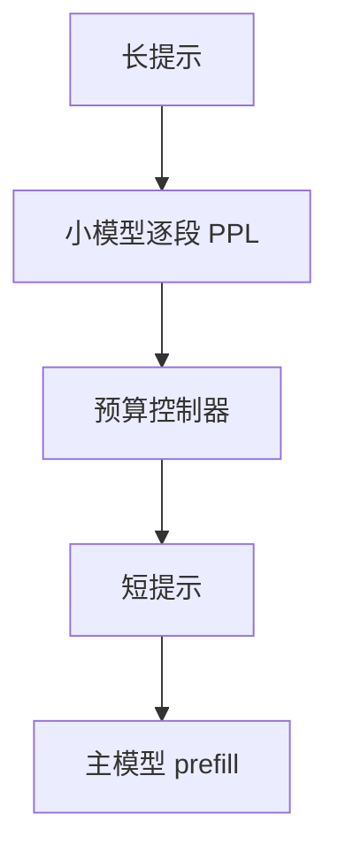

# 提示压缩 LLMLingua

系统提示、检索段落、对话历史里，大量 token 对下一句几乎没有信息。先用小模型打掉它们，大模型按预算看见更短的前缀。

<footer>—— Jiang et al., LLMLingua, EMNLP 2023；长上下文检索见 LongLLMLingua</footer>

[上一课](/llm/tensor-decomposition) 压的是权重。本课权重冻结：压的是**提示**。缺口是上下文窗口与 prefill FLOPs 随 token 线性（注意力还更差），RAG 与工具轨迹把前缀撑满。LLMLingua 用小 LM 的困惑度做逐 token 预算控制，迭代删掉「可预测因而信息少」的词。后课词表裁剪回到模型文件内部。不重写 [Prompt Cache](/llm/prompt-cache) 的前缀缓存。

## 问题

用户真正的问句往往只有几十 token，前面却挂着几千 token 的说明与文档。完整前缀质量最好，贵。截断尾部或头部会误删关键约束。需要按**信息量**分配预算：不可预测、任务相关的 token 留下，套话与重复检索句删掉。小模型的 PPL 是便宜代理；它与大模型的信息量不完全一致，这是误差来源。

这不是 KV 量化，也不是 Deja Vu 跳通道。输出词表与权重原封不动。压缩器失败的可见症状是丢约束、丢引用、丢格式，而不是 PPL 微涨。

LongLLMLingua 把问题改成：在多文档里先选段再压 token，避免平均地从每篇各删一半。RAG 场景应走这条，而不是对拼接后的超长串做一次全局删词。

## 方法

预算控制器：给定目标压缩比，用小模型对提示分段算条件 PPL，迭代去掉当前最可预测的 token，直到长度达标。保留特殊标记、数字、代码标识符的白名单。与大模型的 chat template 对齐，否则压缩器看见的切分与主模型不同，分数无意义——接到 [预分词正则](/llm/pretokenization-regex) 的同一快照纪律。

评测必须用下游：问答准确、引用是否仍在、格式是否可解析。禁止只报「压缩比 × 速度」而不报任务分。与缓存：压缩后的前缀哈希变了，Prompt Cache 命中率下降，是另一笔账。

## 机制

可预测 token 对交叉熵贡献小，删掉后大模型的条件分布往往仍能补全语法。任务关键实体恰好是高 PPL 的那类，所以代理与目标大体同向。失败在：小模型与大模型的分词器或领域不一致，于是「可预测」指错对象；以及对话里的指代，删了先行词后短提示在主模型里无法还原。

与 RL 推理链：压缩思维链会把自检步骤删成套话，[GRPO](/llm/grpo) 训出的长链不要当普通系统提示压。用户可见问句通常不压。

## 边界与工程取舍

不要对已经短的提示再压。不要把压缩器本身做成又一次大模型调用还宣称省钱。法律、代码、JSON schema 应白名单整段保留。下一课词表裁剪：减的是 embedding 行数，提示仍可以很长。

## 小结

- LLMLingua 压输入 token，不改 $W$；代理是小模型 PPL。
- 验收用下游约束是否还在，不用压缩比本身。
- RAG 先选段再压词；分词器必须与主模型一致。
- 推理长链与 schema 不要当套话删。
- 出处：Jiang et al., EMNLP 2023 LLMLingua；后续 LongLLMLingua。
