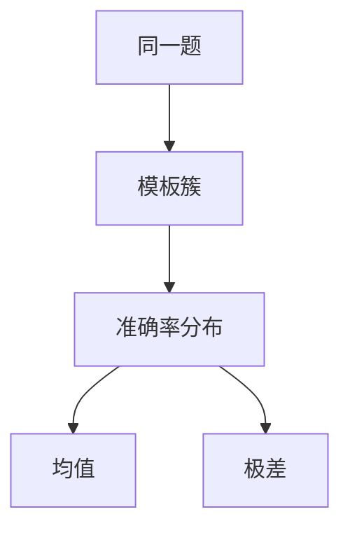

# 提示格式敏感

把冒号换成换行、把选项从 A. 换成 (A)，准确率可以跳几个点。那是格式方差，不是能力跃迁。

<footer>—— Sclar 等对提示表面特征的量化；HELM 亦长期报告模板敏感</footer>

[上一课](/llm/loglik-vs-generative-eval)把似然与生成拆开。两套协议都还剩一个自由度：提示的表面句法。本课写格式敏感。缺口不是再讲 few-shot，而是：**同一套题、同一个模型，模板微扰不该被写成新 SOTA。** 后课答案抽取默认格式已经是误差源之一。

## 问题

Sclar 等人系统扰动分隔符、空格、选项标记、大小写，发现许多模型的准确率分布很宽：均值好看，换一种同样「合理」的模板就跌出置信区间。排行榜若只报作者最顺手的那一条提示，等于在优化提示工程，不是在测模型。

聊天模板把问题再放大一层：Hugging Face `apply_chat_template`、系统提示、是否把 few-shot 封进多轮，都会改 token 序列。基座没有聊天模板，Instruct 权重有；把两者放进同一列却用不同封装，格式方差被算进「对齐收益」。

格式敏感与[污染](/llm/eval-contamination)正交。污染是题见过；格式敏感是题没变、包装变了。两者都会让涨分无法解释，但补丁不同。

## 方法

最小协议：冻结一簇模板（不少于数种分隔与选项标记），报告均值与极差，而不是最好的一个。官方脚本（后课 harness）应把模板当版本号的一部分。对 Instruct 模型，额外锁死系统提示是否为空、few-shot 是用户轮还是拼进单轮。

比较两个模型时，用**同一簇**模板，禁止各自调到最佳。声称鲁棒，应看极差是否下降，而不是看某一条高峰。

## 机制

表面格式改变的是相对位置与特殊符号先验。模型在预训练里见过更多「A.」而不是「(A)」，似然协议会把质量分给更像语料的选项标记，即使内容等价。生成协议则把「先复述再给字母」的路径概率改掉，抽取器随之成功或失败。few-shot 例题的格式若与试题不一致，模型会模仿例题的错格式，试题被判错——这是协议 bug，不是学科无知。

## 边界

不可能穷尽所有同义改写。目标是把「常见排版」的方差暴露出来，而不是证明对任意扰动不变。下一课答案抽取会处理生成协议里比格式更下游的那一层：从段落里把「最终答案」抠出来。

## 小结

- 模板微扰可造成数点准确率差；只报最佳提示无效。
- 报告均值与极差；跨模型必须共用模板簇。
- 聊天封装属于格式，不是可忽略的样板。
- 出处：Sclar 等对提示表面特征敏感度的量化；HELM 的模板报告传统。
