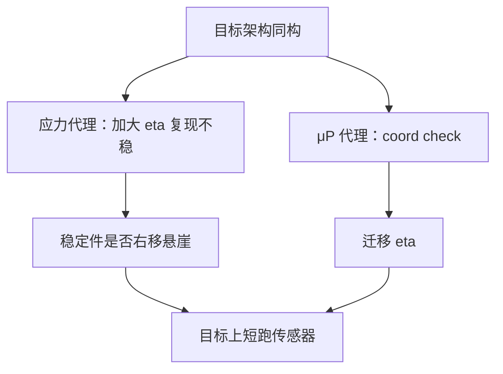

# 小模型代理实验

能在小模型上用大学习率复现的不稳，才配叫机制；只在小模型上降了损失的改动，迁移到大模型时必须再过 coord check 与同一稳定件。

<footer>—— Wortsman et al., Small-scale proxies for large-scale Transformer training instabilities, ICLR 2024；超参迁移见 Yang 等 μP</footer>

[上一课](/llm/inference-compute-optimal)把预算决策放到损失面与推理账上。缺口是：你没有预算在目标宽度上扫完所有稳定件与形状。Wortsman 等人说明大模型训练不稳可以在小模型上**故意加 $\eta$** 复现，从而把 cap、QK-Norm、$\beta_2$ 的消融放在代理上。μP 则要求代理与目标同参数化。本课把「代理实验」写成缩放实践的方法，而不是「小模型论文」。后课的生长与升级，默认先在代理上验证拼接是否炸。

## 问题

代理失败有两种。假阴性：小模型太稳，大学习率不稳在小宽度上不出现，于是你关掉 cap，目标宽度上炸。假阳性：小模型数据制度不同（更多 epoch、更小 $U$），某正则在代理上有用，目标上是纯伤害。Wortsman 的处方针对不稳：**提高代理 $\eta$ 直到出现与大模型同类的传感器报警**（熵塌缩、尖峰），再测对策是否把悬崖推走。μP 的处方针对超参：**宽度轴 coord check 平坦** 才迁 $\eta$。

两者都要求：深度、词表、稳定件集合尽量同构，只缩宽度或只缩 $N$。把 6 层 GELU 代理的结论迁到 80 层 SwiGLU 目标，叫架构消融，不叫代理。

代理的 token 数不应按参数比线性缩到几乎只剩压熵段。阶段课写过：架构差别出现在幂律段。代理至少要看见斜率，而不是只比 1 个 epoch 的终点。

## 方法

设计清单：

1. 同深度带子、同词表或按词表定律缩小后声明不可比的部分。
2. 同优化器分组、同 $\beta_2/\varepsilon$、同是否 cap。
3. 不稳代理：扫 $\eta$ 直到触顶率 / 熵报警，记录悬崖位置；再打开候选稳定件，看悬崖是否右移。
4. 超参代理：μP infshape + coord check，再迁。
5. 数据制度：尽量同 $R$、同配比；否则把差异写进「不可迁」列表。

验收迁移：目标模型上只跑少量 step 的 coord check 与传感器，不要求跑完。若代理说 cap 右移悬崖、目标上前 2k step 熵仍塌，是实现未对齐（Flash 核无 cap），不是代理理论失败。

## 机制

不稳往往来自尺度连乘，宽度是放大器。小模型把 $\eta$ 当放大器，可以进入同一饱和区，这是假宽度上的应力测试。损失面的幂律指数则对绝对 $N$ 敏感，小代理拟合的 $\alpha$ 外推要留出（拟合课）。所以：稳定件用应力代理；谷底用一组覆盖两三个数量级 $N$ 的真缩放跑，不要用单档 100M 拟合去买 70B。

## 边界

本课不把代理当缩小版产品评测：涌现课已说明阈值指标在小模型上全是随机。下游只作 sanity，不作 SOTA 决策。下一课开始改**已有检查点的形状**：往深长、往 MoE 长，而不是从随机初始化扫 $N$。

## 小结

- 不稳用加大 $\eta$ 的小代理复现；超参用 μP coord check；两者都要求同构稳定件。
- 假阴性来自代理太稳，假阳性来自数据制度不同。
- 代理要跑进幂律段；不要用单档小模型拟合 $\alpha$ 买大模型。
- 迁移失败先查实现对齐，再查代理设计。
- 出处：Wortsman et al., ICLR 2024；Yang 等，Tensor Programs V。
