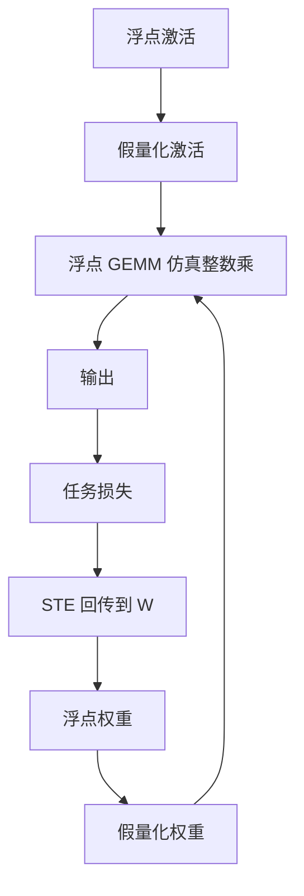

# QAT

前向假装已经是整数，反向把量化当成恒等；这样学到的权重会自己躲开格子缝，推理才能丢掉浮点乘加。

<footer>—— Jacob et al., Quantization and Training of Neural Networks for Efficient Integer-Arithmetic-Only Inference, CVPR 2018</footer>

量化感知训练（Quantization-Aware Training, QAT）在**训练图**里插入假量化，让权重与激活见到推理时会遇到的格子，再用反向去改尚未真正离散的浮点参数。Jacob、Kligys、Chen 等人 2018 年的工作把这条路写成可落地的整数推理配方：假量化、直通梯度、训练后把浮点折叠成整数乘加与偏置校正。它与 [PTQ](/llm/other-ptq) 的分界不在「8-bit 还是 4-bit」，而在**要不要对原网络求梯度**。大语言模型上 QAT 极贵，所以默认先 PTQ；当 4-bit 重建已经补不回下游任务、或必须整数-only 部署时，QAT 才重新进菜单。本篇写 Jacob 给出的机制，以及它在 LLM 上为什么常常用不起。

## 问题

推理若在整数 ALU 上跑，真实前向是 $\hat{x}=s_x(q_x-z_x)$ 再整数 GEMM。若训练全程 FP32，权重会停在格子之间；部署一步量化，等于给每层加一份从未见过的噪声，小网络还能靠过参数化吞掉，部署敏感的检测与端侧模型会直接掉 mAP。PTQ 用校准去选尺度或取整，不改表示本身；表示若与格子冲突，校准只能做局部门面修补。

QAT 要解决的是：在还能量化之前，让损失的梯度把参数推到「量化后仍然好」的区域。约束是训练图必须几乎等于推理图，否则学到的是另一个函数。Jacob 等人面对的是卷积、深度可分与移动端整数 CPU，目标是**整数-only**：连归一化与偏置都折叠进整数域。LLM 服务很少真正整数-only，但假量化这一套被原样借用。

### 假量化不是真的改 dtype

训练时张量仍是浮点。假量化算子执行

$$
q = \mathrm{round}\big(\mathrm{clip}(x/s+z)\big),\qquad \hat{x}=s(q-z),
$$

前向的 $\hat{x}$ 在值域上等于推理会用的反量化结果，反向则需要 $\partial\hat{x}/\partial x$。$\mathrm{round}$ 与 $\mathrm{clip}$ 的真实导数几乎处处为零，于是用直通估计（straight-through estimator, STE）：把 round 当成恒等，clip 在窗外梯度为零。这是偏置的、有噪声的梯度，不是无偏估计。QAT 能收敛，靠的是噪声相对损失尺度够小、以及训练足够长去平均它。

STE 不是定理保证的最优松弛。它是 2018 年前后工业界能跑通的默认。后续有把量化看成随机舍入、或对尺度也求梯度的变体；写进 LLM 工具时，仍要先核对是否还在 Jacob 的假量化图上，以免把 PTQ 校准误叫成 QAT。

## 方法

典型流程：从已收敛的浮点模型出发（很少从随机初始化直接 QAT），插入权重量化与激活量化节点；尺度 $s$ 可按批统计（类似 BN 的移动平均）或作为可学习参数；跑若干 epoch，学习率低于原训练。结束后把权重写成整数，把 BN 的缩放与量化尺度折叠，导出整数图。Jacob 文中的推理侧强调：卷积、加、ReLU 都可以在整数上对齐，避免「训练假量化、推理却在浮点里反量化再乘」的不一致。

对 Transformer，假量化通常只套在线性层的输入与权重上，softmax、RMSNorm、嵌入查表留在浮点——已经不是整数-only。若坚持全整数注意力，还要量化分数与指数近似，那是另一条产品线，不要冒充 CVPR 2018 的配方已经覆盖。

与 PTQ 对照：GPTQ/AWQ/AutoRound 的优化变量是尺度、取整或未量化列，原 $W$ 在量化后扔掉高精度副本（推理不再需要）。QAT 全程保留浮点主权重，量化只出现在前向仿真里；导出整数是训练结束的一次冻结。显存与墙钟因此接近再训一遍模型，对 70B 是数量级差异。

### 尺度与零点谁来学

对称量化令 $z=0$，负数范围浪费在 ReLU 后的激活上，但实现简单。非对称量化对激活更准，整数 GEMM 要带零点校正。Jacob 把这些写成推理图里的整数偏置项。LLM 的 RMSNorm 输出可正可负，对称 INT8 常见；若做 QAT，尺度可以用校准移动平均先初始化，再在训练中缓慢更新，避免每步 amax 乱跳把 STE 噪声放大。尺度跳得太快，等价于每步换一套格子，低秩适配器与残差都会学不稳。

## 机制

假量化把损失景观切成一块块台阶。STE 在台阶内部提供与未量化时相同的方向，在台阶边界提供错误的「可以滑过去」的幻觉。训练足够久时，权重大质量会迁到台阶中心，推理取整不再跨边界——这就是「躲开格子缝」。若训练太短，只是在原浮点解附近加了噪声，效果可能差于认真做的 PTQ，因为 PTQ 至少针对层输出做了补偿。

深层网络里激活量化的噪声会沿残差累积。Jacob 面对的移动网用 BN 稳定激活尺度；Transformer 用 RMSNorm，每层重新拉回尺度，这是 LLM 上 8-bit QAT 仍可能稳的原因之一。4-bit 激活 QAT 则把台阶变得很宽，STE 的幻觉更强，需要更长微调或只量化权重（W4A16 的 QAT 变体），否则不如 GPTQ。

从浮点全参再做 QAT，和从量化检查点做「再训练」不是同一实验。后者若不允许 STE 穿过整数，只是在离散点上跳，通常训不动。QAT 的主权重必须保持浮点，直到导出那一刻。

## 边界与工程取舍

成本：70B 级全参 QAT 需要接近原微调的算力与数据，还要维护假量化图的数值稳定。多数团队的理性顺序是 PTQ → 不行再对敏感层 QAT 或蒸馏。端侧小模型、必须整数 CPU、或许可证不允许浮点运行时，QAT 的固定成本才摊得开。

数据：QAT 会拟合训练分布。用通用网页再训一遍对话模型，等于破坏对齐。应用侧 QAT 应在下游 SFT 数据上做短微调，并当作另一次对齐，而不是「无损压缩」。安全与拒答行为都可能漂。

与 LoRA：[QLoRA](/llm/qlora) 量化的是冻结基座，梯度只进适配器，不是 Jacob 意义下的全网假量化。若对适配器也假量化，低秩增量与量化台阶同量级，容易学废。QAT 与 QLoRA 不要叠成一句「都是 4-bit 训练」。

### 整数-only 在 LLM 里很少兑现

Jacob 的标题是 integer-arithmetic-only。LLM 服务栈几乎总在 GPU 上混用 BF16 softmax 与 INT8/FP8 GEMM。宣称 QAT 却在推理时反量化回 BF16 再乘，得到的是「见过量化噪声的浮点模型」，加速取决于核，不取决于整数 ALU。签字要写推理图，不写训练时插入了几个 FakeQuant。

论文数字来自 MobileNet 一类与 ImageNet。把 CVPR 2018 的精度掉点表抄到 LLaMA 上没有意义。可引用的是方法：假量化、STE、折叠 BN。LLM 掉点必须自己测。

## 小结

- QAT 在训练前向插入假量化，用 STE 回传，使浮点权重迁到量化后仍优的区域。
- 与 PTQ 的差别是对原网络求梯度；导出整数发生在训练结束，而不是校准一次。
- Jacob et al. 2018 给出整数-only 推理图与零点折叠；LLM 上通常只把线性层假量化。
- 全网 QAT 对大模型成本接近再训练，默认应先 PTQ。
- 尺度乱跳、训练过短、数据域错位，都会让 QAT 差于好的 PTQ。
- 与 QLoRA 的 4-bit 存储不是同一件事；推理图必须与训练假量化一致才有意义。
- 出处：Jacob et al., *Quantization and Training of Neural Networks for Efficient Integer-Arithmetic-Only Inference*, CVPR 2018。
