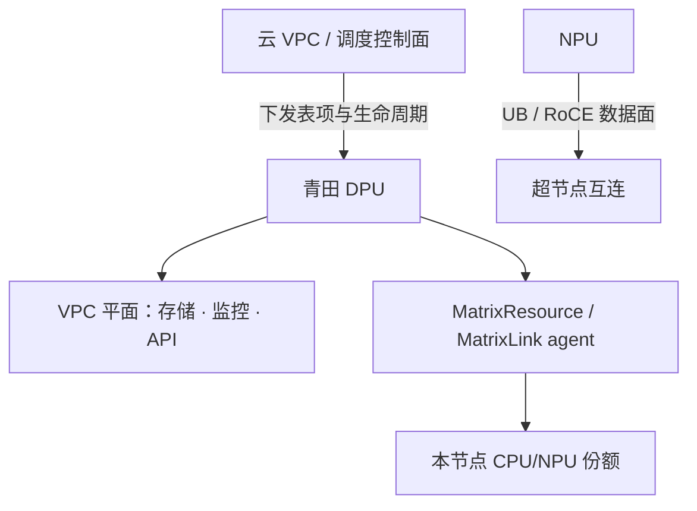

# 青田 DPU 与 VPC 控制面

    
超节点的南北向出口不应再经过主机操作系统的软交换；青田卡把 VPC 做成可下发的硬件路径，控制面改表，数据面转发。

    <footer>—— 对照华为云青田架构白皮书，以及 CloudMatrix384 把 Qingtian 卡作为节点 VPC 平面出口的描述</footer>

CloudMatrix384 有三张网：UB 管域内 Scale-Up，RoCE 管 NPU 之间的 Scale-Out，第三张是接到数据中心的 VPC 平面。论文写明：每节点一块青田（Qingtian）卡，挂在鲲鹏上，作为该节点的南北向出口，单向带宽最多 400 Gbps 量级，跑标准以太网/IP，可选 UB-over-Ethernet。它不是「又一块更快的网卡」这么简单——华为云的青田体系把虚拟化、VPC 隔离、弹性网卡从宿主机内核里搬走，让控制面下发到卡上的表项，数据面在卡上转发。本篇写 DPU 在超节点里干什么、VPC 控制面如何落到卡，以及为什么推理数据面不要走这条口。

## 问题

若南北向仍由宿主机 Linux 做软交换，则部署、监控、对象存储、租户安全组都会和推理抢 CPU 与 PCIe。更糟的是多租户：VPC 隔离若只存在于软件网桥，逃逸面是整台机器的内核。超节点把 8 张 910C 与 4 颗鲲鹏收成一个逻辑节点之后，爆炸半径更大：控制面若打穿主机，影响的是整柜份额，而不只是一台虚机。

VPC 控制面要解决的是：租户网络的生命周期——子网、路由、安全组、弹性网卡、对等连接——如何在不经过业务 NPU 的前提下，变成每包都能执行的转发规则。数据面若还要问一次计算节点上的 vSwitch，延迟与隔离都回到传统云主机。

### 三平面为什么不能合成一张「大以太网」

UB 要的是微秒内的内存语义；RoCE 要的是 NPU 之间无损或准无损的远程读写；VPC 要的是可路由、可计费、可审计的租户网络，并通往 OBS/EVS/SFS 与管控 API。合成一张网可以少买光模块，但 PFC 队列、ACL 与对象存储大流会互相污染。论文把当前实现写成三平面分离，长期再谈 RDMA 与 VPC 收敛。青田卡站在第三平面上，不要让它去转发 EP 的 token。

青田卡执行的是节点级资源管理与 VPC 出口，不是 UB 交换。MatrixResource / MatrixLink 的 agent 跑在卡上，向云控制面报到，并不意味着 MoE All-to-All 也从这里走。

## 方法

把节点看成「计算复杂 + 一块 DPU 出口」。鲲鹏跑用户态与本地 OS，NPU 跑模型；青田卡拥有高速网口，并向宿主机提供直通的虚拟网卡（VF passthrough）。VPC 管理面把该租户的路由、VXLAN 封装、安全组、网络 ACL 下发到卡，而不是下发到计算 OS 的 iptables 长链。包进卡后按租户表查找、封装、送入数据中心 underlay；对端青田卡解封装，再送到对端实例。全程按 VPC 表隔离，这是华为云白皮书里「从物理隔离到逻辑隔离」在网络侧的落点。

在 CloudMatrix 软件栈里，卡上还跑两类 agent。MatrixResource 按拓扑分配超节点内的计算实例；MatrixLink 配置 UB 与 RDMA 的链路、QoS 与动态路由。它们的**控制消息**走 VPC 平面到达卡，再由卡去改本节点的资源与链路状态。这与数据面上 NPU 走 RoCE/UB 是两条路径：调度指令可以经过青田，token 不行。

### 控制面与数据面的时间尺度

VPC 变更是秒到分钟：加一块弹性网卡、改安全组、挂载 EVS。推理迭代是毫秒：decode 一步、KV 搬一次。方法上必须禁止把后者同步到前者。实例开通时，青田卡准备好南北向连通与存储挂载；运行中，KV 与专家通信绕开卡。UBoE 若启用，也是把 UB 语义叠在以太网上通往特定对端，而不是把所有 UB 流量改道 VPC 出口。

白皮书写：VPC 管理面把转发表下到青田卡，卡按 ENI/子网查租户路由，VXLAN 封装后发送。这是控制面「改表」、数据面「查表」的经典 DPU 分工，与智能网卡 offload OVS 同类，只是产品名不同。

## 机制

DPU 能卸下主机，是因为它有自己的处理器、内存与加速器，运行一个比宿主机更小的可信计算基。网卡虚拟化、加密、存储协议的一部分可以在卡上完成，宿主机只看见直通设备。对超节点，这意味着 4 颗鲲鹏不必再为每包中断服务 VPC；NPU 的 PCIe/UB 带宽也不被存储副本抢占——存储走青田口，训练/推理集合通信走 NPU 口。

隔离机制是按租户查表，而不是按主机 IP 碰运气。同一超节点切给两个租户时，VPC 提供网络命名空间级隔离；计算份额的隔离还要靠 UB 分区与 [多租户](/llm/multi-tenant-gpu) 那一套。青田不能单独保证「NPU 上的权重不被隔壁租户读」，它保证的是包出节点之后进错 VPC 的路径在硬件上不存在。

### 故障时控制面仍要能摸到节点

卡是南北向与管控通道。卡挂了，云控可能失去对该节点的 Matrix 代理，即使 UB 域内 NPU 还能互相算。运维上应把青田卡视为节点可用性的一部分：掉卡即掉管，应把该节点从池中摘掉，而不是继续在不可管的 8 卡上跑宽 EP。这与「计算面故障」不同，需要单独的健康检查，检查路径本身也走 VPC，避免用 UB 去探活管控。

## 边界与工程取舍

不要把 DPU 写成推理加速器。没有 AIC，不能跑 MoE。不要把 400 Gbps 的 VPC 口拿去补 RoCE：对象存储流是大块、可缓冲的；decode KV 是延迟敏感的。安全组规则过深、日志全开，会在卡上变成新的 CPU 瓶颈，表现为「存储变慢」而不是「NPU 利用率低」，排障时容易找错平面。

多云或自建机房若没有青田，功能对等物是别家 DPU 或 SR-IOV + 硬件 offload；语义仍应是「控制面改表、数据面不经主机」。不要在文档里把华为云 OBS 的 SLA 写成 UB 内存池的延迟。UBoE 与平面收敛是演进项，当前作业与防火墙策略按三平面写。

出处分两处：CloudMatrix384 论文给出卡在超节点拓扑中的位置与带宽量级；华为云青田安全/虚拟化白皮书给出 VPC 表项下发与 VXLAN 隔离。本篇不引用未公开的卡上核心数或未发布的固件接口。

## 小结

- 青田卡是 CloudMatrix 节点的 VPC 平面出口与节点级管控代理所在地。
- VPC 控制面把路由、安全组、弹性网卡下发到卡；数据面在卡上按租户表转发。
- MatrixResource / MatrixLink 的控制消息可以走青田；MoE 与 KV 数据面走 UB/RoCE。
- 卡故障等于节点失管，应从池中摘除，不要只看 NPU 是否还能互 ping。
- 三平面分离是为了隔离拥塞与攻击面，不是为了多买三种网卡好看。
- 出处：Zuo et al., arXiv:2506.12708；华为云青田系统安全技术白皮书中的 VPC 隔离描述。
