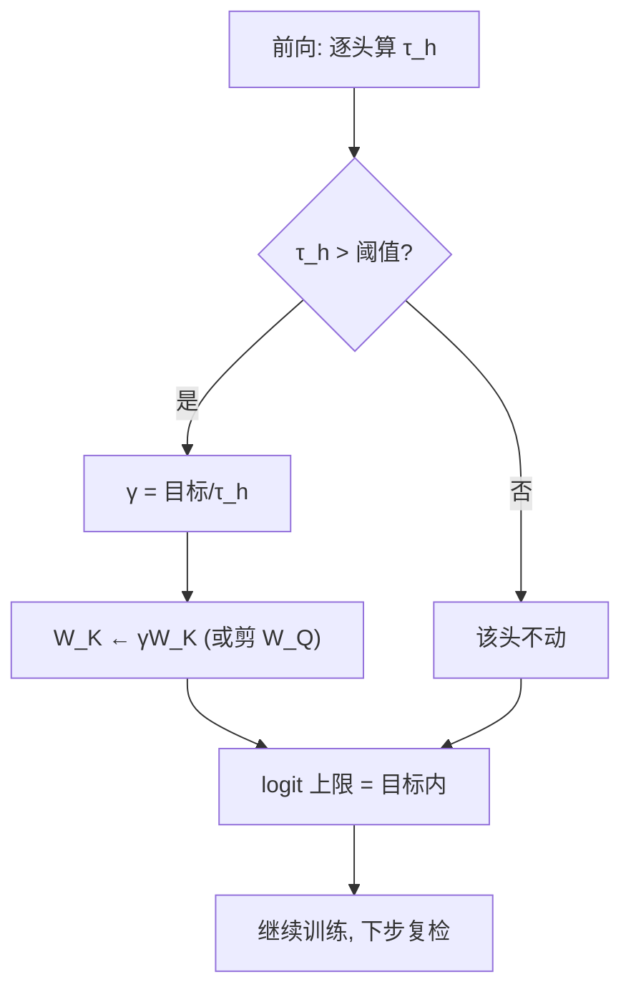
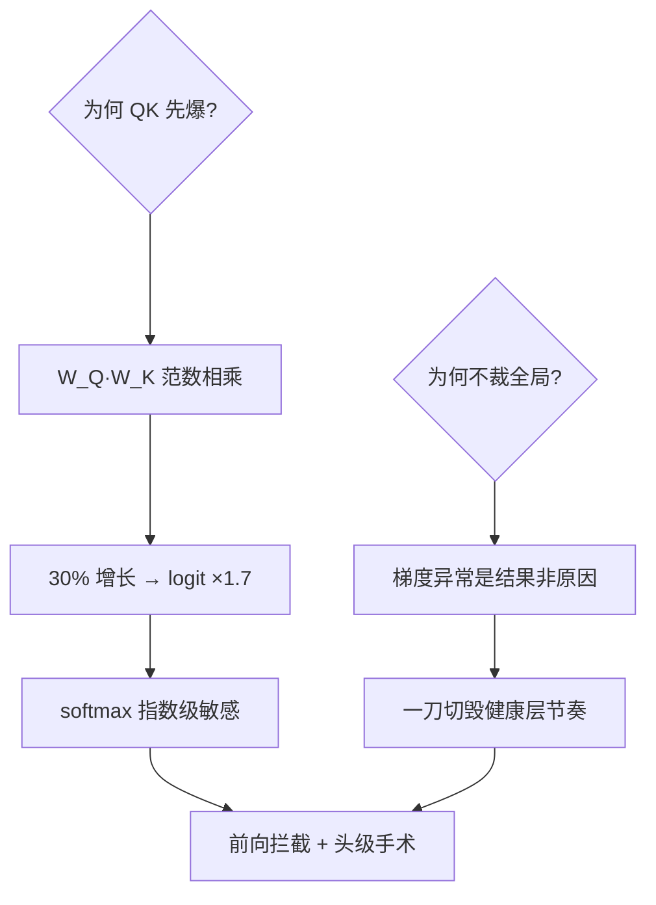

# qk-clip

训练崩溃不查学习率先查 QK 头：少数头的 logit 指数爆长，一剪头部权重，loss 尖峰当场熄火。

<footer>—— 据 QK-Clip（万至千团队 Moonshot Kimi K2 技术报告 2025）；Grok-2 训练稳定性附记</footer>

[Schedule-Free 优化](/llm/schedule-free-optimizer)管全局节奏，本课管致命局部：MoE 大模型训练中 1/1000 步的 loss spike。缺口是 **QK-Clip**——按头诊断注意力 logit 的发散，对越界头直接缩放 $W_Q$ 或 $W_K$。它是把「稳定性工程」从全局梯度裁剪推进到头级手术的代表作。本课不做 Muon 系优化器稳定性的一般理论。

## 问题

Muon 类优化器放宽了 Adam 的二阶矩自适应，梯度更新范数更「生猛」，MoE 大模型上出现低频 loss spike：某个注意力头持续输出巨大 QK 点积 → softmax 饱和 → 梯度路径异常 → loss 拉高数个点后缓慢恢复，且常在恢复后复发。全局梯度裁剪（grad clip）按范数一刀切，杀敌一百自损三千——问题只在个别头。缺口：**定位并只剪病灶头**。

术语翻译：QK logit = $q^\top k/\sqrt{d}$ 的分值，进 softmax 前的数量级决定注意力集中度；logit 最大值 $\approx\|q\|\|k\|/\sqrt d$，故控制 $W_Q,W_K$ 的谱范数即控制 logit 上限；α-threshold = 触发裁剪的 logit 阈值（Kimi K2 报告用 $\tau_{max}\approx 100$）。

数字实例：$d=128$，某头 $\|q\|=30$、$\|k\|=35$，logit 上限 $\approx 30\times35/11.3\approx 93$——逼近 100 阈值。QK-Clip 对该头把 $W_K$ 缩到 $\gamma=0.5$，logit 上限即降半到 46，softmax 恢复分辨力；其余 63 个头不动。

## 方法

每步前向（或每 N 步）扫全部头：算 $\tau_h=\max(q^\top k/\sqrt d)$，超阈值则对该头执行 $W_K\leftarrow\gamma W_K$（或剪 $W_Q$），γ 按 $\gamma_{target}/\tau_h$ 定，使缩放后 logit 恰落在目标内；阈值本身随训练动态调整（发散头消失后阈值收紧到更低水平）。关键性质：缩放 $W_K$ 与 $W_Q$ **不改 softmax 输出的归一化结构**之外的语义——它等价于给该头的温度乘 $1/\gamma$，是注意力本来就有的自由度，故干预几乎无副作用。

直觉类比：一屋子话筒（注意力头）里有一支啸叫（logit 爆长），调音台的全局推子（grad clip）一刀拉低全场音量——演出没法听了；QK-Clip 是找到啸叫的那支话筒把它的增益旋钮拧小半格，演出继续。

## 机制

为什么发作在 QK 而不是 V/输出投影：softmax 对 logit 是指数敏感的，$W_QW_K$ 的乘积结构使两个矩阵的范数**相乘**放大（各长 30% 则 logit 翻 1.7 倍），而 V/输出投影只线性放大。为什么全局裁剪失效：spike 的梯度异常是**结果**不是原因，等它传回来时全局范数早已被少数层污染，一刀切的裁剪破坏所有健康层的更新节奏。QK-Clip 在前向即拦截——病根暴露在 logit 上，治疗落在权重上，诊断与治疗同址。阈值自适应的逻辑：初始阈值抓恶性发散，训练稳定后阈值下调抓「慢性高温」，把病消灭在发烧前。

常见误区：见到 spike 就降学习率重训——低频 spike 的根因是结构性（个别头动力学），降 LR 只是把发作推迟；另一误区是剪 V 或输出投影——它们对 softmax 无影响，logit 该爆还爆，白剪。

## 边界

QK-Clip 管「注意力 logit 发散」这一类 spike；MoE 的路由震荡、优化器二阶矩失配、数据异常 batch 引发的 spike 走各自的路（路由熵正则、optimizer 状态回滚、数据回放过滤）。阈值是超参：过松漏抓、过紧误剪健康头的表达自由度——Kimi K2 报告的经验是「抓大放小」逐步收紧。与 [logit 软上限](/llm/logit-softcap)的分工：软上限在**推理/输出**层给 logit 封顶（tanh 式），QK-Clip 在**训练**层做权重手术——一个是运行时护栏，一个是发育期正畸。适用性：Muon/MoE 大模型是重灾区，稠密 AdamW 模型多数用不上，但头级监控的诊断价值普适。

直觉类比：QK-Clip 与软上限的关系像「正畸 vs 护齿套」——正畸（剪权重）在发育期把牙列排齐，一劳永逸；护齿套（软上限）比赛时戴上防止磕碰，随时可摘。训练崩溃要正畸，推理越界装护齿。

## 小结

- logit 上限 $\propto\|W_Q\|\|W_K\|$，少数头乘积爆长即 spike 根因。
- 头级诊断 + 缩 $W_K/W_Q$，等价于调该头温度，副作用近零。
- 全局梯度裁剪治标伤好层；阈值自适应抓大放小。
- 出处：Kimi K2 技术报告（QK-Clip）2025；Grok-2 训练稳定性附记。
