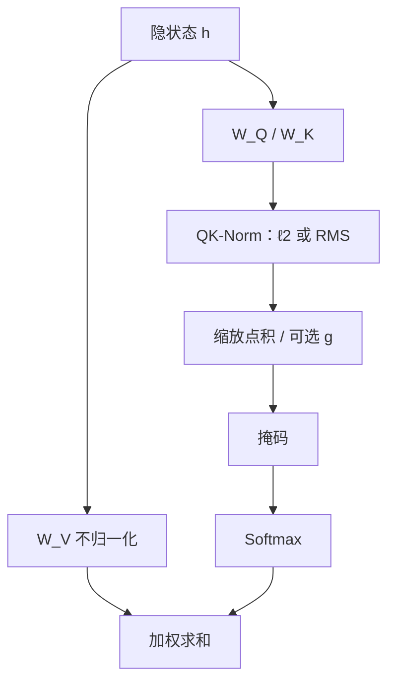

# QK-Norm

对查询与键在点积之前做归一化，softmax 的输入不再随向量范数指数漂移；混合模态里两种熵差很大的符号尤其需要这道闸。

<footer>—— Henry et al., Query-Key Normalization for Transformers, Findings of EMNLP 2020；大规模预训练侧见 Chameleon Team, arXiv:2405.09818</footer>

[缩放点积注意力](/llm/sdpa) 用 $1/\sqrt{d_k}$ 把独立分量下点积的标准差拉回常数阶。这假定 $q,k$ 的尺度本身被初始化与残差流管住。深度一加、学习率一抬、再在同一条序列里混进图像码或音频码，$q,k$ 的范数会在训练中途指数涨，logits 先饱和，梯度再尖。Henry、Dachapally、Pawar、Chen 在 2020 年把点积改成**沿头维对 $q,k$ 做 $\ell_2$ 归一化**，再乘可学习标量，称作 QKNorm：每个分数变成缩放余弦，而不是裸点积。预训练把它写成 QK-Norm 之后，ViT-22B、小规模不稳定性代理、以及 [Chameleon](/llm/chameleon) 的早期融合都把它当成稳定件；Grok 系大 MoE 与随后的 OLMo 2、Gemma 3、Qwen3 则多用 RMSNorm 打在 $q,k$ 上，精神相同、范数定义略异。本篇写预训练为什么要它，不把块级 RMSNorm 说成同一层。

## 问题

softmax 只看见差值。向量范数变大时，即使角度关系不变，点积幅度变大，权重趋于 one-hot，Jacobian 趋于零。Vaswani 的缩放处理的是**维度**带来的方差；它不处理训练过程中 $\|q\|$、$\|k\|$ 被残差、门控与多模态熵差推高。Wortsman 等人用小模型加大学习率就能复现注意力 logit 不稳，并发现 QK-Norm 让可训练学习率跨三个数量级仍不炸。Chameleon 把同一现象写在混合离散符号上：文本条件熵低、图像码条件熵高，softmax 平移不变会鼓励「范数竞赛」，直到超出 bfloat16 有效范围。他们的消融：7B 去掉 QK-Norm 约在 20% epoch 处发散。

Grok 类超大 MoE 预训练同样在深栈、大学习率、专家路由的复合尺度下跑，社区配方与后续开源密集模型把「点积前归一化 $q,k$」当成与 Pre-LN 同级的默认件。公开的 Grok-1 JAX 参考实现以校验形状为主，不能当成完整训练图；稳定策略应以 Chameleon 报告、ViT-22B 与后来写明 QK-Norm 的技术报告为准，而不是从加载脚本反推。

### 块级 Norm 管的是残差，不管点积空间

Pre-LN / RMSNorm 打在子层入口，管的是进入注意力投影之前的 $h$。投影 $W_Q$、$W_K$ 仍可以把尺度放飞；RoPE 旋转不改变范数，但也不把已经变大的向量压回去。因此「已经有 RMSNorm」不等于「注意力 logits 有界」。QK-Norm 的作用点更窄：只改 $q,k$，不改 $v$，残差流与值通路保持原样。

Henry 的 QKNorm 用 $\ell_2$ 并把 $1/\sqrt{d}$ 换成可学习 $g$，初始化常跟 $\sqrt{d}$ 同阶。当代 LLM 常用 RMSNorm（无均值）打在头维，有的仍另乘 $1/\sqrt{d_k}$，有的认为单位 RMS 后尺度已定。两套超参不能混抄。

## 方法

Henry 等：对每个头、每个位置，

$$
\hat q_i = \frac{q_i}{\|q_i\|_2},\qquad \hat k_j = \frac{k_j}{\|k_j\|_2},\qquad
s_{ij} = g\,\hat q_i^\top \hat k_j,
$$

再 softmax。$g$ 可学习。效果是分数落入 $[-g,g]$，注意力权重存在与长度、头维无关的理论上界（单位球面余弦）。Chameleon 写的是对 $q,k$ 做 **LayerNorm 再点积**，直接控制送进 softmax 的范数增长；34B 还要 Swin 式重排 Norm，挡住 SwiGLU 乘法把残差放大，但消融写明 **QK-Norm 在 7B/34B 都不能省**。Dehghani 等把 QK-Norm 写进 22B ViT，作为大规模视觉 Transformer 的稳定项。OLMo 2 用查询/键 RMSNorm，并报告单独改输出侧 post-norm 或单独 QK-Norm 都不够，合在一起才压住梯度范数尖峰。Gemma 3 用 QK-Norm 替换 2 代的 logit soft-capping。

### 和 soft-cap、和 $1/\sqrt{d_k}$、和 z-loss

Logit soft-capping 在点积之后把分数压进 $\mathrm{tanh}$ 一类有界区间，是事后削峰；QK-Norm 是事先不让范数进 softmax。$1/\sqrt{d_k}$ 仍可保留，作为与头维对齐的常数温度。最终词表上的 [z-loss](/llm/z-loss-moe) 惩罚 $\log^2 Z$，管的是分类器配分函数，不是注意力内部——Chameleon 两者都用。不要把三道闸当成可以互相删除的替代品；它们作用在不同张量上。

实现上，Norm 在 RoPE 之前或之后都有人用：先 Norm 再旋转，单位球面被旋转保持；先旋转再 Norm，几何相同。GQA 时 $k$ 头更少，$q$ 头共享同一组被 Norm 过的 $k$，尺度仍按头维独立。训练与推理必须同一套：推理漏掉 QK-Norm，等于用另一组未校准的余弦，接受率、长上下文都会偏。

## 机制

单位化之后，幅度从角度里分离。梯度主要走方向，范数通道被堵住，残差流仍可通过 $W_V$ 与输出投影放大信号。这降低「某一层突然学到很大 $W_Q$」导致的全局饱和。混合模态里，高熵符号原本可以用涨范数抢 softmax 质量；Norm 之后只能靠方向竞争，熵差不再自动变成 logit 漂移。Wortsman 的代理实验说明：不稳往往在学习率–深度乘积过大时出现，QK-Norm 拓宽的是这个乘积的可行域，不是提高单步的最优困惑度上限。

单位 L2 加上过小的 $g$ 会给单键注意力权重加上与长度有关的天花板，长上下文上可能「谁都赢不了」。RMSNorm-QK 若有效尺度仍是 $\sqrt{d_k}$ 量级，天花板在实用长度上通常碰不到。改 $g$ 的初始化等于改温度，应单独消融。

### 预训练配方里的位置

QK-Norm 是结构超参，不是数据课程。它出现在「深、长、多模态、大 LR」同时成立的配方里：Chameleon 的 4.4T 混合、ViT-22B 的视觉缩放、OLMo 2 的多万亿 token 英语堆叠。浅而短的纯文本小模型上，Henry 当年的收益写在低资源翻译 BLEU，平均约 +0.9，和今天「防止发散」的叙事不是同一张表。写预训练清单时，应同时记：Norm 类型（LN / RMS）、是否可学习 $g$、与 soft-cap 是否互斥、RoPE 相对顺序。

## 边界与工程取舍

QK-Norm 不替代正确的初始化，也不修复坏数据引起的损失尖峰。它增加每层两次 Norm 的开销，融合核要能把 RMS 打进注意力；FlashAttention 变体若假设裸 $QK^\top$，要走支持 QK-Norm 的接口，否则回退到物化分数。推理量化时，$q,k$ 先 Norm 再量化与先量化再 Norm 误差不同，应与训练精度路径对齐。

不要给未写明的闭源模型编造「一定用了 QK-Norm」。Grok-1 开源包没有把训练时的注意力稳定策略写全；引用 Grok 时说明是配方谱系与社区实现，硬规格以 Chameleon、OLMo 2、Gemma 3、Qwen3 等自述为准。与 [注意力尺度稳定性](/llm/attention-scale-stability) 的关系是：那篇把缩放当主题，本篇把预训练期的 $q,k$ 归一化当主题。

出处：Henry et al., *Query-Key Normalization for Transformers*，Findings of EMNLP 2020；Dehghani et al., *Scaling Vision Transformers to 22 Billion Parameters*；Wortsman et al., small-scale proxies for training instabilities；Chameleon Team, arXiv:2405.09818；OLMo Team, *2 OLMo 2 Furious*，arXiv:2501.00656。Grok 开源公告不替代上述论文。

## 小结

- QK-Norm 在点积前归一化 $q,k$，把注意力分数从范数漂移里解开，常用 $\ell_2$+可学习 $g$ 或 RMSNorm。
- 它不取代 $1/\sqrt{d_k}$，也不取代词表 z-loss 或 soft-cap；作用张量不同。
- Chameleon 证明混合模态预训练上无此项会发散；ViT-22B 与 OLMo 2 把它写成稳定组合的一部分。
- Grok 类大模型训练常被放进同一谱系，但公开权重仓库不是完整训练图。
- 推理必须与训练同一顺序（RoPE 与 Norm）；过小的 $g$ 会在长上下文上封顶。
- 出处：Henry et al., Findings of EMNLP 2020；Chameleon，arXiv:2405.09818。
