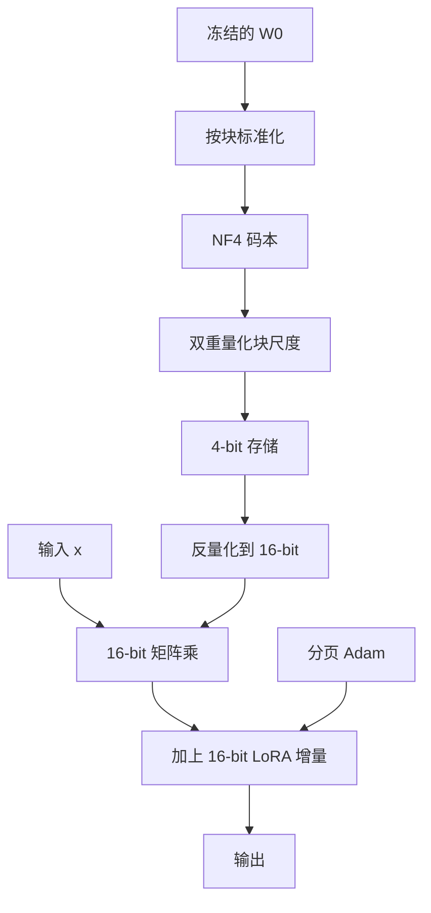

# QLoRA

把冻结的基座压到 4-bit，并不妨碍在 16-bit 里对低秩增量求梯度；省下的显存来自存储与优化器，而不是来自改写 LoRA 的数学。

<footer>—— Dettmers 等，QLoRA: Efficient Finetuning of Quantized LLMs，NeurIPS 2023</footer>

LoRA 已经把可训练参数砍到基座的一个零头，但训练时仍要把冻结的 $W_0$ 以 16-bit 放进显存，再为适配器准备激活与 Adam 状态。65B 级模型在这一约束下仍然进不了单张 48GB 卡。Dettmers 等人 2023 年的 QLoRA 不改 $h=W_0x+\frac{\alpha}{r}BAx$ 这条前向，而是把冻结的 $W_0$ 存成 4-bit，计算时再反量化；并补上两种专门对付量化常数与优化器尖峰的工程：对量化常数再做一次量化，以及用统一内存把 Adam 状态页出 GPU。Guanaco 一类结果说明：在合适的数据上，这样训出的适配器可以贴近 16-bit LoRA，而不是「4-bit 只能做玩具实验」。

## 问题

训练显存通常拆成四块：权重、激活、梯度、优化器状态。LoRA 把后两项的主体从 $W_0$ 挪到 $A$、$B$ 上，权重本身却仍按半精度常驻。对 LLaMA-65B，仅 16-bit 权重就超过 120GB 量级，单卡装不下。把基座量化到 4-bit，权重大约降到四分之一，65B 才进入 48GB 的讨论范围。

朴素 4-bit 整数量化对预训练权重并不公平。大模型权重近似零均值正态，均匀格子会在分布中心浪费码字、在尾部又过粗。量化常数（每个块一个尺度）若仍用 32-bit，块一细，常数本身又吃回可观的每参数比特。反向过程中，梯度检查点会制造短暂的激活尖峰，Adam 状态与权重挤在同一块显存里时，尖峰直接 OOM——不是平均用量不够，是峰值不够。QLoRA 要同时回答这三个问题：码字怎么切才匹配正态权重；量化元数据如何不再反过来撑爆每参数比特；优化器在尖峰到来时能否把状态临时挪走。

### 存储精度与计算精度必须分开

若前向、反向都在 4-bit 里做乘加，低秩增量的梯度会被量化噪声淹没，LoRA 的小更新与量化误差同量级。QLoRA 的选择是：存储用 4-bit，矩阵乘在反量化后的 16-bit 里做。冻结权重没有优化器状态，因此「存得省」不影响「算得准」。适配器与其梯度仍用 16-bit。这不是二重标准，而是承认：量化的对象是不更新的 $W_0$，不是正在学习的 $\Delta W$。

QLoRA 不是一种新的低秩公式，也不是 GPTQ 那种「量化完就部署」的压缩。它是训练期的权重量化：基座只读、适配器可写。把 QLoRA 训出的适配器接到未量化的 16-bit 基座上，通常仍然可用，因为学习发生在反量化后的空间里。

## 方法

方法由三块组成，缺一块都会把「单卡 65B」打回原形。

第一块是 NF4（4-bit NormalFloat）。对标准正态，按分位数切开 16 个量化水平，使每个箱子的概率质量接近相等。权重先按块标准化，再映到这张固定码本。相对逐块均匀 INT4，NF4 在「权重真是近似正态」时信息论上更省码字浪费；它不是学习出来的码本，推理时也不需要额外的聚类表。

第二块是双重量化（double quantization）。块尺度本身是一组 FP32 常数，块长 64 时每参数大约要摊 0.5 bit 的元数据。把这些尺度再按更大的块量化成 8-bit（再附一个更粗的尺度），元数据降到大约每参数 0.127 bit。基座仍是 NF4，只是「谁来存尺度」被压缩了一次。省下的是常数，不是权重网格。

第三块是分页优化器（paged optimizer）。利用 NVIDIA 统一内存，把 Adam 的一阶、二阶动量放在可被 CUDA 自动换入换出的页上。梯度检查点回放、长序列造成的激活尖峰到来时，优化器状态被换到主机内存，尖峰过去再换回。平均训练速度会掉一点，但避免了为峰值去买一张更大的卡。

前向仍是 LoRA：反量化后的 $W_0$ 与 $BA$ 在同一 16-bit 空间相加。反向对 $W_0$ 不累积梯度，只对 $A$、$B$ 以及层归一化等仍解冻的少量参数求梯度。

## 机制

### NF4 为何对正态权重要好于均匀格子

均匀 4-bit 把 $[-m,m]$ 切成等宽 16 段。正态密度在零点最高，等宽格子在中心过稀、在尾部过密，量化误差的平方期望被中心附近的大量质量抬高。按分位数切，等于让每个码字服务相近的概率质量，均方误差对近似高斯的权重更友好。QLoRA 把这一码本写成常数表，反量化就是查表乘回块尺度，不引入额外的可学习量化器，也就不会在训练中途改变 $W_0$ 的离散网格。

双重量化能成立，是因为尺度随块变化缓慢、动态范围远小于权重本身。对已经很小的一组正数再做 8-bit，误差相对 NF4 网格是高阶小量。它不试图「再压一次权重」，只压元数据。若把双重量化误接到适配器上，正在更新的 $B$、$A$ 会被二次离散化，低秩学习会先于基座误差坏掉。

分页优化器解决的是峰值，不是均值。若平均激活已经把显存顶满，换页只会变成持续的 PCIe 抖动，吞吐崩掉。它是给「大部分时间装得下、偶尔检查点回放装不下」用的安全阀。

### 量化噪声如何进入 LoRA 梯度

反量化后的 $\tilde W_0 = W_0 + E$，其中 $E$ 是块内量化误差。前向多出 $Ex$ 一项，反向里适配器看到的残差也含这部分。因为 $E$ 对冻结权重固定，它更像一种静态的、按块的扰动，而不是每步都在跳的随机噪声。LoRA 的低秩增量可以部分补偿 $E$ 在任务方向上的投影，这也是「4-bit 基座 + 16-bit 适配器」往往好于「全程 4-bit 训练」的原因：补偿发生在高精度的 $\Delta W$ 里。补偿不了的是 $E$ 里与任务正交、又被低秩装不下的分量；那部分表现为不可消除的拟合上限，而不是学习率没调好。

## 边界与工程取舍

QLoRA 的显存红利绑定在「基座冻结」上。若解冻层归一化、嵌入或最后一层，对应的 16-bit 优化器状态会回来；解冻过多就把方法退回普通量化感知训练。推理部署可以继续 4-bit 基座加适配器，也可以把适配器合并进反量化后的权重再重新量化；两条路的数值都不等于训练时每步看到的 $\tilde W_0+\Delta W$，需要用验证集确认，而不是假定无损。

NF4 假设权重近似正态。对已经不规则量化过、或稀疏到接近脉冲的张量，分位数码本可能还不如逐块 INT4。双重量化在块很小、尺度噪声相对大时，误差不再是高阶小量。分页优化器依赖统一内存实现，换运行时或换厂商后端时这一条可能根本不存在，不能写进「算法必有」的清单。

数据与超参仍按 LoRA 的逻辑选：适配器学习率、秩、目标模块。QLoRA 不提供新的容量，只提供把同一容量装进更小显存的手段。单卡能训 65B，不等于 65B 的 4-bit 适配器在所有任务上等于 16-bit 全参；它等于「在 LoRA 已经够用的任务上，把硬件门槛降一档」。

把 QLoRA 与推理端的 GPTQ、AWQ 混为一谈，会导出错误的操作：那些方法优化的是给定校准集下的推理误差，训练期并不回传适配器梯度。QLoRA 的 4-bit 是为了让反向传得动；部署期可以换成另一种 4-bit，但那是另一次校准，不是同一张码本自动生效。

### 实现上必须对齐的三件事

反量化要发生在矩阵乘之前，且与保存的 NF4 表一致；训练与评估不能一个走 NF4、一个走 INT4。双重量化的块大小要与检查点一起存，否则尺度对不上，基座等于随机。分页只包优化器状态，不要把激活也寄希望于同一套换页——激活该用检查点与微批次来管。这三件事任一错位，表现都是「能跑但损失不降」或「一长序列就 OOM」，看起来像超参问题，其实是存储格式问题。

## 小结

- QLoRA 冻结 4-bit 基座，在 16-bit 里训练 LoRA 增量；公式仍是 LoRA，改的是 $W_0$ 的存储。
- NF4 按正态分位数切 4-bit 码本，匹配预训练权重的近似高斯形状。
- 双重量化压缩的是块尺度等元数据，把每参数额外比特压回去。
- 分页优化器利用统一内存消化梯度检查点造成的显存尖峰。
- 量化误差对适配器是固定扰动，低秩增量可以补偿其任务方向上的投影。
- 方法不增加 LoRA 容量，也不替代推理侧专用量化；解冻过多参数会吃掉显存红利。
- 出处：Dettmers 等，*QLoRA: Efficient Finetuning of Quantized LLMs*，NeurIPS 2023。
