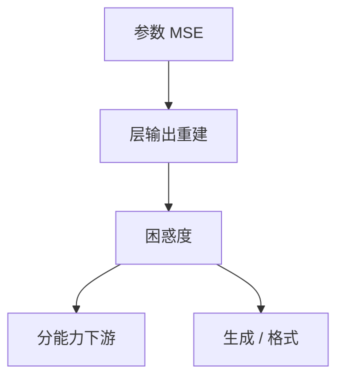

# 量化误差度量

权重 MSE 好看，不等于层输出好看，更不等于聊天还在、算术还在。度量要声明张量对象与任务对象，禁止用一个数结束讨论。

<footer>—— 对照 SQNR / 层重建误差与困惑度；GPTQ 用 PPL 当苛刻指标</footer>

[上一课](/llm/fp8-formats)把 E4M3 / E5M2 写成 8-bit 浮点核格式：偏精度对偏范围，必须配缩放，离群照样溢出；它是计算维，不是存储码本维。格子与格式有了。缺口是怎么知道坏了多少：参数域、层输出域、语言模型域、下游任务域，只优化上一层的代理会在下一层翻车。[GPTQ](/llm/gptq) 优化 $\|WX-\hat WX\|$ 却用 PPL 签字，已经是跨层。本课把尺子摆齐，不重讲 E4M3 的指数位。后课退化模式默认用这组指标说话。

## 问题

$\|W-\hat W\|$ 对 RTN 友好，对任务不友好（AdaRound 的出发点）。$\|WX-\hat WX\|$ 对齐一层线性，不对齐 softmax 与采样。困惑度对齐下一个 token 的对数损失，对量化敏感，但仍可能掩盖「选择题还对、生成格式已崩」。下游准确率方差大，小掉点看不清。问题是 **同时报一组数，并写明校准域是否等于评测域**。

SQNR / SNR：信号功率比量化噪声，便于层间比较，单位 dB，不代替任务。饱和率：多少值打在格子端点，诊断 $s$ 是否过小。离群通道占用的码字比例：诊断粒度。

评测污染与种子方差是别的课。这里假定评测集干净。量化前后必须同一解码配置，否则温度差会被当成量化差。

## 方法

推荐最小集：

1. 逐层重建 MSE / SQNR（校准 $X$ 与一块保留 $X$）。
2. 校准域与保留域的 PPL。
3. 短生成与指令遵循抽样（肉眼或自动格式检查）。
4. 分能力：算术、代码、长上下文各一。

若 1 好 2 差：误差在层间累积或校准过拟合。若 2 好 4 差：PPL 不反映该能力，见下一课退化模式。

比较两种量化器必须锁：校准集、group size、对称性、是否量化头、核路径（真低比特还是解包）。换一项就不是同一工作负载契约——对比方法课的纪律借到这里。

## 机制

误差沿残差流相干累积时，逐层 MSE 都「不大」，末端 PPL 已炸。所以只看平均层 MSE 会漏。看末端隐藏态或 logits 的漂移更接近任务。argmax 任务比生成更耐漂移：这是选择题虚稳的机制。

FP8 与 INT 的误差分布形状不同（相对 vs 绝对台阶），同一 MSE 不意味同一 PPL。跨格式比较必须走任务域。

## 边界与工程取舍

不要只报 C4 PPL。不要用训练 CE 当量化验收（那是另一精度路径）。不要把压缩比写进质量表。下一课专门写退化 **模式**：哪些能力先死，以便决定回退 bit 还是改校准。

## 小结

- 度量分参数、层输出、PPL、生成、分能力；禁止单点。
- 层 MSE 好仍可能末端炸，要看累积与 logits。
- 选择题虚稳；生成与长尾先暴露。
- 比较量化器必须锁校准与核路径。
- 出处：GPTQ 对 PPL 的使用；SQNR / 重建误差工程实践。
