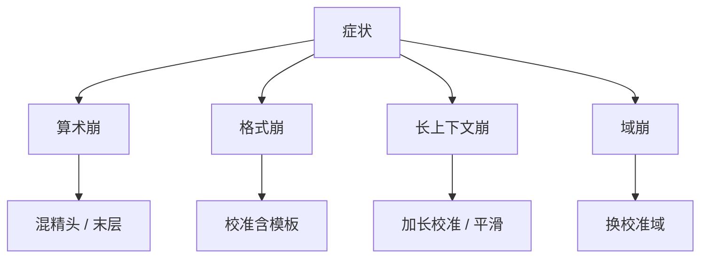

# 量化后退化模式

平均分还在，算术先乱、格式先崩、长上下文先饱和。退化是有结构的，不是「整体糊了一层」。下一刀该加 bit 还是该换校准，取决于哪一种模式。

<footer>—— 对照离群通道、lm_head 精度与长序列激活；指标见上一课</footer>

[误差度量](/llm/quant-error-metrics) 要求分能力报数。本课写 **常见死法**，把数映射到处方。缺口是诊断，不是又一个量化器。[离群](/llm/why-activation-outliers) 与 [GPTQ](/llm/gptq) 的校准过拟合在此会合。量化基础课序到此结束；下一单元稀疏会引入另一种退化（支撑被删）。

## 问题

模式 A：短 PPL 几乎不动，多位数加法、单位换算失败——精细幅度被粗格子吃掉，lm_head 或末层该留精度。模式 B：拒绝指令格式、乱说话、重复——可能是特殊 token 通道被量化，或校准没有 chat template。模式 C：短上下文正常，长请求爆或变傻——RoPE / 激活离群在长度上才出现，校准太短。模式 D：某一语种或代码崩——校准域偏。模式 E：NaN / inf——FP8 溢出或尺度为零。

把这些都叫「量化掉点」会开错药：A 要混精，C 要加长校准，E 要缩放，而不是一律回到 FP16。

与剪枝退化不同：剪层伤深度依赖与长链推理；量化伤幅度与离群维。联合压缩时先分清是哪一刀切的，见量化与剪枝分工课。

## 方法

诊断顺序：饱和率与 inf 计数 → 分能力表 → 出问题样本的层激活直方图 → 对照校准是否覆盖该模式。处方表：溢出降 $s$ 或改 FP8 缩放；离群绑架加通道平滑或该维留高精；头层差保护 embed/lm_head；域差换校准；核解包则性能问题不是质量问题。

回归集应永久包含：短 PPL、一个算术包、一个格式包、一条长上下文、一个域外包。量化发布跟模型发布一样走这套，而不是只看平均。

## 机制

argmax 对 logits 的小扰动不敏感，所以选择题虚稳（度量课）。算术需要的 logit 间隔更细，同一扰动先死。格式依赖少数特殊维，离群课说过它们可能是功能钉，量化或剪都伤。长度把激活动态范围拉开，格子在短校准上估的 $s$ 不够。机制不同，所以不能用一个全局 $\Delta$PPL 当充分统计量。

## 边界与工程取舍

不要用「再训一下 QAT」掩盖未诊断的模式——QAT 贵，且可能修 A 不修 C。不要把投机解码的拒绝率上升全算在量化上（草稿模型也可能被量化）。稀疏单元从 SparseGPT 开始，误差来自硬零，退化模式会换一套，但验收纪律相同：分能力、禁连乘加速比。

## 小结

- 退化有结构：算术、格式、长度、域、溢出，处方不同。
- 选择题虚稳；用分能力回归集发布。
- 先诊断饱和 / 离群 / 校准覆盖，再决定混精还是换数据。
- 与剪枝伤深度依赖区分，联合时对症状归因。
- 出处：离群与 GPTQ/AWQ 校准实践；度量课的指标层级。
