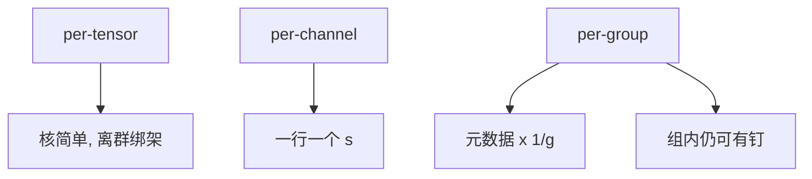

# per-tensor / channel / group

尺度共享的范围越大，元数据越少、核越简单、离群越能绑架整张量。粒度是在「一个 $s$ 管多少个数」上买精度。

<footer>—— 对照 per-tensor INT8 与 GPTQ / AWQ 的分组尺度</footer>

[上一课](/llm/symmetric-asymmetric-quant) 决定格子滑不滑动。本课决定 **同一套 $(s,z)$ 覆盖多大一块**。缺口是粒度：per-tensor、per-channel（通常沿输出通道）、per-group（沿输入通道每 $g$ 个）。[GPTQ](/llm/gptq) 常用 $g=128$ 一类分组；AWQ 保护通道也是通道维上的尺度。不要重讲 Hessian，只补共享范围如何与[离群](/llm/why-activation-outliers) 相互作用。

## 问题

Per-tensor：一层一个 $s$。核最简单，离群一个数就拉开整层格子，其余权重挤在零附近。Per-channel：每个输出通道一个 $s$，匹配「某行权重很大」的结构，INT8 通道尺度是成熟路径。Per-group：把一行再切成组，组内共享 $s$，逼近逐元素尺度，元数据按 $1/g$ 增长，核要按组反量化。

$g$ 太小：每参数比特被 scale 吃掉，带宽红利消失。$g$ 太大：组内仍可能有离群。问题是 **误差与元数据与核实现三方同时可行的 $g$**，不是越小越先进。

「逐 token」激活量化是另一维粒度，服务上 KV 与激活常 per-token 尺度。本课主线先盯权重；激活粒度在校准课会碰头。

## 方法

权重 PTQ：从 per-channel 起，4-bit 不够再降到 group。GPTQ / AWQ 的公开实现把 group size 当检查点字段，换 $g$ 必须重跑量化，不能只改推理配置。lm_head、embed 常留更高精度或更细粒度，因为误差直接进 logits。

激活：per-tensor 几乎只在无离群时能 W8A8；SmoothQuant 把难度推到权重通道尺度上，使激活能 per-tensor 或粗粒度。否则 per-channel / per-token。

存储布局必须与核一致：group 沿哪一维切、是否 packed INT4，是契约。错维等于错尺度，质量崩了还以为是校准问题。

## 机制

离群若沿通道对齐，per-channel 几乎消灭绑架；若离群在通道内部稀疏几个元素，只有细 group 或非均匀/混精能救。激活离群沿 hidden 维对齐时，权重侧 group 帮不上激活格子，要平滑或混精。粒度选择其实是在猜离群的轴——先测直方图的轴，再选 $g$。

GEMM 核按 tile 吃数据。group 边界与 tile 不对齐会强制边界处理，吞吐掉档。所以 $g$ 常取 64/128，不只是精度美学。

双重量化（QLoRA）是把 per-group 的 $s$ 再量化，专治「$g$ 小导致 scale 比特反弹」。它不改变 $W$ 的网格几何。

## 边界与工程取舍

不要把论文的 $g=128$ 当物理常数。不要在没有对应核时用 $g=4$ 宣传每参数 4 bit——实际带宽按解包后算。不要对不同层用不同 $g$ 却共用一个加载器。下一课校准集：这些 $s,z$ 从哪些样本估出来。

## 小结

- 共享尺度的范围：张量 $\lt$ 通道 $\lt$ 组 $\lt$ 元素，精度升、元数据与核复杂度升。
- 离群轴决定哪一档粒度够用；先测再选 $g$。
- GPTQ/AWQ 的 group size 是检查点契约。
- $g$ 还要对齐 GEMM tile，不只对齐误差。
- 出处：INT8 通道量化实践；GPTQ/AWQ 分组尺度。
