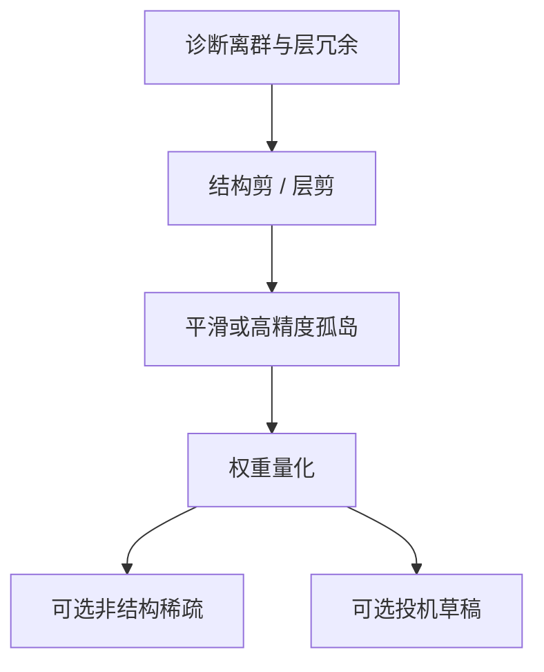

# 量化误差与剪枝的分工

量化管的是每个还在的数用几 bit 表示；剪枝管的是哪些数根本不必存在。两者都降流量，但破坏的几何不同，不能把压缩比加起来当独立因子。

<footer>—— 对照权重量化（GPTQ 等）与结构化 / 非结构化剪枝；投机草稿是第三条轴，上一压缩课已写</footer>

[激活离群值](/llm/why-activation-outliers) 解释了量化为何在少数通道上失败。[结构化剪枝](/llm/structured-prune)、[非结构化稀疏](/llm/unstructured-sparsity)、[层剪](/llm/layer-prune) 已经分别讲过删什么。本课写 **分工**：同一预算下先剪还是先量化、误差如何叠加、以及离群维应该被剪掉还是被更高比特保护。不要重讲 INT4 网格或 N:M 稀疏核，只补「两条误差不是正交的」。

## 问题

量化误差来自离散格子：$\tilde W=q^{-1}(q(W))$，函数连续但有台阶，离群决定格子尺度。剪枝误差来自硬零：把坐标或通道或层置零，函数的支撑变小。先量化再按量化后的幅度剪，剪的是格子上的幻影；先剪再量化，幸存权重的动态范围会变，离群集合会变。顺序改变最终网络，不是实现细节。

压缩比宣传常把「4bit × 50% 稀疏」写成 8×。核与加速器上，非结构稀疏很少吃满理论值，量化也有 scale 开销；更严重的是质量：两次有损靠近同一功能维时，误差相关，总损失大于分开评估之和。分工问题是： **哪一种误差更适合哪一种冗余**。

### 两种冗余

幅度连续、方向重要的参数：适合量化（保留方向、粗化幅度）。接近恒等、通道可删、层可跳的结构：适合剪枝（支撑变小、剩下的仍用较高精度）。离群功能维属于前者里的麻烦子类——幅度既重要又极端，量化伤它，剪枝更伤它，只能留高精度孤岛。[投机草稿](/llm/draft-as-compression) 属于第三条：不改 $p$ 的权重，压缩串行步。三轴可以叠，但验收必须在**最终联合图**上做，不能把三篇论文的加速比相乘。QAT 把量化台阶引进训练，剪枝的 mask 若同时学，优化器会把质量塞进幸存且对台阶鲁棒的方向。这比「训完再剪再量化」更一致，也更贵。事后压缩则必须选一个主刀：通常先结构剪（改形状、让核变简单），再量化（改 bit），最后才考虑非结构稀疏吃带宽。

## 方法

### 事后压缩的推荐顺序

推荐顺序（事后压缩）：

1. 层剪 / 结构化通道剪：改计算图与 KV 层数，收益直接落在 decode 延迟。
2. 再测离群；对功能维做逐通道平滑或混合精度。
3. 权重量化（GPTQ / AWQ 一类）+ 激活量化若需要。
4. 非结构稀疏只在有稀疏核且前三步之后仍欠带宽时加。
5. 投机草稿独立叠加，目标模型用上面的压缩图。

联合搜索（每个块选「剪这一层 vs 把这一层 4bit」）更优但组合爆炸。启发式：串行瓶颈（深度）优先剪；并行瓶颈（宽、权重流量）优先量化。Decode 延迟几乎线性于层数，所以服务场景层剪往往先于把所有层打到 3bit。

## 机制

量化保持支撑，近似是局部的：小权重扰动。剪枝是非局部的：整通道消失，下游层看见的表示缺了一块，可能逼出新的离群（补偿）。所以剪完必须重新校准量化统计，不能复用剪前的 SmoothQuant $\sigma$。这是误差非正交的具体机制。

激活量化对离群敏感，权重量化对列 / 通道离群敏感。剪掉「几乎恒等」的层，激活幅度沿深度的分布会变，W8A8 的标定作废。任何改图操作之后，量化校准集要重跑。把校准当一次性手续，是联合压缩最常见的事故。

蒸馏小模型与剪枝竞争同一预算：与其把 70B 剪到质量不可用，不如蒸馏到 8B 再量化。草稿压缩课写过质量由目标 $p$ 兜底的情况；这里没有兜底——剪和量化都改 $p$ 本身。不要用投机的无损承诺来安慰权重量化。

### 何时量化优于剪

需要保持架构接口（张量并行切分、现成核、LoRA 形状）时，量化不改形状，部署更便宜。当加速器没有低比特核、却有结构化稀疏或更少层的收益时，剪更值。边缘设备内存硬顶，两者都要，仍应按上面顺序，并用一套下游集看联合误差，包括长上下文——离群与 KV 量化在长序列上才充分暴露。

## 边界与工程取舍

MoE 上剪路由专家等于改配比 $\rho$；量化共享专家伤全局。分工还带架构语义，不是通用套件。视觉前缀、音频码的量化网格应与文本分开，早融合序列里一块 INT4 会让 OCR 先死、聊天还在。

评测不要只用短 CE。剪层伤深度依赖，量化伤精细幅度（算术、格式）。分开看两项指标，才能知道下一步该剪还是该回退 bit。联合压缩的论文数字若只报平均值，会隐藏「数学崩了、聊天还行」。

金融里的「量化」在本站是微观结构课，与权重量化无关。本课只在 LLM 压缩单元里使用该词。

## 小结

- 量化粗化还在的数；剪枝删除支撑；投机压缩目标模型的步数。三轴误差相关。
- 事后压缩宜先改图（结构剪），再处理离群，再量化，稀疏与草稿最后叠加。
- 剪完必须重校准量化统计；新离群会补偿出现。
- 功能离群维留精度，不要剪也不要挤进 3bit。
- 验收用联合图与分能力指标，禁止加速比连乘。
- 出处：GPTQ / AWQ / SmoothQuant 与结构化剪枝、层剪的工程顺序。
