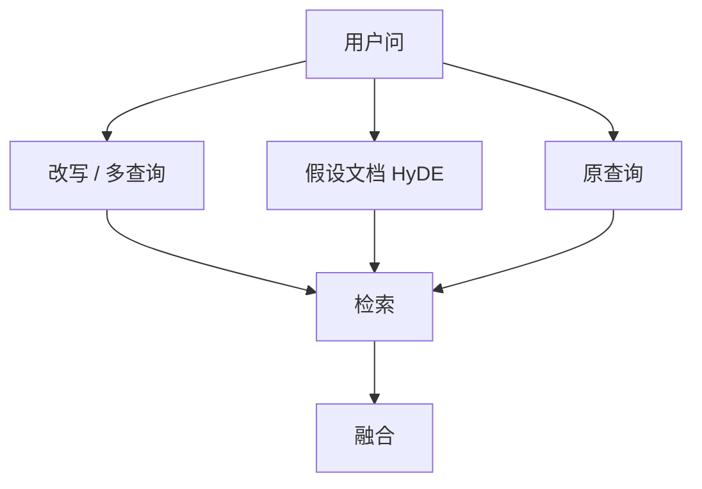

# 查询改写与 HyDE

用户问的是口语短句，索引里是陈述性段落。先把查询写成「像文档的文本」，再嵌入，往往比调切分更有效。

<footer>—— Gao 等 HyDE；查询扩展与多查询改写的工程传统</footer>

[上一课](/llm/multimodal-embeddings)把跨模态检索写成可缓存的双塔余弦空间，与 VLM 早融合分工。嵌入单元把向量训好了；RAG 进阶从查询侧开始。缺口是查询–文档不对称：口语提问不含手册里的小节标题与术语。本课写改写与 HyDE，不重讲图文召回。后课多跳默认：单跳改写仍不够时，才拆子问题。

## 问题

口语「那个超时怎么调」不含手册里的小节标题与术语。BM25 与稠密都会弱。改写：用生成器把问题变成关键词、同义问法或多查询，分别检索再融合（RRF）。风险是改写错误被放大：生成器编造的术语会把检索带跑。

Gao 等人的 HyDE 走更远：让模型先写一份**假设答案文档**，再对这篇假文档嵌入去检索真文档。思路是：假文档在语言上更靠近语料中的陈述段，几何上更近。假文档事实可以错，只要风格与主题对；错得太具体会检索到错误实体。

改写是额外模型调用，延迟与费用要进 SLO。能用规则（拼标题路径、拆引号内短语）解决的，不要上生成。

## 方法

阶梯：规则规范化 → 多查询改写 → HyDE。每步保留原查询一路，与改写路融合，避免单点失败。HyDE 应对假设文档做长度限制，并禁止它直接当读者上下文——读者只读检索到的真块。评测看端到端 QA，也看检索召回；只看生成流畅会掩盖带偏。

## 机制

稠密检索要求查询向量落在文档流形上。短问句与长陈述的边缘分布不同，即使对比训过非对称双塔，口语仍常偏出。改写与 HyDE 是在测试时把查询推回文档流形。生成器的幻觉在此表现为**检索偏置**而不是最终答幻觉；最终幻觉由阅读器课处理。若生成器与语料域差得远，假文档会落在错误流形，HyDE 有害。

## 边界

法律与医疗上，错误实体的假设文档风险高，应降级为多查询而不是假答案。下一课多跳：一跳改写找不到需要组合的证据链。

## 小结

- 改写把口语推回文档流形；原查询必须保留一路。
- HyDE 用假文档嵌入，假文档不当读者输入。
- 改写错误会放大检索偏置，域差大时关掉 HyDE。
- 出处：Gao 等 HyDE；多查询融合实践。
