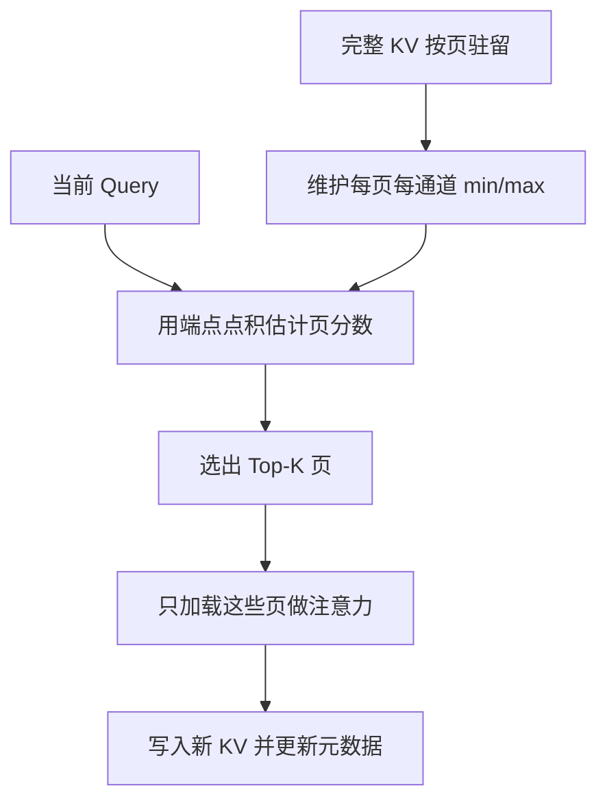

# QUEST KV

哪些键真正重要，强烈依赖于当前这条查询；与其按历史分数永久扔掉 KV，不如保留全部缓存，每步只把估计最关键的页加载进注意力。

<footer>—— Tang, Zhao, Zhu, Xiao, Kasikci, Han，QUEST，ICML 2024</footer>

[H2O](/llm/h2o-kv) 与 [Scissorhands](/llm/scissorhands) 用历史注意力做**永久驱逐**。Tang、Zhao、Song Han 等人指出：同一位置对查询 A 无用，对查询 B 可能极关键——论文里用「A is B. C is D. A is」一类例子说明，「is」会回头打到「B」，而中间的「D」不会。QUEST（Query-Aware Sparsity）因此不删 KV，而是**按当前 $q$ 挑选要读的页**。长上下文 decode 的瓶颈是从 HBM 搬完整缓存；只搬 Top-$K$ 页就能降延迟。本篇写页级 min/max 估计与和驱逐算法的分界。

## 问题

长窗口（32K、128K）下，decode 每步都要把全部 $K,V$ 读进核。Llama 7B、32K、FP16 的 KV 约 16GB 量级，论文测过读缓存可占单步一半以上时间。已知注意力稀疏——少数 token 主导输出——但「哪少数」随 $q$ 变。历史分数驱逐一旦把将来要用的证据丢掉，针检索、多跳、先叙事后提问都会坏。TOVA 一类「只看当前 $q$ 就永久丢」同样不可逆。

保留全部 KV 则空间不降，只降逐步带宽。这与分页注意力的物理布局吻合：缓存本来就按页存。QUEST 的问题收成：如何用远小于一页 KV 的元数据，估计「这一页对当前 $q$ 有多可能含高分键」，使得 Top-$K$ 页的近似注意力在长依赖任务上仍可用。

### 查询无关稀疏的失败模式

H2O 留下的 H2 是对**过去查询**的充分统计。生成方向一转，H2 集合可能完全不对。图示任务里，关键证据在中间一句，要等很后面的查询才变得高分。驱逐系统在中间阶段就会把它当低分清掉。QUEST 把稀疏性写成 $q$ 的函数：每步的可见集 $S(q_t)$ 可以和 $S(q_{t-1})$ 不同，旧页随时可以再次被选中。

QUEST 省的是注意力的内存流量，不是显存占用。全部 KV 仍驻留（或仍占逻辑容量）。若显存才是瓶颈，仍要驱逐、量化或卸载；QUEST 解决的是「缓存已经在卡上，但读它太慢」。

## 方法

KV 按页管理，页大小与 [PagedAttention](/llm/paged-attention) 一类块可以同量级。对每一页、每一通道，维护该页内键的最小值与最大值：

$$
k_{p,d}^{\min}=\min_{j\in\mathrm{page}\ p}K_{j,d},\qquad k_{p,d}^{\max}=\max_{j\in\mathrm{page}\ p}K_{j,d}.
$$

当前查询 $q$ 对页 $p$ 的临界性上界取逐通道可能的最大点积再求和：

$$
\hat s_p=\sum_d \max\bigl(q_d k_{p,d}^{\min},\, q_d k_{p,d}^{\max}\bigr).
$$

因为 $k_d$ 落在 $[k^{\min}_d,k^{\max}_d]$ 时，$q_d k_d$ 的最大值必在端点。$\hat s_p$ 高表示这一页至少有一个键可能打出高分。选出 Top-$K$ 页（$K$ 如 128、256 页，或换算成 token 预算），只加载这些页的 $K,V$ 做近似 [SDPA](/llm/sdpa)。最近页通常强制包含，以免局部句法丢失。元数据是每页每通道两个标量，相对整页 KV 很小。

### 层间稀疏度不均

作者在 LongChat-7B 上测：在困惑度几乎不升的约束下，前两层可稀疏度很低（不到约 10%），其余层可超过约 90%。QUEST 的估计与 oracle（若已知该看哪些 token）接近。实现上应对浅层用更大的 $K$ 或关掉稀疏，避免在还没形成特征的层上砍上下文。这不是超参游戏，而是注意力在深度上的经验结构。

## 机制

机制是「用键的轴对齐包围盒，对当前 $q$ 做一次便宜的上界打分，再把带宽花在上界高的页上」。它不要求物化完整注意力矩阵，也不依赖历史 softmax——因此与 FlashAttention / FlashInfer 的「不输出权重」不冲突：历史分数路径需要的统计，QUEST 根本不需要。估计是页级的，假阳性（页里其实没有真高分 token）只会浪费一次加载；假阴性（真正的针所在页分数偏低）才会伤任务。min/max 在通道异常值上会撑开包围盒，使页分数偏高、Top-$K$ 变「什么都有点像」，稀疏收益下降。这是为了召回付出的精度。

相对通道剪枝的 SparQ 一类方法，QUEST 保持页内全通道，硬件上仍是规整的块读取。相对驱逐，正确性论证变成「每步近似，但信息仍在」：将来的 $q$ 仍能把漏掉的页再捞回来，只要这一步的 Top-$K$ 没漏掉当前真正需要的证据。

$\hat s_p$ 是上界启发式，不是该页最大 $q^\top k$ 的精确值——精确值要看完全页的键。通道求和还会把「许多中等通道」加出高分。$K$ 必须留余量，用针检索回归，而不是只看平均困惑度。

### 论文数字

32K 上下文上，相对 FlashInfer 的自注意力延迟最高约 7.03× 降低；端到端在 4-bit 权重量化设定下约 2.23×。LongBench、passkey、PG19 上，同等 token 预算比历史驱逐基线更稳。端到端加速小于注意力核加速，因为 FFN 与残差不稀疏。权重量化与 QUEST 正交：一个减权重流量，一个减 KV 流量。

## 边界与工程取舍

显存不够时 QUEST 不能单独救命，需要与量化、卸载或真正的驱逐合用；合用后「再捞回来」的能力取决于页是否还在。预填充阶段若也做页选择，会改变首 token 质量，原文主打 decode。页太大，min/max 过粗；页太小，元数据与 Top-$K$ 排序开销涨。排序本身是每步每层一次小操作，通常可忽略，但在极短上下文上 QUEST 可能负加速——没有足够「可跳过的页」。

不要把 QUEST 写成「稀疏注意力训练法」。模型仍按稠密注意力训练，推理才跳页，是近似。安全过滤、引用要求「必须看见某段原文」时，近似可见集不够格。多请求连续批处理里，每条请求的 $q$ 不同，页选择不能共享；共享的是物理 KV 池，不是 Top-$K$ 集合。

强制包含最近页、并对前几层禁用稀疏，几乎是落地必选项。关掉这两条，只看论文平均稀疏度，会在局部语法和底层表示上先坏掉。

## 小结

- QUEST 保留全部 KV，按当前查询用页内键的 min/max 估计临界性，只加载 Top-$K$ 页做注意力。
- 查询相关稀疏避免历史驱逐的不可逆误杀，适合长依赖与针检索。
- 它减的是 HBM 流量而非显存容量；浅层应更密。
- 论文：注意力最高约 7.03×，端到端约 2.23×（含权重量化设定）。
- 包围盒估计偏召回；页大小、强制最近页与层策略决定质量。
- 出处：Tang et al., *QUEST: Query-Aware Sparsity for Efficient Long-Context LLM Inference*，ICML 2024；arXiv:2406.10774。
