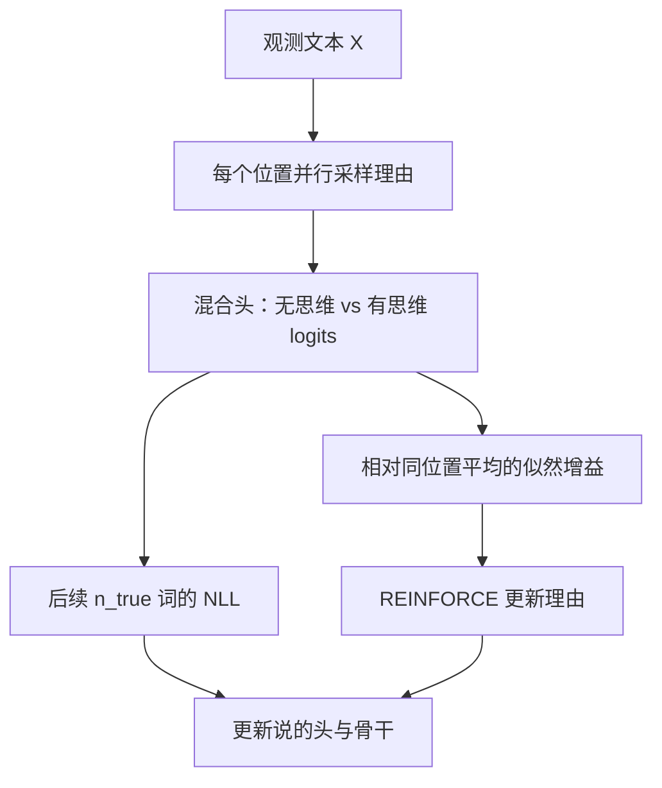

# Quiet-STaR

    
推理不该只发生在问答数据集的答案之前；任意文本的下一个词，都可以先在内部想一遍，再决定怎么说。

    <footer>—— Zelikman 等，Quiet-STaR: Language Models Can Teach Themselves to Think Before Speaking，2024</footer>

[STaR](/llm/star-reasoner) 让模型在有标准答案的题目上自举思维链：做对了就留下理由，做错了就看答案再合理化。Zelikman、Harik、Shao、Jayasuriya、Haber、Goodman 把同一精神扩到**没有题面的互联网文本**：每个 token 后面先生成一段不说出声的理由，若这段理由让后面的词更好预测，就用 REINFORCE 加强它。想是静的（quiet），说才写进序列。本篇按 arXiv:2403.09629 写 think / talk / learn 三步，以及它不是 o1 那种产品级长链。

## 问题

STaR 的监督来自「最终答案对不对」。高质量问答要人出题，覆盖永远是语言里推理现象的子集：对话里的心智理论、证明里没写出来的代数、新闻里省略的因果，都不会出现在 GSM8K 的标签里。若语言模型真是在「预测下一个 token 中学会世界」，内部推理应当能从任意语料里长出来——只要想对了能降低未来词的损失，想错了就升高。

三件工程上的硬事挡住这条路。第一，对序列每个位置都采样理由，朴素实现是长度乘思维长度的串行生成，贵。第二，预训练模型一开始不会「在特殊标记之间思考」，插入思维会把表示打出分布，语言建模立刻变差。第三，只预测下一个 token 太近视：一段有用的默想往往帮的是再后面几个词。需要并行采样、把「有思维 / 无思维」的预测混起来、以及非近视的回报。

### 从题目级 STaR 到 token 级自举

STaR 的外环是：采样理由 → 过滤正确答案 → 微调 → 重复。Quiet-STaR 没有正确答案，过滤标准改成「相对同位置其它理由，是否提高了对后续 $n_{\mathrm{true}}$ 个真词的似然」。仍是自举，监督从任务标签变成未来文本本身。这把推理训练嵌回继续预训练，而不是嵌进指令微调。

Quiet 指思维 token 不进入对外可见的「说」；训练时它们插在序列里，推理时实现必须掩掉思维起止符，否则模型会把标记漏到用户可见输出。仓库 README 把这一点写成已知陷阱。

## 方法

对观测序列 $X$，在每个位置 $j$ 并行采样 $r$ 条长度为 $t$ 的理由 $T_j$，用可学习的 `<|startofthought|>` / `<|endofthought|>` 包起来。起止符的嵌入初始化成破折号「—」（语料里常表示停顿），并给它们更大的梯度权重，以便更快进入「思考模式」。并行生成避免按位置串行等待。

**Talk。** 思维结束后的隐状态与原 token 隐状态送进一个浅层混合头，输出权重 $w$，在「无思维 logits」与「有思维 logits」之间插值。早期思维是噪声，混合让模型可以先几乎不用它，再逐渐加大。语言建模损失打在混合后的概率 $p^{\mathrm{talk}}$ 上。

**Learn。** 回报是该理由相对同位置平均理由的后续似然增益：

$$
r_j=\log p^{\mathrm{talk}}_{j:j+n_{\mathrm{true}}}(X_{j+1:j+n_{\mathrm{true}}+1})-\log \bar p^{\mathrm{talk}}_{j:j+n_{\mathrm{true}}}(\cdots).
$$

REINFORCE 加强高于平均的理由。作者发现丢掉负回报更稳，尽管引入偏差。非近视：$n_{\mathrm{true}}\gt 1$，让「为后面几步铺垫」的思维也能得分。主实验从 Mistral 7B 出发，语料以 OpenWebMath 为主（技术文本密度高），并在 C4 上验证仍有、但更小的收益。

评测故意**不做** GSM8K / CommonsenseQA 的任务微调：零样本直接答题。报告 CommonsenseQA $36.3\%\to 47.2\%$，GSM8K $5.9\%\to 10.9\%$，且随思维 token 数增加而更好。他们还观察到思维对「难预测 token」的帮助不成比例地大。

### 并行思维与教师强制

训练时未来词是已知的，可以从每个位置同时展开思维，再用真后续词算回报——这是扩展的教师强制，不是推理时的从左到右。推理时才变成：在当前位置生成思维，掩起止符，再预测下一个可见 token。训练与推理的这一裂缝，是所有「内部独白」方法的税；Quiet-STaR 用混合头缓冲训练端的分布偏移，并不消除推理端的额外延迟。

## 机制

### 为什么多数 token 不需要想

「the person is run-」后面几乎一定是 `ing`。作者猜想网上绝大多数块想了也没用，早期实验也看到收益集中在难 token。因此算法必须能学会**少想**：混合头可以把 $w$ 推近 0。评测若只看平均困惑度，会被大量无感位置稀释；他们才把 GSM8K / CQA 的零样本直接答当成「难 token 外推」的探针。OpenWebMath 比 C4 更有效，支持「语料里推理密度决定自举斜率」。

REINFORCE 只更新理由生成，NLL 还要更新混合头与基座语言建模头。两条损失缺一：只有 NLL 时模型可以学成「混合权重永远靠近无思维」；只有 REINFORCE 时「说」的校准会漂。

### 与说出声的思维链不同

产品级长链（o1、R1）把思维写成用户可折叠或可隐藏的文本，优化目标是题对不对。Quiet-STaR 的思维是为**语言模型损失**服务的隐变量，不保证可读，也不保证能当解题草稿。把 Quiet-STaR 写成「开源 o1」是类型错误。它更接近：在继续预训练里插入一段可学习的暂停。

## 边界与工程取舍

每个位置 $r$ 条、每条 $t$ 个思维 token，训练 FLOPs 按 $r\cdot t$ 涨，即使并行也吃带宽。Mistral 7B 上的零样本增益绝对值不大（GSM8K 仍约 11%），证明的是「无任务标注也能长出一点直接推理」，不是竞赛数学系统。负回报丢掉之后，有害思维的抑制变弱。起止符若在推理时不掩，会污染可见输出。

没有标准答案意味着无法过滤「想得头头是道、对未来词碰巧有用、对事实有害」的理由。安全与幻觉不在这篇的评测里。实现绑在当时 Hugging Face Mistral 的补丁上，版本一变就要重贴。

思维长度是超参，不是测试时预算强迫。拉长 $t$ 在原文曲线上有帮助，但与 [s1 的 Wait](/llm/s1-budget-forcing) 不是同一接口：后者干预已训好的思考–回答模板，前者在预训练目标里学「何时默想」。

### 何时不必上 Quiet-STaR

已有可验证奖励与长链 RL，直接走 R1 一类，不必在每个 token 上开静默思维。任务就是问答、标签充足，STaR 更简单。decode 延迟预算极紧、不能为每个可见 token 付一段隐思考，用普通语言模型。需要逐步可检查的解题痕迹，用说出声的 CoT 加 [PRM](/llm/lightman-prm)。

## 小结

- Quiet-STaR 把 STaR 从带答案的问答扩到任意文本：每个 token 后默想，用对未来词的似然当回报。
- 三步：并行采样理由（think）、混合有无思维的预测（talk）、REINFORCE 加强有用理由（learn）。
- Mistral 7B 在 OpenWebMath 上继续训之后，零样本 CQA / GSM8K 有报告中的提升，且随思维长度增加。
- 它优化的是语言建模，不是竞赛准确率；不是隐藏长链产品。
- 推理时必须处理起止符，否则静默思维会漏到可见输出。
- 出处：Zelikman, Harik, Shao, Jayasuriya, Haber, Goodman，*Quiet-STaR: Language Models Can Teach Themselves to Think Before Speaking*，arXiv:2403.09629，2024。
