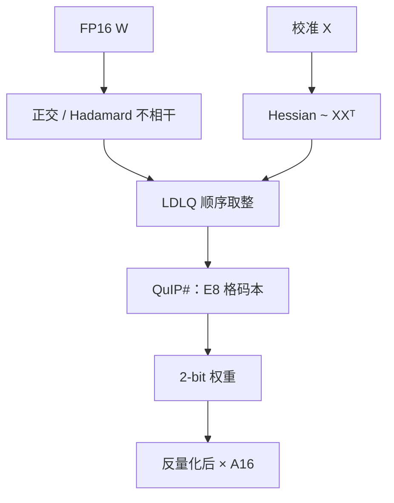

# QuIP / QuIP#

    
若权重在标准基下不够不相干，逐元素 2-bit 网格的最坏误差没有希望；先用正交变换把能量摊开，再用二阶自适应取整，理论保证与实测才能对上。

    <footer>—— Chee 等，QuIP，NeurIPS 2023；Tseng 等，QuIP#，ICML 2024</footer>

Jerry Chee、Yaohui Cai、Volodymyr Kuleshov 与 Christopher De Sa 的 NeurIPS 2023 论文 **QuIP**（arXiv:2307.13304）给 LLM 的 2-bit 权重量化补上一条可证明的缝：不相干处理（incoherence processing）加 LDL 自适应取整（LDLQ）。Albert Tseng、Jerry Chee、Qingyao Sun 与同一组作者的 ICML 2024 续作 **QuIP#**（arXiv:2402.04396）把随机正交换成快速 Hadamard，并把均匀网格换成 E8 格上的向量码本，使 2-bit LLaMA-2-70B 的困惑度落到可与较小 FP16 模型比较的区间。两篇都是 **权重量化**；激活默认较高精度。不要把 QuaRot 的 W4A4 写进 QuIP 的 2-bit 权重表。

## 问题

2-bit 均匀量化每元素只有四个代表值。若某列权重幅度极大，格子被该列绑架，其余元素等效 1-bit。GPTQ 的 Hessian 补偿能改邻居，但不能改变「标准基下权重不相干性不足」这一几何事实。QuIP 把不相干性写成可检验的量：大致要求 $\max |W_{ij}|$ 相对 Frobenius 范数足够小，使得逐元素误差的理论界不爆。随机正交共轭 $W' = UWV$ 在高维上以高概率改善该量。

自适应取整的另一半来自 OBQ / GPTQ 谱系：量化一个系数后，应用 Hessian 去改尚未量化的系数。QuIP 的 LDLQ 把 Hessian 的 LDL 分解变成顺序取整，使补偿是精确的一次回代，而不是反复显式求逆。问题是同时做到：几何上不相干、算法上能在 70B 级跑完、理论上 2-bit 有界。缺任何一块，都会变成「又一个很慢的 2-bit 启发式」。

### 不相干性让逐元素网格变得合法

不相干不是「权重看起来像白噪声」的审美，而是量化最坏误差与平均能量之间的比。卷积或嵌入里常见的相干结构——少数大权重、其余近零——对 2-bit 最致命。正交变换混合行与列，把大权重的能量摊到许多中等系数上。浮点函数通过把同一变换施加于激活来保持：推理时 $x$ 先乘 $V$，再与 $W'$ 乘，再乘 $U^\top$，或把 $U,V$ 融进相邻层。代价是部署要带旋转，或融完之后权重不再稀疏、不再可解释。

QuIP 的保证是权重量化误差界，不是生成质量定理。PPL 下降依赖校准激活与 Hessian 近似。把「with guarantees」写成「2-bit 一定对齐 FP16」，过读了。

## 方法

QuIP：对一层估计 Hessian $H\sim XX^\top$，做 LDL 分解；在不相干的坐标里按顺序对权重取整，并用下三角回代替换尚未量化的系数——LDLQ。前后乘随机正交（可用 Kronecker 结构化随机阵降低乘的成本）。位宽主线是 2-bit 与 3-bit 权重，OPT / LLaMA 家族。理论节给出不相干假设下的误差形式；实验节用 WikiText 困惑度对照 RTN、GPTQ。

QuIP#：两点替换。第一，Hadamard 代替通用随机正交，乘法 $O(d\log n)$ 且硬件友好，不相干性在实践中足够。第二，不再逐元素 4 个电平，而是把权重向量（常用 8 维一组）量化到 **E8 格**（Gosset 格）的码本上；格点比立方网格更密地填满空间，同样比特下球半径更小。码本还可以在校准上做块级微调，使代表点迁到该层权重的真实分布附近。2-bit LLaMA-2-70B 的 PPL 相对 FP16 的缺口明显收窄，成为当时开源 2-bit 权重量化的前沿之一。

### LDLQ 是自适应取整，不是另学一套码本

GPTQ 用近似 Hessian 逆做块内补偿；LDLQ 把补偿写成精确的三角回代，数值上更干净，实现上也更刚性——顺序与分解必须匹配。它仍是**标量（或按格点的向量）取整 + 线性补偿**，码字不是 AQLM 那种多本加法码。QuIP# 的 E8 是把「取整到哪个代表点」从立方格子换成格点；LDLQ 的顺序补偿仍然适用。把 QuIP# 写成「Cornell 版 AQLM」会混掉加性码本与格量化两条线。

## 机制

不相干处理之后，每个权重对输出的最坏贡献更接近平均贡献，均匀量化的信噪比才有意义。Hadamard 是一类确定性不相干变换，还与 QuaRot 后来在激活上用的工具同源，但 QuIP# 的旋转是为 **权重几何** 服务，激活往往仍 FP16。E8 格在 8 维单位体积里有高的装填密度：同样 16 个比特（2-bit × 8 维）能表达的最小欧氏误差，优于 8 个独立 2-bit 标量。微调码本让格点从「普遍最优」迁到「这一层权重最优」，接近向量量化的收益，却仍保持格的快速最近邻结构。

2-bit 的部署机制与 4-bit INT 核不同。均匀 INT4 可以走专用 GEMM；E8 查表或反量化后再乘，算术密度取决于核有没有为该码本写过。论文的质量表不等于服务墙钟。decode 仍是带宽墙：2-bit 权重少搬字节，即使反量化到 16-bit 再乘，加载仍可能赢——前提是反量化本身不是新的墙。

QuIP 与 QuIP# 必须分列引用。NeurIPS 2023 没有 E8，也没有声称 Hadamard 已是最终实现。ICML 2024 的 70B 数字不要写回 2023 的定理陈述。

### 2-bit 的核与 4-bit GEMM 不是同一条部署路

W4A16 的生态（AWQ、GPTQ、Marlin 一类核）成熟得多。QuIP# 的产品位置是：显存极紧、愿意为 2-bit 写查表核、接受校准与码本微调的成本。若硬件已有高质量 INT4 Tensor Core，先问 4-bit 是否已够，再问 2-bit 的边际。与 AQLM 的比较应画比特–困惑度帕累托，而不是单点「谁赢」；两者在 2-bit 附近多次易位，取决于是否允许微调码本、是否同一校准。

## 边界与工程取舍

### 保证不覆盖激活量化

把 QuIP# 的 2-bit 权重接到未经处理的 INT4 激活上，理论界立刻失效。W4A4 是 QuaRot / SpinQuant 的合同。`lm_head` 与嵌入常留更高比特，否则词表投影先坏；论文若已排除这些层，引用时应写「主体线性层 2-bit」。Kronecker / Hadamard 融合若与 RoPE、残差顺序冲突，会出现安静的函数错误。码本微调会过拟合校准句，指令模型要另测，纪律与 GPTQ 相同。

70B 的 2-bit 检查点体积诱人，但训练 QLoRA 一类适配器时，基座若是格量化，反量化核必须进入训练前向。不要假设 bitsandbytes 的 NF4 与 E8 可互换。QuIP 原文的随机正交在大 $d$ 上乘得起是因为实验层宽有限；生产实现几乎都应走 QuIP# 的 Hadamard 路径。

出处：Chee et al.，*QuIP: 2-Bit Quantization of Large Language Models With Guarantees*，NeurIPS 2023；Tseng et al.，*QuIP#: Even Better LLM Quantization with Hadamard Incoherence and Lattice Codebooks*，ICML 2024。

## 小结

- QuIP 用不相干正交变换加 LDLQ 自适应取整，给 2-bit 权重量化提供可检验的几何假设与算法。
- QuIP# 换成 Hadamard 与 E8 格码本，并把码本校准微调写成质量关键。
- 两篇都是 W2A16 主线，不是激活 4-bit。
- 部署墙钟取决于格 / 查表核，不能抄 INT4 GEMM 的加速。
- 出处：Chee et al.，NeurIPS 2023；Tseng et al.，ICML 2024。
