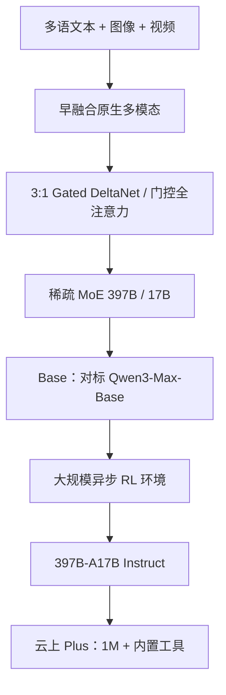

# Qwen3.5（397B-A17B）

    
3970 亿总参里每步只激活 170 亿；用门控 DeltaNet 线性注意力加稀疏 MoE，把旗舰能力接到可部署的推理账单上。

    <footer>—— 阿里云社区，Qwen3.5: Towards Native Multimodal Agents，2026-02-17；阿里集团开源说明</footer>

[Qwen3](/llm/qwen3) 的开源旗舰是 235B-A22B 的文本 MoE，思考 / 非思考做在同一套权上。[Qwen3-VL](/llm/qwen3-vl) 另开视觉线。2026 年 2 月 16 日前后放出的 **Qwen3.5-397B-A17B**（云上亦称 **Qwen3.5-Plus**）改成**原生视觉–语言基座**：文本、图像、视频进，文本出；语种从约 119 扩到 **201**；结构走 Qwen3-Next 系的 [Gated DeltaNet](/llm/gated-delta-net) 与门控全注意力混合，再叠稀疏 MoE。总量 **397B**、激活 **17B**。官方强调它在推理费用上对标远超 1T 的 Qwen3-Max，而不是再堆激活。本篇按集团新闻与阿里云社区发布博文写；完整技术报告若尚未作为本篇引用源出现，就不编 arXiv 号。

## 问题

3 的文本 MoE 与 3-VL 的视觉塔是两条训练图。智能体一旦要「看屏幕、看两个小时的录像、再写前端」，外挂投影会把对齐误差写进工具环。同时，Max 级稠密/宽 MoE 的解码吞吐撑不住百万上下文上的多步 agent。3.5 要同时做到：早融合的多模态、比 235B-A22B 更稀的激活、以及线性注意力把长序列从二次里解放出来。

第二个问题是后训练。官方写：相对 Qwen3，3.5 的增益主要来自**几乎所有想得到的 RL 任务与环境都做了规模化**，重点加难度与可泛化环境，而不是刷单一指标。没有环境多样性，混合注意力只会让模型更快地在错误 harness 上自信。

### 开源 397B-A17B ≠ 云上 Plus 的全部产品开关

开源检查点是 Qwen3.5-397B-A17B。Plus 是 Model Studio 托管档：发布文写默认 **1M** 上下文、官方内置工具与自适应工具使用。社区博文还写开源侧原生上下文 **256K**（262,144），再用 YaRN 一类方法扩到 1M——托管默认 1M 不等于预训练就是全程满注意力 1M。词表约 **25 万**（相对 3 的约 15 万），多数语言上编码长度降 10%–60%。不要把 OCR 专用档 [Qwen3.5-OCR](/llm/qwen35-ocr-model) 当成这颗通用基座的别名。

官方吞吐句：32k / 256k 上下文下，397B-A17B 解码吞吐约为 Qwen3-Max 的 8.6× / 19.0×，能力相当；相对 Qwen3-235B-A22B 约为 3.5× / 7.2×。这是发布博文的对照，不是第三方测速。

## 方法

混合注意力：官方写融合 **Gated Delta Networks** 线性注意力与稀疏 MoE。Transformers 文档将层类型写成约 **3:1**——三层线性注意力配一层门控全注意力——与 Qwen3-Next 一致。线性层用递推状态吸收长上下文与视觉 token，全注意力层周期性插入以保留精确匹配。MoE 更高稀疏：397B 总量、17B 激活。多 token 预测（MTP）用于推理加速。视觉走早融合，数据含大规模图文与 STEM / 视频；高分辨率与 GUI 截图是发布能力列表里的一等公民，而不是后加的 OCR 头。

预训练三条轴。强度：视觉–文本 token 相对 Qwen3 显著加量，中英、多语、STEM、推理过滤更严，使 397B-A17B 的 Base 可对标大于 1T 的 Qwen3-Max-Base。效率：Next 骨架 + 稳定性改动 + MTP。通用性：原生多模态，并在近似规模上超过 Qwen3-VL。基础设施把视觉与语言的并行策略解耦，稀疏激活用来重叠跨模块计算，宣称混合图文视频数据上相对纯文本基线吞吐近 100%；原生 FP8 管激活、路由与 GEMM，敏感层监测后可回 BF16，激活显存约减半、速度提升约 10% 以上。

后训练：异步 RL 框架做训练–推理分离、FP8 端到端、rollout 路由回放、投机解码与多轮锁定，宣称端到端 3×–5× 加速，并原生支持百万级 agent 脚手架。发布表示例（官方表，须连脚注）：MMLU-Pro 87.8，GPQA 88.4，AIME26 91.3，SWE-bench Verified 76.4，BrowseComp 在简单折叠下 69.0、采用与 V3.2/K2.5 相同丢弃策略时 78.6；视觉侧 MMMU 85.0、MMMU-Pro 79.0、MathVision 88.6。HLE 无工具 28.7，并不在所有行上压过 Gemini 3 Pro——官方表要整张读。

长视频理解写到约两小时；手绘 UI 转前端、手机/电脑视觉智能体、科学视觉推理，是集团新闻列出的产品能力。OSWorld-Verified 62.2 一类 GUI 分依赖环境版本，换脚手架不可比。

## 机制

Gated DeltaNet 把层内混合从 $O(n^2)$ 换成对状态矩阵的线性更新，KV 不再随长度线性堆在每一层；3:1 里那一层全注意力负责「必须精确对齐」的依赖，否则线性核会在针检索与随机访问上丢分。17B 激活决定 FLOPs，397B 决定专家容量——相对 235B-A22B，总量更大、激活更小，是有意把服务账单与 Max 级质量拆开。早融合让视觉 token 与文本进同一套混合层，而不是冻结 LLM 再训投影；代价是训练栈必须异构并行，官方用「近 100% 相对纯文本吞吐」证明这笔账划得来。

RL 环境规模化改变的是策略的 harness 鲁棒性：工具 schema、浏览器、IDE 各不相同，只在一种脚手架上 RL 会过拟合。词表加到 25 万是多语压缩，不是推理深度。YaRN 扩到 1M 是推理期外推，与「预训练就是 1M 满注意力」不是一事。

### 和 Qwen3、和 Max

3 的 235B-A22B 是文本 MoE、128 专家 top-8、无共享专家。3.5 换混合注意力与更稀激活，并原生视频。Qwen3-Max 是更大总参的云上旗舰；3.5 的卖点是**质量接近、解码便宜一个数量级**。不要用 3 的 36T 预训句未经核对地抄到 3.5——3.5 博文只说视觉–文本 token「显著更大规模」，未在该文给出与 36T 并列的整数。

### 异构并行与 FP8 是训练句，不是推理保证

发布文把视觉与语言并行策略解耦、用稀疏激活做跨模块重叠，用来解释「混合数据上相对纯文本近 100% 吞吐」。推理期仍取决于 DeltaNet 核是否可用、以及托管是否默认 1M。把训练吞吐句抄成「本地 19 倍于 Max」没有根据。

## 边界与工程取舍

Gated DeltaNet 需要专用核（`fla` / `causal_conv1d` 一类）；缺核会静默落到又慢又吃显存的 PyTorch 路径。开源 256K 与云上 1M 默认不要混用。Plus 的内置工具不是权重里的函数，自托管要自己接。技术报告「即将放出」在发布博文里出现过；在读者只握有博客与模型卡时，层类型 3:1 以官方实现文档为准，专家个数若未写进 3.5 发布文就标**公开信息有限**（不要用 3 的 128 专家填）。后续 Qwen3.6 / 3.8 是另一家族快照。

出处：阿里集团，*Alibaba Open-Sources Qwen3.5…*；阿里云社区 *Qwen3.5: Towards Native Multimodal Agents*（2026-02-17）。不编造未给出的 arXiv 号。

## 小结

- Qwen3.5-397B-A17B 是原生多模态 MoE：397B / 17B 激活，201 语种，约 25 万词表。
- 结构主轴是 Gated DeltaNet 与门控全注意力混合加稀疏 MoE；云上 Plus 默认 1M 与内置工具。
- 后训练靠大规模 RL 环境而非单点刷榜；吞吐相对 Max 有官方 8.6×–19× 句。
- 开源窗口、YaRN 外推与 OCR 专用档必须分开。
- 出处：上述官方新闻与社区发布博文。
