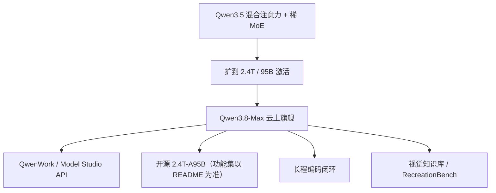

# Qwen3.8-Max

    
在 3.5 的骨架上把稀疏 MoE 拉到 2.4 万亿、每步激活 950 亿，用混合注意力在百万上下文上跑长程编码与视觉智能体，而不是再训一颗纯稠密巨兽。

    <footer>—— 阿里云新闻稿，Alibaba Unveils Qwen3.8-Max，2026-08-03</footer>

[Qwen3.5（397B-A17B）](/llm/qwen-3-5) 证明「线性注意力 + 稀 MoE」可以把旗舰质量接到可部署账单上。2026 年 8 月 3 日的 **Qwen3.8-Max** 把同一设计语言放大：总参 **2.4T**、激活 **95B**，上下文至 **1M**，新闻稿称为通义系列当时最强，并写 Text Arena 第五、Vision Arena 第二。云上经阿里云 Model Studio / QwenWork 提供，权重宣布「下周」在 Hugging Face / ModelScope 放出。本篇只引用 8 月 3 日新闻稿与随后权重页能核对的差分；未出现在这些文本里的专家个数、层数、预训 token **公开信息有限**。

## 问题

3.5 的 17B 激活够日常智能体，不够「十六天无人值守的自演化框架」这类长地平线。Max 产品线过去偏云上闭源；3.8 要把 **Max 级总参**第一次接到可下载路线图上，同时还要原生吃图和视频，而不是回到 Qwen3-Max 的纯文本。若只把 397B 的专家数乘常数、注意力仍全二次，1M 窗口加视觉 token 会先把预填充打爆。需要的是 3.5 已经验证的混合注意力，加上够装世界知识与长程记忆的专家容量。

第二条是产品形态。编码智能体、职场 Agent、黑盒复现应用（RecreationBench）共用同一底座；云上还要内置工具、非思考开关、默认 1M。开源权重若砍掉视觉或思考制度，评测必须写「测的是哪一份检查点」。

### 云上 Max 与开源 2.4T-A95B 可能不是同一功能集

新闻稿把 Qwen3.8-Max 写成多模态基础：视觉智能，可摄入百页文档、整季剧集或上百小时直播并做成可检索知识库。后续权重页出现过 `Qwen3.8-2.4T-A95B` 的名称，以及「官方云上版本在开源检查点之上增加视觉输入、非思考、默认 1M、内置工具」一类说明——若读者面对的仓库 README 如此写，则**自托管不等于复制 Model Studio**。许可上，27B 同胞检查点与 2.4T Max 可能分属 Apache 与定制 Max 协议，以当时 LICENSE 为准，不要默认全家 Apache 2.0。

新闻稿价格未写进那一页新闻正文；第三方与云文档常见口径是每百万输入 2 美元、输出 6 美元、缓存输入约 0.25 美元。集成以 Model Studio 当时价目为准，本篇不把未出现在新闻稿里的价当作规格。

## 方法

架构句来自新闻稿：建立在 Qwen 3.5 的底座上，**稀疏 MoE + 混合注意力**，2.4T 总量、**95B** 激活，以求在巨大容量与推理效率之间折中。这直接继承 3.5 的 Gated DeltaNet / 门控全注意力逻辑；3.8-Max 新闻没有重开 3:1 层表，正确写法是「同家族混合注意力」，不要把 3.5 的层类型整数未经核对地写成 3.8 的测量值。上下文 1M。多模态输入：新闻稿确认视觉；视频 / 长直播作为产品能力列出。输出以文本与可执行工件为主（代码、知识库、前端、三维可视化），不是把 Max 写成对扩散生图模型的替代。

### 长程闭环与 RecreationBench

内部案例：模型在约 **16 天**内自主完成真实软件工程，从零做自演化智能体框架，循环综合用户反馈、社区实践与自测数据，经生成—测试—预览—日志分析，产出开源的 `oh-my-cli`。另称能复现已发表实验并设计超过原论文的方法；在 WWW2025 多模态对话意图识别挑战上超过人类参赛者。这些是厂商案例，不是带 harness 脚注的 SWE 主表——新闻稿**没有**附上与 3.5 博文同规模的基准大表。

RecreationBench：在无互联网、不可见源码的黑盒环境里，只靠交互与视觉反馈复现应用。它测的是「看运行中的 UI、再写回功能」的混合智能体，而不是仓库补丁。新闻稿还把 RL 环境与算力的联合缩放写成通用操作能力的来源，并强调在主流 agent 框架里都能干活。

7 月 19 日 WAIC 上的 Max-Preview 被 8 月 3 日正式版取代。不要把预览演示数字写进 GA 规格。同胞 **Qwen3.8-27B** 是可落地的小检查点，新闻稿把它与 Max 权重一并预告；27B 解决的是单机部署，不是 95B 激活的替代评测。

Frontend Code Arena 新闻稿写第四。Text / Vision Arena 名次随投票窗口变，只能说明「那几天那份快照的偏好」，不能还原温度与是否联网。

## 机制

95B 激活把每 token 计算拉到接近稠密旗舰，2.4T 专家容量装长尾知识与多域工具策略。混合注意力继续让 1M 窗口在视觉 token 膨胀时仍可服务：线性层吃长度，全注意力层保精确检索。长程 16 天案例的机制是**环境环 + 自合成数据**，不是证明上下文真的跨了十六天的 KV——墙钟上的自主运行可以靠外部记忆、压缩与检查点，新闻稿没有把记忆架构写成规格。

云上「更多功能」若成立，机制就是产品层：工具、默认窗口、思考开关可以在推理网关打开，而权重里未必带同一聊天模板。评测 Max API 再搬家到自托管，中间会丢视觉或非思考，这是集成事故而不是「开源变弱」的神秘故事。

### 和 3.5、和 3.8-Flash

3.5-397B-A17B 是效率旗舰：17B 激活、开源当天给齐基准表。3.8-Max 是容量旗舰：95B 激活、新闻稿偏案例与 Arena。3.8-Flash 被写成 Qwen4 架构预览、更小 MoE，角色类似当年 Next 之于 3.5——本篇不把 Flash 的 125B 总量写进 Max 规格。不要用 3 的 36T 或 3.5 的「数万亿视觉 token」未加引用地填 3.8 的预训量。

## 边界与工程取舍

2.4T 是数据中心物件；开源不等于笔记本可跑。定制许可可能按收入与行业设义务，商用前读 LICENSE。新闻稿无完整基准表，SWE / HLE 一类分数若只见于二手，应降权。长直播进 1M 仍受视觉 token 压缩比约束，官方未给每帧 token 整数就不要编。安全、版权（整季剧集入库）属于产品与法律层，不能用模型卡一句话覆盖。

出处：Alibaba Cloud，*Alibaba Unveils Qwen3.8-Max*（2026-08-03）。权重与许可以 Hugging Face / ModelScope 当时卡片为准。不编造 arXiv。

## 小结

- Qwen3.8-Max（2026-08-03）是 2.4T / 95B 激活的稀疏 MoE，1M 上下文，建立在 3.5 混合注意力家族上。
- 云上卖点是长程自主编码、视觉知识库与 RecreationBench；Arena 名次随时间变。
- 开源检查点与托管 Max 的模态、工具、默认窗口可能不一致，以 README 为准。
- 层表与预训 token 公开信息有限；不要把 3.5 的表直接抄过来。
- 出处：阿里云新闻稿。无官方技术报告则不编 arXiv。
