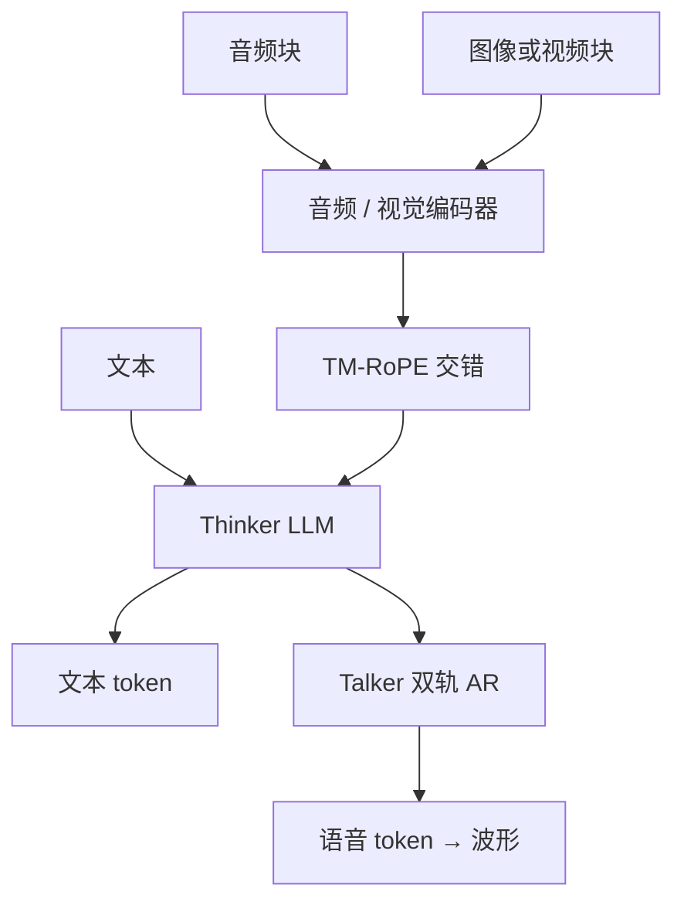

# Qwen2-Audio / Qwen2.5-Omni 语音

    
Qwen2.5-Omni 在端到端里同时感知文本、图像、音频与视频，并以流式方式生成文字与自然语音。

    <footer>—— Xu 等，Qwen2.5-Omni Technical Report，arXiv:2503.20215</footer>

Qwen 的语音线有两代形态。**Qwen2-Audio**（Chu 等，arXiv:2407.10759）是理解型音频语言模型：Whisper-large-v3 初始化的编码器接 Qwen-7B，只出文字，覆盖语音聊天与音频分析。**Qwen2.5-Omni** 把听、看、说收进同一套 Thinker–Talker：Thinker 做多模态理解与文本，Talker 用 Thinker 的隐状态流式出语音 token。本篇写从「会听不会说」到「端到端全模态」的差分，Qwen3-Omni 作为 ASR 基座的细节见 [另篇](/llm/qwen3-omni-speech-base)，此处不重复 AuT 与转写槽位。

## 问题

ASR 把音频映到字；聊天模型把字映到字。用户真正要的经常是：对着麦克风问「这段录音里谁在发脾气」，或边看视频边听声问「他什么时候推门」。Qwen2-Audio 把问题收成 $p(y_{\mathrm{text}}\mid a, x_{\mathrm{text}})$，音频分析与语音指令共用一个模型，并且**不用系统提示词切模式**。它还不解决「用嗓子回答」——语音出站仍要外挂 TTS，口型、延迟与文本节奏要对齐三次。

Qwen2.5-Omni 把问题升级为：同一前向里条件可以是文、图、声、视频，输出可以是文与声，而且要流式。难点有三。编码器若一次吃完整段，首包延迟不可接受。音画不同步则视频问答会指错帧。文本解码与语音解码若抢同一套 LM 头，会互相干扰——模型说话时把思维链读出声，或写字时泄漏声学码。

### 理解型 Audio LM 不是 codec 续写

[音频语言模型](/llm/audio-lm) 可以在神经编解码器的离散码上续写（VALL-E 一类），也可以只把连续音频表示当前缀、LM 仍生成文字。Qwen2-Audio 明确走后者：训练目标是文本 next-token，条件是编码器输出。它能做 ASR、翻译、情感、事件分类与 AIR-Bench 上的指令跟随，但发布物不是 TTS。Omni 才把生成语音当成一等输出。

Qwen2-Audio 总参数约 8.2B：编码器 + Qwen-7B。不要把它写成「7B 全是音频参数」。帧率上，16 kHz、25 ms 窗、10 ms 跳、再 stride-2 池化，约 40 ms 一帧编码器输出。

## 方法

### Qwen2-Audio：自然语言任务提示与双模式

相对 Qwen-Audio 的层级标签，2-Audio 预训练直接用自然语言描述任务，缩小与 SFT 的鸿沟，并扩大数据量。SFT 联合训练两种交互：**音频分析**（任意声、乐、多人说话 + 文或语音指令）与 **语音聊天**（当助手听、用字答）。模式由内容区分，不靠 system prompt。随后 DPO，用 $(x,y_w,y_l)$ 拉事实性与行为。评测强调未经任务微调即在 LibriSpeech、Aishell2、CoVoST、AIR-Bench 等上对上一代 LALM。

### Qwen2.5-Omni：块状感知与 TM-RoPE

音频与视觉编码器做**块状**处理：感知切成块，长程交给 LLM 的共享注意力，以便流式 prefill。音画按时间交错排列，位置用 **TM-RoPE**（Time-aligned Multimodal RoPE）：在多模态 RoPE 里对齐绝对时间，避免「第 $k$ 个视频 patch」与「第 $k$ 个音频帧」仅因下标相同而被当成同时。

### Thinker–Talker

Thinker 是带音频/图像编码器的 Transformer 解码器，负责理解并生成文本。Talker 是双轨自回归解码器，训练与推理都直接读 Thinker 的高维表示与历史，输出语音离散 token，再经声码器成波。二者设计为可端到端训练，推理时像一个模型而不是「LLM 调用 TTS API」。语音 token 的流式解码用滑窗 DiT 限制感受野，降低首包延迟。报告称文本能力可对照同尺寸 Qwen2.5-VL，音频理解强于 Qwen2-Audio；端到端语音指令在 MMLU、GSM8K 上可接近文本输入。

Thinker 像脑、Talker 像口，是官方比喻。工程含义是：文本采样在 Thinker；声学码采样在 Talker；Talker 不重新做视觉编码。Qwen3-Omni 对 Talker 条件做了解耦（文本改为离散 token），那是后代，不要写进 2.5 的默认图。

## 机制

Qwen2-Audio 的机制是编码器–LM 前缀条件：音频表示进入与文本共享的注意力，任务由提示词路由。双模式能共用权重，是因为分析与闲聊都是「听完（或听一段）之后写字」，差别只在用户是否同时给了旁白指令。DPO 不改变编码器几何，只改文本偏好。失败模式是幻觉描述（把噪声说成具体事件）以及指令抢答（把背景人声当命令）。

Omni 的机制是把 TTS 的条件从「已完成的文本」改成「Thinker 正在形成的隐状态」，从而口与手（打字）并行。TM-RoPE 把时间从「模态内下标」提升为跨模态对齐轴，否则唇动与音节会对错位。块状编码使 $\tau$ 时刻只看见已到达的音画块，Thinker 可以先吐字，Talker 跟着吐声。滑窗 DiT 牺牲无限未来声学上下文，换首包延迟。文本与语音仍可能冲突：报告用分离的 Talker 来避免两种词表抢同一 softmax。

从 2-Audio 到 Omni，理解侧从「仅音频」变成「音画文」；生成侧从「无」变成「有」。Qwen2.5-Omni-7B 是这条线上公开的端到端点。再往后的 Qwen3-Omni 换自训 AuT、加长音频窗口，并成为 [Qwen3-ASR](/llm/qwen3-asr) 的理解先验——那是转写产品，不是 Omni 聊天的替代名。

## 边界与工程取舍

Qwen2-Audio 没有官方端到端说话，产品若需要语音回复必须接 TTS，延迟与音色克隆风险外移。Omni 会说，就有仿声与不安全语音内容的责任面，不能再用「我们只出字幕」挡。块状流式在连接抖动时会丢块，造成字幕与声音不同步；重传策略属于服务端，模型报告不保证。

TM-RoPE 假设能拿到可对齐的时间戳；直播流的时钟漂移会让「对齐」变成错位的自信。Talker 依赖 Thinker 隐状态，打断 Thinker 的工具调用或安全过滤器时，2.5 的耦合使外部模块不好插——这正是 3-Omni 后来要解耦的点。评测上 AIR-Bench 用 GPT-4 打分，与 WER 不是同一量纲；不要用 Omni-Bench 总分代替 ASR 生产指标。

语音聊天模式下，用户以为在「打电话」，模型仍可能先在内部写成很长的文本再由 Talker 读出。端到端不等于「没有文本中介」，只等于中介不经过你的 TTS API。

## 小结

- Qwen2-Audio：Whisper-large-v3 编码器 + Qwen-7B，只生成文本；分析与语音聊天联合训练，无系统提示切模式；DPO 对齐。
- Qwen2.5-Omni：块状音画编码、TM-RoPE 时间对齐、Thinker–Talker 端到端出字与出声。
- 理解型 Audio LM 与 codec TTS LM 不是同一损失；2-Audio 属前者，Omni 把后者接进同一推理图。
- 后代 Qwen3-Omni / ASR 继承理解线但改编码器与产品契约，勿把 2.5 的 Whisper 前端写进 3 的默认实现。
- 出处：Chu 等，Qwen2-Audio Technical Report，arXiv:2407.10759；Xu 等，Qwen2.5-Omni Technical Report，arXiv:2503.20215。对照 Qwen 博客 *Qwen2.5 Omni: See, Hear, Talk, Write, Do It All!*。
